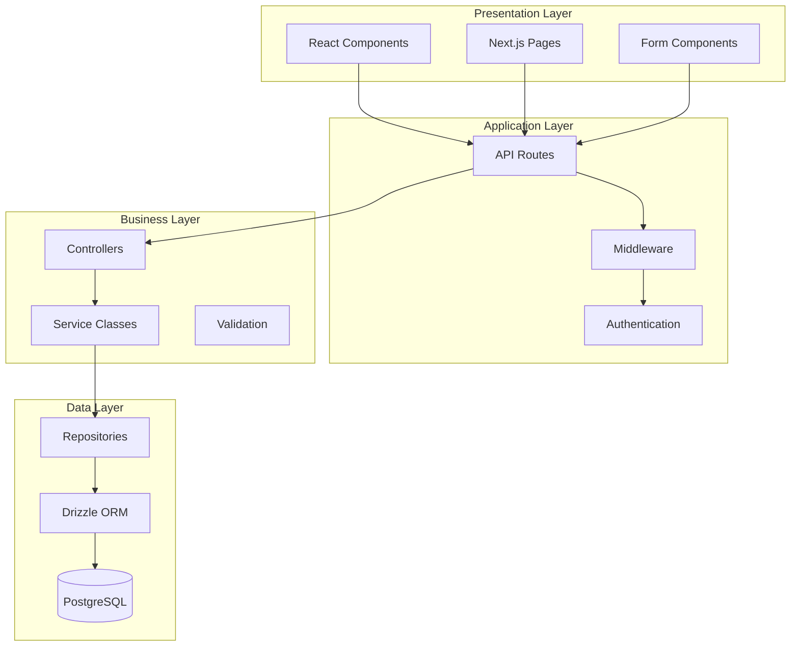

# Architecture Overview

Welcome to the Kavach system architecture documentation. This section provides comprehensive information about the system's design, components, and technical implementation.

## Table of Contents

- [System Overview](./system-overview.md) - High-level system architecture and design principles
- [Component Architecture](./component-architecture.md) - Detailed component relationships and interactions
- [Data Flow](./data-flow.md) - Data flow diagrams and processing patterns
- [Technology Stack](./tech-stack.md) - Technologies used and architectural decisions
- [Design Patterns](./design-patterns.md) - Design patterns and architectural patterns implemented

## Quick Architecture Summary

Kavach is a modern full-stack web application built with Next.js 15, featuring:

- **Frontend**: React 19 with Next.js App Router, TypeScript, and Tailwind CSS
- **Backend**: Next.js API routes with TypeScript
- **Database**: PostgreSQL with Drizzle ORM
- **Authentication**: JWT-based authentication with session management
- **State Management**: Zustand for client-side state
- **Deployment**: Docker-ready with environment-based configuration

## Architecture Principles

### 1. Separation of Concerns
- Clear separation between frontend, backend, and data layers
- Service-oriented architecture with dedicated service classes
- Repository pattern for data access abstraction

### 2. Type Safety
- End-to-end TypeScript implementation
- Zod schemas for runtime validation
- Strongly typed database schema with Drizzle ORM

### 3. Security First
- Comprehensive authentication and authorization system
- Rate limiting and security middleware
- Input validation and sanitization
- Audit logging and security monitoring

### 4. Scalability
- Modular component architecture
- Database connection pooling
- Efficient caching strategies
- Horizontal scaling support

### 5. Developer Experience
- Hot reloading and fast development cycles
- Comprehensive testing framework
- Automated code quality checks
- Clear documentation and examples

## System Layers

## Key Features

### Authentication & Authorization
- Multi-role user system (Customer, Expert, Admin)
- JWT-based authentication with refresh tokens
- Email verification workflow
- Profile completion enforcement
- Admin approval process for experts

### User Management
- Role-based access control (RBAC)
- User profile management
- Account status management (active, banned, paused)
- Audit logging for user actions

### Security Features
- Rate limiting on sensitive endpoints
- Security headers and CORS protection
- Input validation and sanitization
- Anomaly detection and monitoring
- Secure session management

### Data Management
- PostgreSQL database with ACID compliance
- Database migrations and versioning
- Connection pooling and optimization
- Backup and recovery procedures

## Getting Started

1. **System Overview**: Start with [System Overview](./system-overview.md) for a high-level understanding
2. **Components**: Review [Component Architecture](./component-architecture.md) for detailed component information
3. **Data Flow**: Understand [Data Flow](./data-flow.md) patterns and processing
4. **Technology**: Learn about the [Technology Stack](./tech-stack.md) and decisions
5. **Patterns**: Explore [Design Patterns](./design-patterns.md) used throughout the system

## Related Documentation

- [API Documentation](../api/README.md) - Complete API reference
- [Development Setup](../development/setup/README.md) - Development environment setup
- [Security Documentation](../security/README.md) - Security implementation details
- [Deployment Guide](../deployment/README.md) - Deployment and operations

## Contributing

When contributing to the architecture:

1. Follow established patterns and conventions
2. Update documentation for architectural changes
3. Consider security implications of changes
4. Maintain backward compatibility when possible
5. Add appropriate tests for new components

For detailed contribution guidelines, see [Contributing](../contributing/README.md).