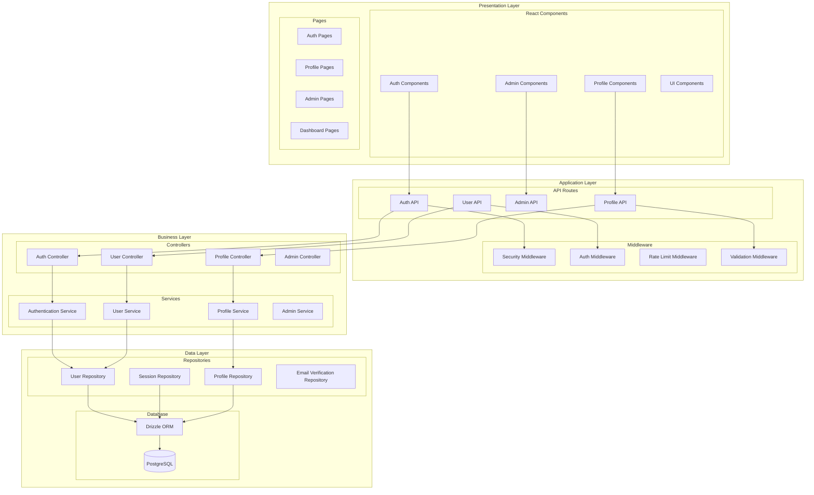
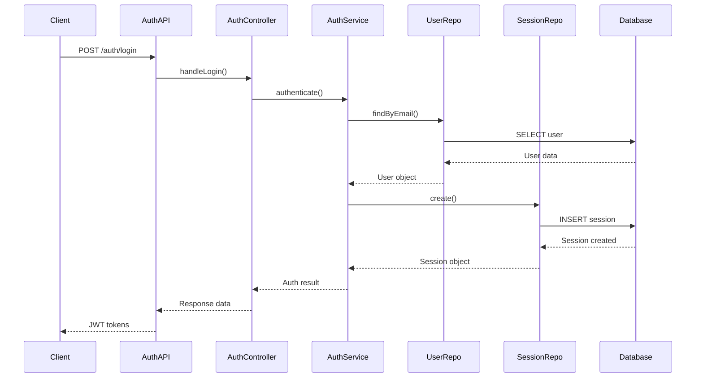
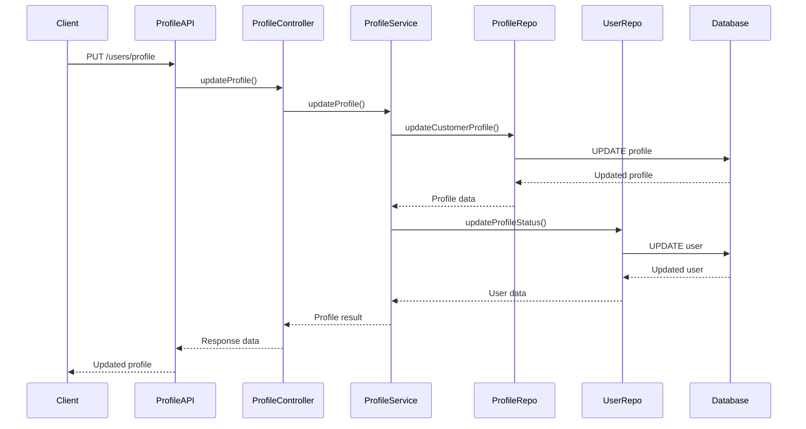
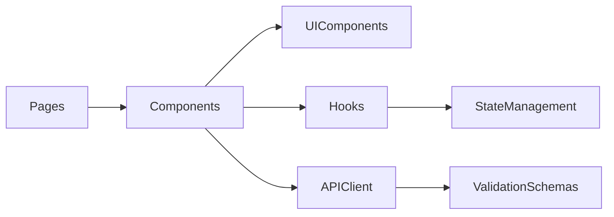
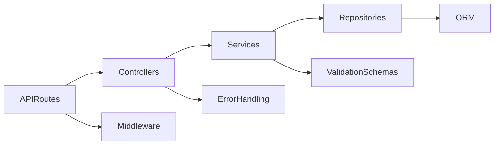
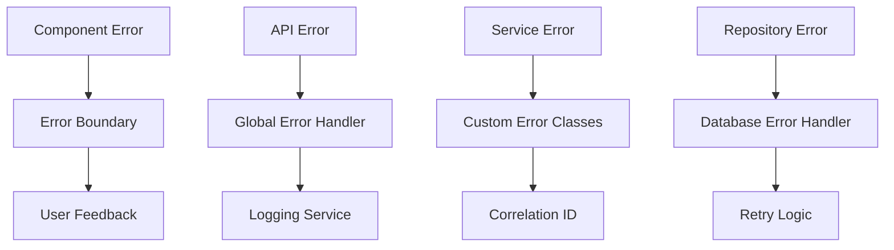
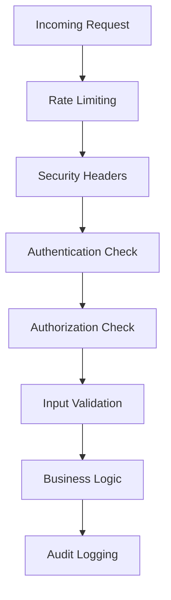

# Component Architecture

This document details the component architecture of the Kavach system, including component relationships, interfaces, and interaction patterns.

## Architecture Overview

The Kavach system follows a layered architecture with clear separation of concerns:



## Component Layers

### 1. Presentation Layer

#### React Components
Located in `src/components/`, organized by feature:

**Authentication Components** (`src/components/custom/auth/`)
- `LoginForm.tsx` - User login form with validation
- `SignupWizard.tsx` - Multi-step registration wizard
- `TabNavigation.tsx` - Navigation between auth forms

**Profile Components** (`src/components/custom/profile/`)
- `CustomerProfileWizard.tsx` - Customer profile completion
- `ExpertProfileWizard.tsx` - Expert profile completion with specializations

**Admin Components** (`src/components/custom/admin/`)
- `UserManagement.tsx` - User CRUD operations
- `DashboardStats.tsx` - Admin dashboard statistics
- `ServiceManagement.tsx` - Service configuration

**UI Components** (`src/components/ui/`)
- Reusable UI primitives based on Radix UI
- Form components, buttons, dialogs, etc.
- Consistent styling with Tailwind CSS

#### Pages
Located in `src/app/`, using Next.js App Router:

**Frontend Pages** (`src/app/(frontend)/`)
```
├── login/page.tsx              # User login page
├── signup/page.tsx             # User registration page
├── dashboard/page.tsx          # User dashboard
├── profile/page.tsx            # Profile management
├── complete-profile/page.tsx   # Profile completion
├── verify-email/page.tsx       # Email verification
├── pending-approval/page.tsx   # Expert approval waiting
├── account-restricted/page.tsx # Restricted account notice
└── admin/
    ├── login/page.tsx          # Admin login
    └── dashboard/page.tsx      # Admin dashboard
```

### 2. Application Layer

#### API Routes
Located in `src/app/(backend)/api/v1/`, organized by feature:

**Authentication API** (`/api/v1/auth/`)
```typescript
// Authentication endpoints
POST /api/v1/auth/login          # User login
POST /api/v1/auth/signup         # User registration
POST /api/v1/auth/logout         # User logout
POST /api/v1/auth/refresh        # Token refresh
GET  /api/v1/auth/me             # Current user info
POST /api/v1/auth/verify-email   # Email verification
POST /api/v1/auth/resend-verification # Resend verification
POST /api/v1/auth/check-email    # Email availability check
```

**User Management API** (`/api/v1/users/`)
```typescript
// User management endpoints
GET    /api/v1/users/profile     # Get user profile
PUT    /api/v1/users/profile     # Update user profile
POST   /api/v1/users/change-password # Change password
```

**Admin API** (`/api/v1/admin/`)
```typescript
// Admin endpoints
POST   /api/v1/admin/login       # Admin login
GET    /api/v1/admin/users       # List all users
POST   /api/v1/admin/users       # Create user
GET    /api/v1/admin/users/:id   # Get user details
PUT    /api/v1/admin/users/:id   # Update user
DELETE /api/v1/admin/users/:id   # Delete user
POST   /api/v1/admin/users/:id/ban   # Ban user
POST   /api/v1/admin/users/:id/pause # Pause user
```

#### Middleware Components
Located in `src/lib/auth/` and `src/middleware.ts`:

**Security Middleware** (`src/middleware.ts`)
- Request correlation tracking
- Rate limiting enforcement
- Security headers application
- Route protection and access control

**Authentication Middleware**
- JWT token validation
- Session management
- User state extraction
- Token refresh handling

**Rate Limiting Middleware**
- Endpoint-specific rate limits
- IP-based and user-based limiting
- Configurable limits and windows
- Rate limit header management

### 3. Business Layer

#### Service Classes
Located in `src/lib/services/`, implementing business logic:

**Authentication Service** (`src/lib/services/auth/authentication.service.ts`)
```typescript
export class AuthenticationService extends BaseService {
  async authenticate(credentials: LoginCredentials): Promise<AuthResult>
  async register(userData: RegisterData): Promise<RegisterResult>
  async verifyEmail(token: string): Promise<VerificationResult>
  async refreshTokens(refreshToken: string): Promise<TokenResult>
  async logout(sessionId: string): Promise<void>
}
```

**User Service** (`src/lib/services/user/user.service.ts`)
```typescript
export class UserService extends BaseService {
  async getUserProfile(userId: string): Promise<UserProfile>
  async updateUserProfile(userId: string, data: ProfileUpdate): Promise<UserProfile>
  async changePassword(userId: string, passwords: PasswordChange): Promise<void>
  async getUserByEmail(email: string): Promise<User | null>
}
```

**Profile Service** (`src/lib/services/profile/profile.service.ts`)
```typescript
export class ProfileService {
  async getUserProfile(userId: string): Promise<ProfileData | null>
  async updateCustomerProfile(userId: string, data: CustomerProfileData): Promise<void>
  async updateExpertProfile(userId: string, data: ExpertProfileData): Promise<void>
  async completeProfile(userId: string, profileData: ProfileData): Promise<void>
}
```

**Admin Service** (`src/lib/services/admin/admin.service.ts`)
```typescript
export class AdminService extends BaseService {
  async getAllUsers(filters?: UserFilters): Promise<User[]>
  async createUser(userData: CreateUserData): Promise<User>
  async updateUser(userId: string, data: UpdateUserData): Promise<User>
  async banUser(userId: string, reason: string): Promise<void>
  async pauseUser(userId: string, reason: string): Promise<void>
}
```

#### Controllers
Located in `src/lib/controllers/`, handling HTTP request/response:

**Authentication Controller** (`src/lib/controllers/auth/auth.controller.ts`)
- Handles authentication-related HTTP requests
- Validates input data using Zod schemas
- Calls appropriate service methods
- Formats responses with proper HTTP status codes

**User Controller** (`src/lib/controllers/user/user.controller.ts`)
- Manages user profile operations
- Handles file uploads and validation
- Implements proper error handling
- Manages user state transitions

### 4. Data Layer

#### Repository Pattern
Located in `src/lib/database/repositories/`:

**User Repository** (`src/lib/database/repositories/user-repository.ts`)
```typescript
export class UserRepository {
  async findById(id: string): Promise<User | null>
  async findByEmail(email: string): Promise<User | null>
  async create(userData: CreateUserData): Promise<User>
  async update(id: string, data: UpdateUserData): Promise<User>
  async delete(id: string): Promise<void>
  async updateStatus(id: string, status: UserStatus): Promise<void>
}
```

**Session Repository** (`src/lib/database/repositories/session-repository.ts`)
```typescript
export class SessionRepository {
  async create(sessionData: CreateSessionData): Promise<Session>
  async findByToken(token: string): Promise<Session | null>
  async findByUserId(userId: string): Promise<Session[]>
  async delete(sessionId: string): Promise<void>
  async deleteExpired(): Promise<number>
  async revokeUserSessions(userId: string): Promise<void>
}
```

**Profile Repository** (`src/lib/database/repositories/profile-repository.ts`)
```typescript
export class ProfileRepository {
  async getCustomerProfile(userId: string): Promise<CustomerProfile | null>
  async getExpertProfile(userId: string): Promise<ExpertProfile | null>
  async createCustomerProfile(data: CustomerProfileData): Promise<CustomerProfile>
  async createExpertProfile(data: ExpertProfileData): Promise<ExpertProfile>
  async updateCustomerProfile(userId: string, data: Partial<CustomerProfileData>): Promise<void>
  async updateExpertProfile(userId: string, data: Partial<ExpertProfileData>): Promise<void>
}
```

#### Database Schema
Located in `src/lib/database/schema/`:

**Core Tables**
- `users` - User accounts and authentication data
- `sessions` - User sessions and JWT tokens
- `email_verifications` - Email verification tokens
- `customer_profiles` - Customer-specific profile data
- `expert_profiles` - Expert-specific profile data

## Component Interactions

### Authentication Flow


### Profile Management Flow


## Component Dependencies

### Frontend Dependencies


### Backend Dependencies


## Error Handling Architecture

### Error Flow


### Error Types
- **ValidationError** - Input validation failures
- **AuthenticationError** - Authentication failures
- **AuthorizationError** - Permission denied errors
- **DatabaseError** - Database operation failures
- **ExternalServiceError** - Third-party service failures

## Security Components

### Security Architecture


### Security Features
- **JWT Authentication** - Stateless token-based authentication
- **Rate Limiting** - Configurable rate limits per endpoint
- **Input Validation** - Zod schema validation
- **Security Headers** - CORS, CSP, and other security headers
- **Audit Logging** - Complete audit trail for security events

## Performance Considerations

### Caching Strategy
- **Database Connection Pooling** - Efficient database connections
- **Query Optimization** - Indexed queries and efficient joins
- **Response Caching** - API response caching where appropriate
- **Static Asset Optimization** - CDN and compression

### Monitoring Components
- **Performance Monitoring** - Request timing and resource usage
- **Error Tracking** - Error rates and patterns
- **Security Monitoring** - Security event correlation
- **Health Checks** - System health and availability monitoring

## Related Documentation

- [System Overview](./system-overview.md) - High-level system architecture
- [Data Flow](./data-flow.md) - Data processing patterns
- [Technology Stack](./tech-stack.md) - Technology choices and rationale
- [API Documentation](../api/README.md) - Complete API reference