# Data Flow Architecture

This document describes the data flow patterns, processing workflows, and information architecture within the Kavach system.

## Overview

The Kavach system processes data through multiple layers with clear separation of concerns, ensuring data integrity, security, and performance. Data flows through the system following established patterns for different types of operations.

## Core Data Flow Patterns

### 1. Request-Response Flow

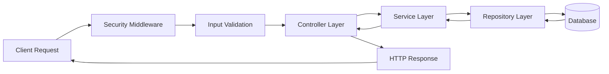
```mermaid
graph LR
    Client[Client Request] --> Middleware[Security Middleware]
    Middleware --> Validation[Input Validation]
    Validation --> Controller[Controller Layer]
    Controller --> Service[Service Layer]
    Service --> Repository[Repository Layer]
    Repository --> Database[(Database)]
    Database --> Repository
    Repository --> Service
    Service --> Controller
    Controller --> Response[HTTP Response]
    Response --> Client
```

### 2. Authentication Data Flow

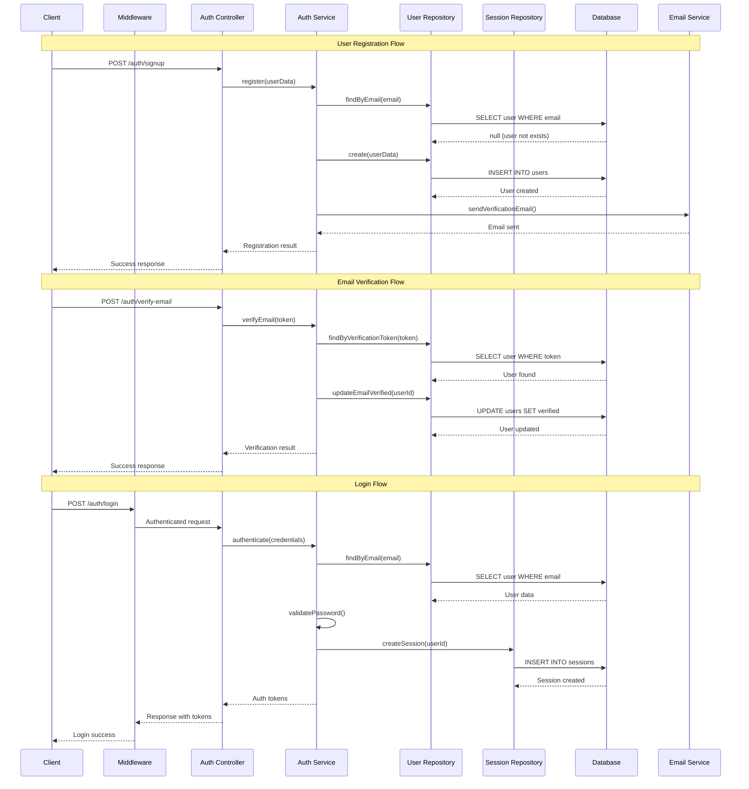
```mermaid
sequenceDiagram
    participant C as Client
    participant MW as Middleware
    participant AC as Auth Controller
    participant AS as Auth Service
    participant UR as User Repository
    participant SR as Session Repository
    participant DB as Database
    participant ES as Email Service
    
    Note over C,ES: User Registration Flow
    C->>AC: POST /auth/signup
    AC->>AS: register(userData)
    AS->>UR: findByEmail(email)
    UR->>DB: SELECT user WHERE email
    DB-->>UR: null (user not exists)
    AS->>UR: create(userData)
    UR->>DB: INSERT INTO users
    DB-->>UR: User created
    AS->>ES: sendVerificationEmail()
    ES-->>AS: Email sent
    AS-->>AC: Registration result
    AC-->>C: Success response
    
    Note over C,ES: Email Verification Flow
    C->>AC: POST /auth/verify-email
    AC->>AS: verifyEmail(token)
    AS->>UR: findByVerificationToken(token)
    UR->>DB: SELECT user WHERE token
    DB-->>UR: User found
    AS->>UR: updateEmailVerified(userId)
    UR->>DB: UPDATE users SET verified
    DB-->>UR: User updated
    AS-->>AC: Verification result
    AC-->>C: Success response
    
    Note over C,ES: Login Flow
    C->>MW: POST /auth/login
    MW->>AC: Authenticated request
    AC->>AS: authenticate(credentials)
    AS->>UR: findByEmail(email)
    UR->>DB: SELECT user WHERE email
    DB-->>UR: User data
    AS->>AS: validatePassword()
    AS->>SR: createSession(userId)
    SR->>DB: INSERT INTO sessions
    DB-->>SR: Session created
    AS-->>AC: Auth tokens
    AC-->>MW: Response with tokens
    MW-->>C: Login success
```

### 3. Profile Management Data Flow

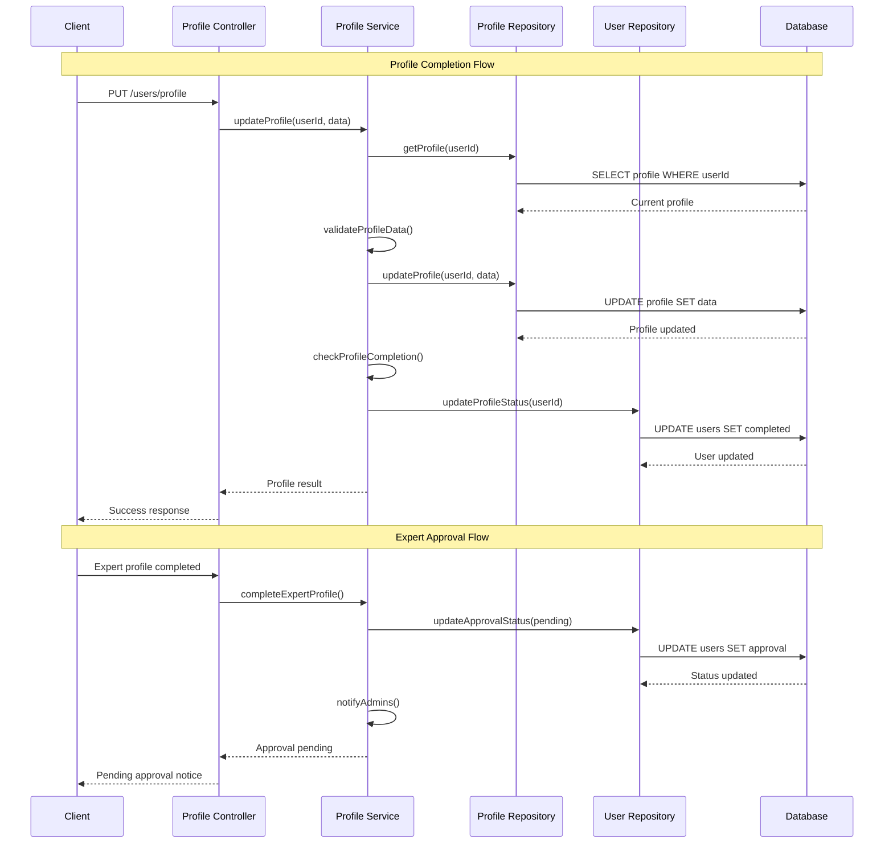
```mermaid
sequenceDiagram
    participant C as Client
    participant PC as Profile Controller
    participant PS as Profile Service
    participant PR as Profile Repository
    participant UR as User Repository
    participant DB as Database
    
    Note over C,DB: Profile Completion Flow
    C->>PC: PUT /users/profile
    PC->>PS: updateProfile(userId, data)
    PS->>PR: getProfile(userId)
    PR->>DB: SELECT profile WHERE userId
    DB-->>PR: Current profile
    PS->>PS: validateProfileData()
    PS->>PR: updateProfile(userId, data)
    PR->>DB: UPDATE profile SET data
    DB-->>PR: Profile updated
    PS->>PS: checkProfileCompletion()
    PS->>UR: updateProfileStatus(userId)
    UR->>DB: UPDATE users SET completed
    DB-->>UR: User updated
    PS-->>PC: Profile result
    PC-->>C: Success response
    
    Note over C,DB: Expert Approval Flow
    C->>PC: Expert profile completed
    PC->>PS: completeExpertProfile()
    PS->>UR: updateApprovalStatus(pending)
    UR->>DB: UPDATE users SET approval
    DB-->>UR: Status updated
    PS->>PS: notifyAdmins()
    PS-->>PC: Approval pending
    PC-->>C: Pending approval notice
```

### 4. Admin Operations Data Flow

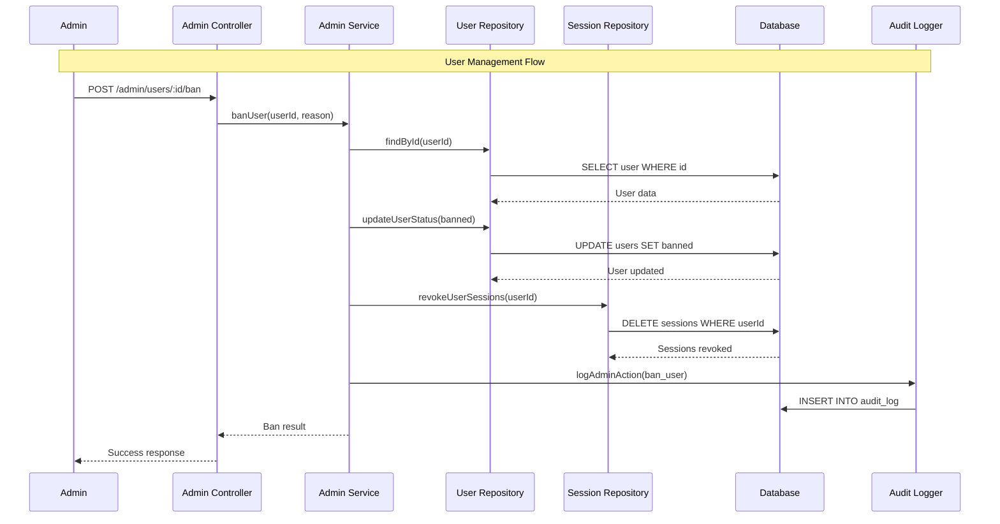
```mermaid
sequenceDiagram
    participant A as Admin
    participant AC as Admin Controller
    participant AS as Admin Service
    participant UR as User Repository
    participant SR as Session Repository
    participant DB as Database
    participant AL as Audit Logger
    
    Note over A,AL: User Management Flow
    A->>AC: POST /admin/users/:id/ban
    AC->>AS: banUser(userId, reason)
    AS->>UR: findById(userId)
    UR->>DB: SELECT user WHERE id
    DB-->>UR: User data
    AS->>UR: updateUserStatus(banned)
    UR->>DB: UPDATE users SET banned
    DB-->>UR: User updated
    AS->>SR: revokeUserSessions(userId)
    SR->>DB: DELETE sessions WHERE userId
    DB-->>SR: Sessions revoked
    AS->>AL: logAdminAction(ban_user)
    AL->>DB: INSERT INTO audit_log
    AS-->>AC: Ban result
    AC-->>A: Success response
```

## Data Processing Patterns

### 1. Input Validation Pipeline

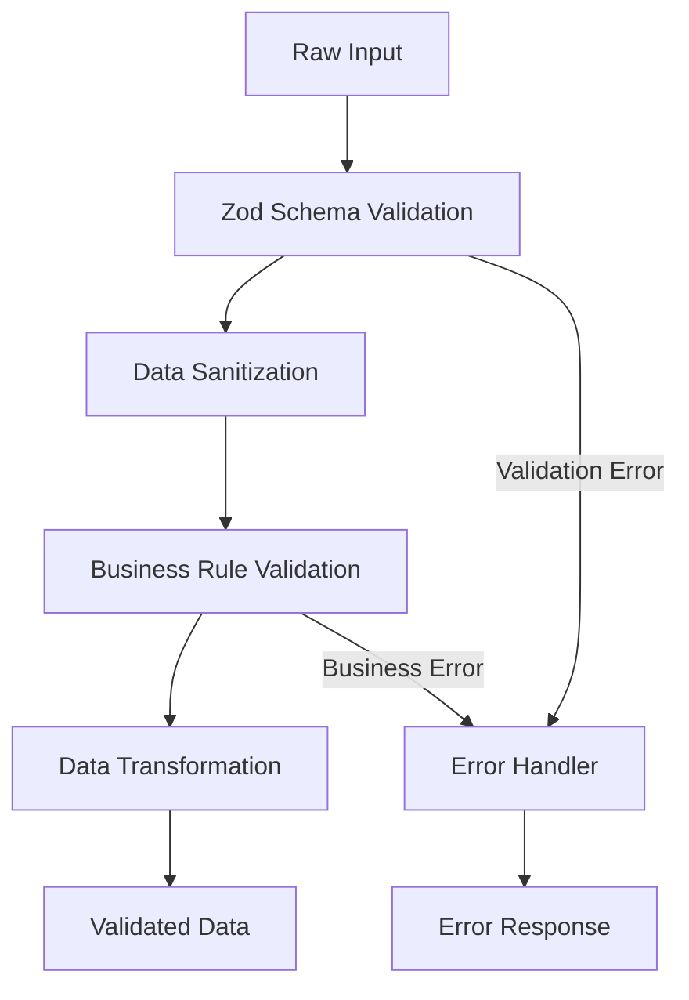
```mermaid
graph TB
    Input[Raw Input] --> Schema[Zod Schema Validation]
    Schema --> Sanitize[Data Sanitization]
    Sanitize --> Business[Business Rule Validation]
    Business --> Transform[Data Transformation]
    Transform --> Output[Validated Data]
    
    Schema -->|Validation Error| ErrorHandler[Error Handler]
    Business -->|Business Error| ErrorHandler
    ErrorHandler --> ErrorResponse[Error Response]
```

### 2. Database Transaction Flow

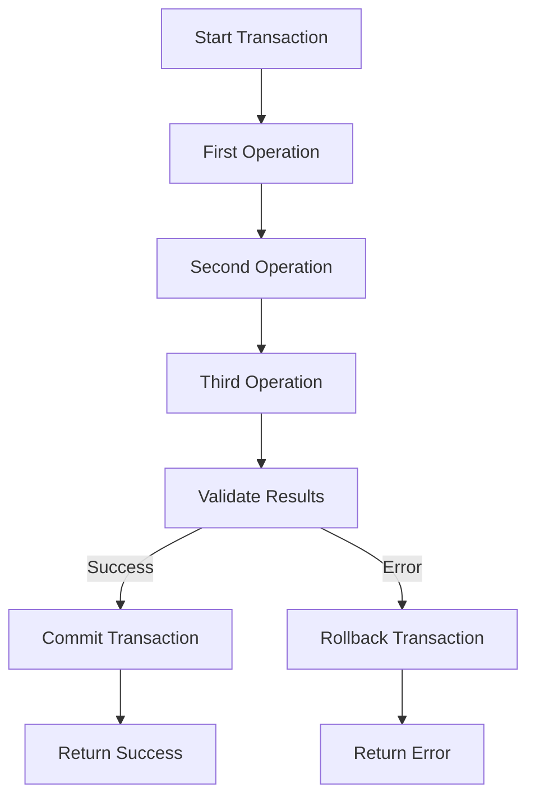
```mermaid
graph TB
    Start[Start Transaction] --> Operation1[First Operation]
    Operation1 --> Operation2[Second Operation]
    Operation2 --> Operation3[Third Operation]
    Operation3 --> Validate[Validate Results]
    Validate -->|Success| Commit[Commit Transaction]
    Validate -->|Error| Rollback[Rollback Transaction]
    Commit --> Success[Return Success]
    Rollback --> Error[Return Error]
```

### 3. Error Handling Flow

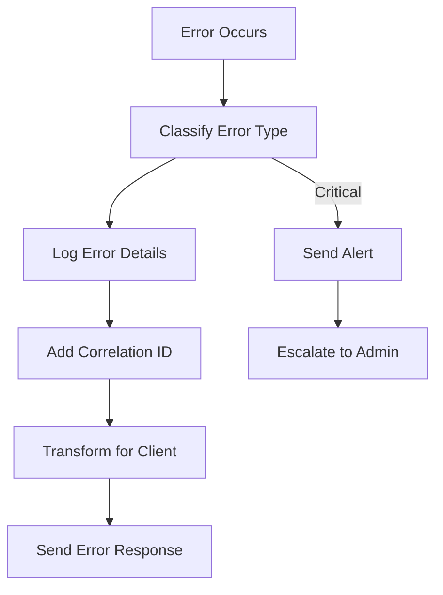
```mermaid
graph TB
    Error[Error Occurs] --> Classify[Classify Error Type]
    Classify --> Log[Log Error Details]
    Log --> Correlate[Add Correlation ID]
    Correlate --> Transform[Transform for Client]
    Transform --> Response[Send Error Response]
    
    Classify -->|Critical| Alert[Send Alert]
    Alert --> Escalate[Escalate to Admin]
```

## Data Models and Relationships

### 1. User Data Model

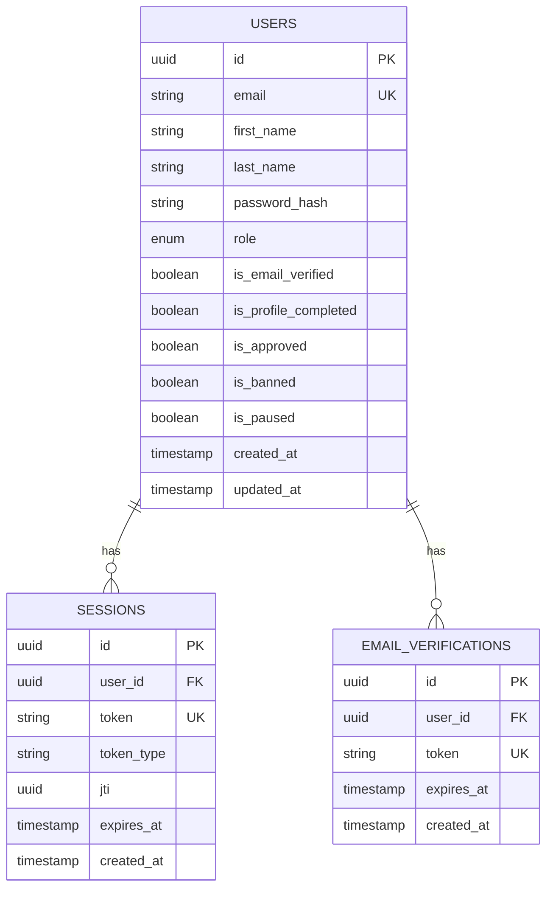
```mermaid
erDiagram
    USERS {
        uuid id PK
        string email UK
        string first_name
        string last_name
        string password_hash
        enum role
        boolean is_email_verified
        boolean is_profile_completed
        boolean is_approved
        boolean is_banned
        boolean is_paused
        timestamp created_at
        timestamp updated_at
    }
    
    SESSIONS {
        uuid id PK
        uuid user_id FK
        string token UK
        string token_type
        uuid jti
        timestamp expires_at
        timestamp created_at
    }
    
    EMAIL_VERIFICATIONS {
        uuid id PK
        uuid user_id FK
        string token UK
        timestamp expires_at
        timestamp created_at
    }
    
    USERS ||--o{ SESSIONS : has
    USERS ||--o{ EMAIL_VERIFICATIONS : has
```

### 2. Profile Data Model

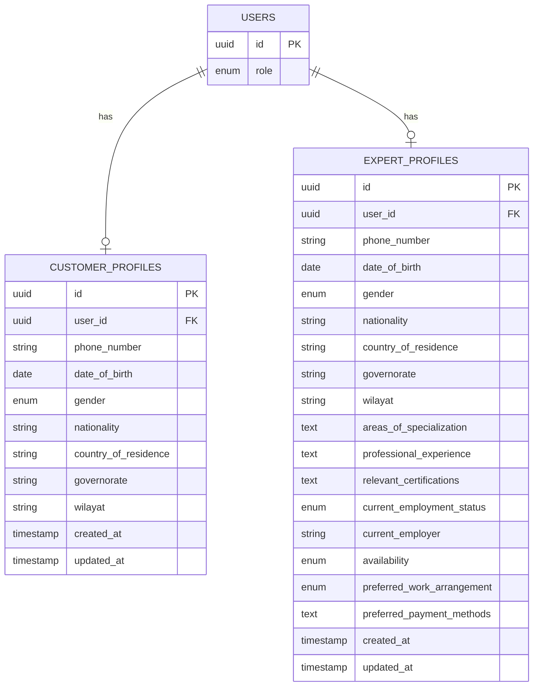
```mermaid
erDiagram
    USERS {
        uuid id PK
        enum role
    }
    
    CUSTOMER_PROFILES {
        uuid id PK
        uuid user_id FK
        string phone_number
        date date_of_birth
        enum gender
        string nationality
        string country_of_residence
        string governorate
        string wilayat
        timestamp created_at
        timestamp updated_at
    }
    
    EXPERT_PROFILES {
        uuid id PK
        uuid user_id FK
        string phone_number
        date date_of_birth
        enum gender
        string nationality
        string country_of_residence
        string governorate
        string wilayat
        text areas_of_specialization
        text professional_experience
        text relevant_certifications
        enum current_employment_status
        string current_employer
        enum availability
        enum preferred_work_arrangement
        text preferred_payment_methods
        timestamp created_at
        timestamp updated_at
    }
    
    USERS ||--o| CUSTOMER_PROFILES : has
    USERS ||--o| EXPERT_PROFILES : has
```

## Data Flow Scenarios

### 1. New User Registration

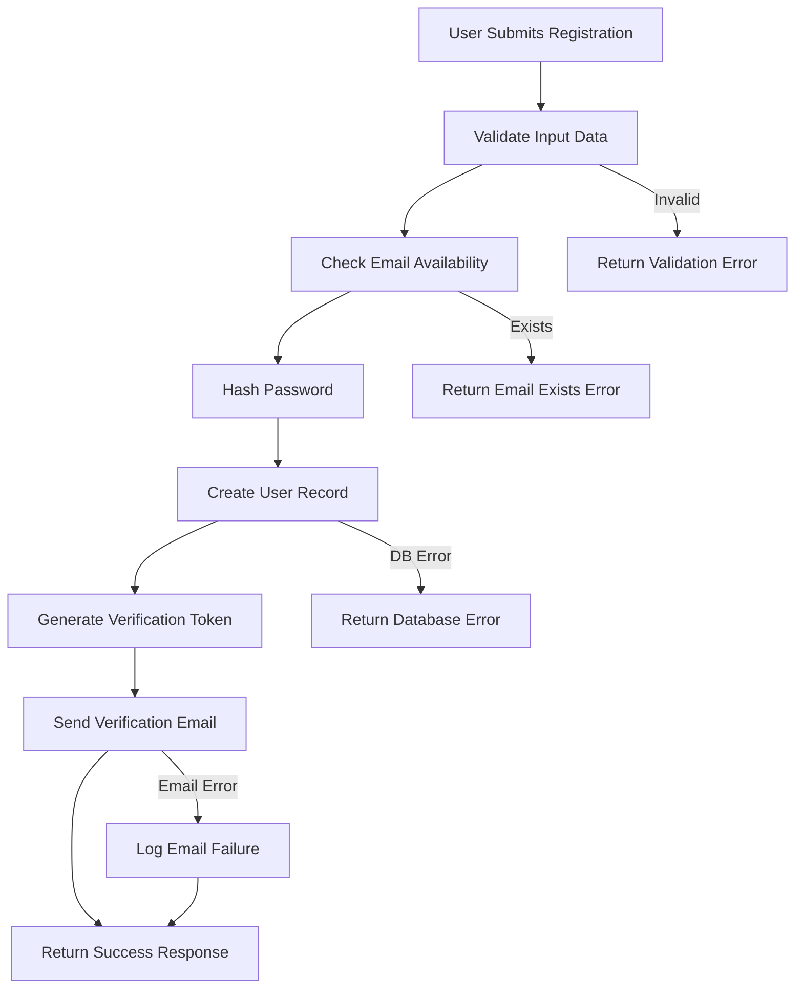
```mermaid
graph TB
    Start[User Submits Registration] --> Validate[Validate Input Data]
    Validate --> CheckEmail[Check Email Availability]
    CheckEmail --> HashPassword[Hash Password]
    HashPassword --> CreateUser[Create User Record]
    CreateUser --> GenerateToken[Generate Verification Token]
    GenerateToken --> SendEmail[Send Verification Email]
    SendEmail --> Response[Return Success Response]
    
    Validate -->|Invalid| ValidationError[Return Validation Error]
    CheckEmail -->|Exists| EmailError[Return Email Exists Error]
    CreateUser -->|DB Error| DatabaseError[Return Database Error]
    SendEmail -->|Email Error| EmailFailure[Log Email Failure]
    EmailFailure --> Response
```

### 2. User Authentication

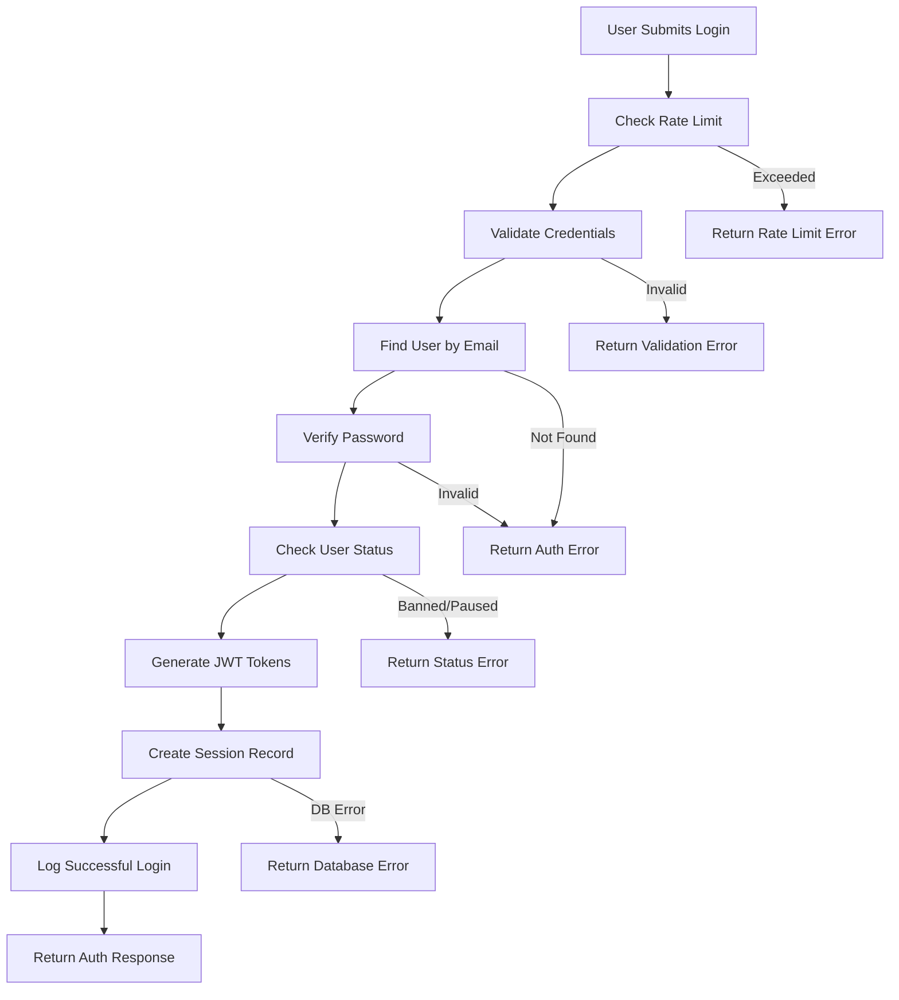
```mermaid
graph TB
    Start[User Submits Login] --> RateLimit[Check Rate Limit]
    RateLimit --> ValidateInput[Validate Credentials]
    ValidateInput --> FindUser[Find User by Email]
    FindUser --> CheckPassword[Verify Password]
    CheckPassword --> CheckStatus[Check User Status]
    CheckStatus --> GenerateTokens[Generate JWT Tokens]
    GenerateTokens --> CreateSession[Create Session Record]
    CreateSession --> LogSuccess[Log Successful Login]
    LogSuccess --> Response[Return Auth Response]
    
    RateLimit -->|Exceeded| RateLimitError[Return Rate Limit Error]
    ValidateInput -->|Invalid| ValidationError[Return Validation Error]
    FindUser -->|Not Found| AuthError[Return Auth Error]
    CheckPassword -->|Invalid| AuthError
    CheckStatus -->|Banned/Paused| StatusError[Return Status Error]
    CreateSession -->|DB Error| DatabaseError[Return Database Error]
```

### 3. Profile Update

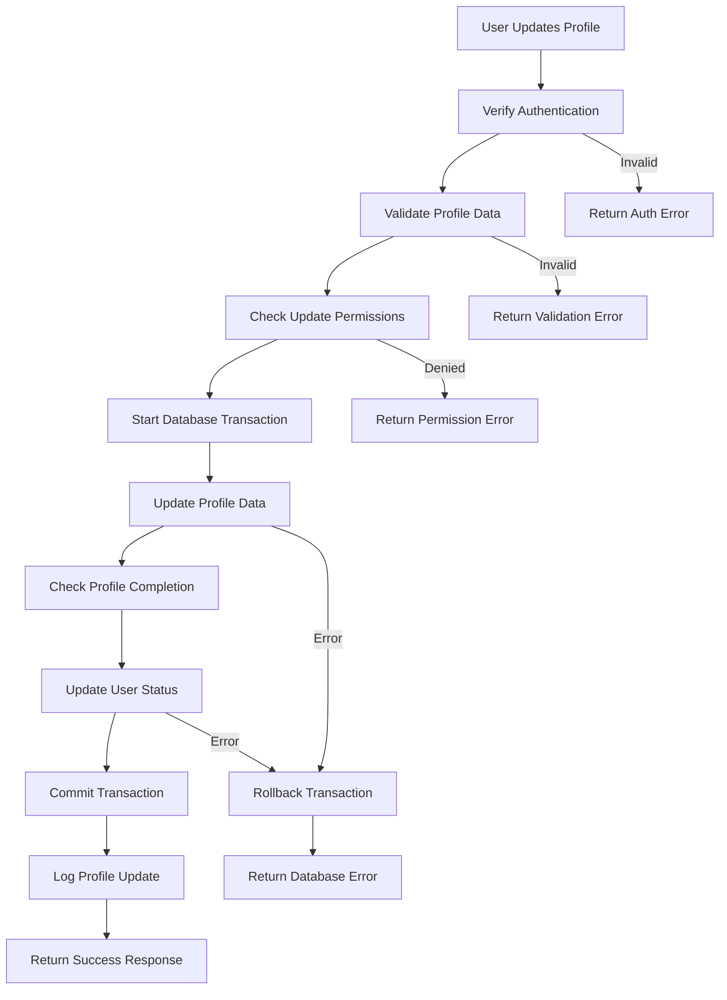
```mermaid
graph TB
    Start[User Updates Profile] --> Authenticate[Verify Authentication]
    Authenticate --> ValidateData[Validate Profile Data]
    ValidateData --> CheckPermissions[Check Update Permissions]
    CheckPermissions --> StartTransaction[Start Database Transaction]
    StartTransaction --> UpdateProfile[Update Profile Data]
    UpdateProfile --> CheckCompletion[Check Profile Completion]
    CheckCompletion --> UpdateUserStatus[Update User Status]
    UpdateUserStatus --> CommitTransaction[Commit Transaction]
    CommitTransaction --> LogUpdate[Log Profile Update]
    LogUpdate --> Response[Return Success Response]
    
    Authenticate -->|Invalid| AuthError[Return Auth Error]
    ValidateData -->|Invalid| ValidationError[Return Validation Error]
    CheckPermissions -->|Denied| PermissionError[Return Permission Error]
    UpdateProfile -->|Error| RollbackTransaction[Rollback Transaction]
    UpdateUserStatus -->|Error| RollbackTransaction
    RollbackTransaction --> DatabaseError[Return Database Error]
```

## Data Security and Privacy

### 1. Data Encryption Flow

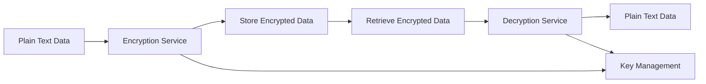
```mermaid
graph LR
    PlainText[Plain Text Data] --> Encrypt[Encryption Service]
    Encrypt --> Store[Store Encrypted Data]
    Store --> Retrieve[Retrieve Encrypted Data]
    Retrieve --> Decrypt[Decryption Service]
    Decrypt --> PlainText2[Plain Text Data]
    
    Encrypt --> KeyManagement[Key Management]
    Decrypt --> KeyManagement
```

### 2. Audit Trail Flow

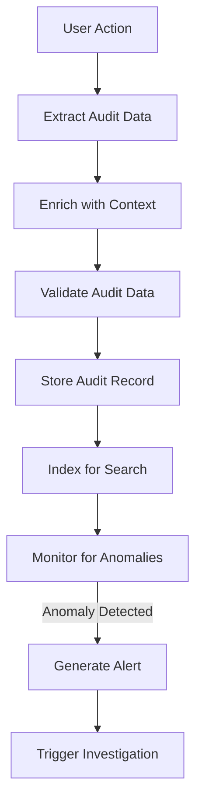
```mermaid
graph TB
    Action[User Action] --> Extract[Extract Audit Data]
    Extract --> Enrich[Enrich with Context]
    Enrich --> Validate[Validate Audit Data]
    Validate --> Store[Store Audit Record]
    Store --> Index[Index for Search]
    Index --> Monitor[Monitor for Anomalies]
    
    Monitor -->|Anomaly Detected| Alert[Generate Alert]
    Alert --> Investigate[Trigger Investigation]
```

## Performance Optimization

### 1. Database Query Optimization

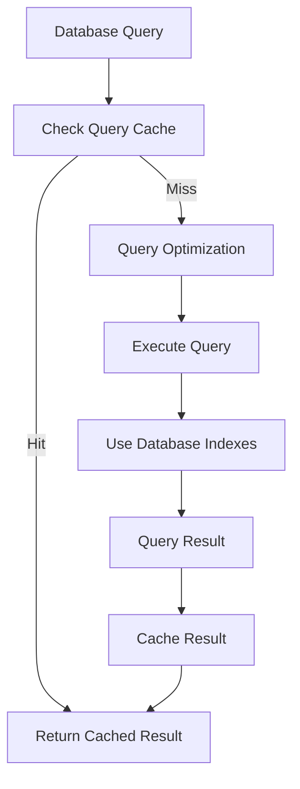
```mermaid
graph TB
    Query[Database Query] --> Cache[Check Query Cache]
    Cache -->|Hit| Return[Return Cached Result]
    Cache -->|Miss| Optimize[Query Optimization]
    Optimize --> Execute[Execute Query]
    Execute --> Index[Use Database Indexes]
    Index --> Result[Query Result]
    Result --> CacheResult[Cache Result]
    CacheResult --> Return
```

### 2. Connection Pooling

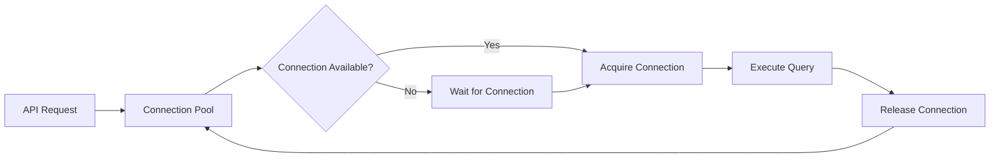
```mermaid
graph LR
    Request[API Request] --> Pool[Connection Pool]
    Pool --> Available{Connection Available?}
    Available -->|Yes| Acquire[Acquire Connection]
    Available -->|No| Wait[Wait for Connection]
    Wait --> Acquire
    Acquire --> Execute[Execute Query]
    Execute --> Release[Release Connection]
    Release --> Pool
```

## Data Consistency Patterns

### 1. ACID Transaction Pattern

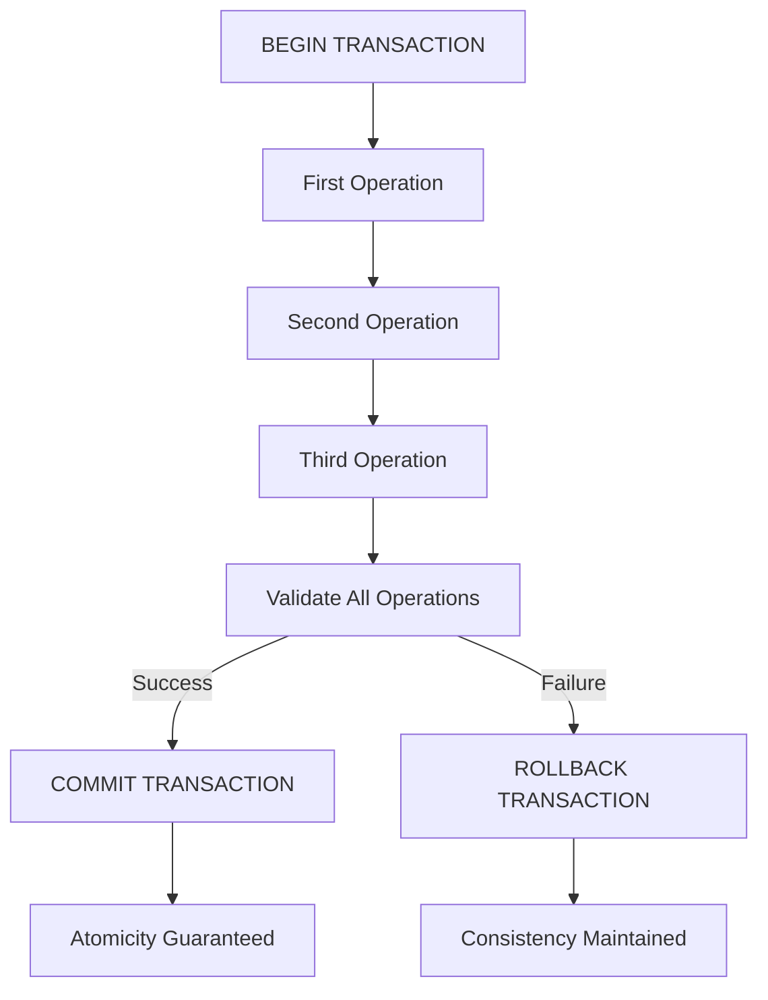
```mermaid
graph TB
    Begin[BEGIN TRANSACTION] --> Operation1[First Operation]
    Operation1 --> Operation2[Second Operation]
    Operation2 --> Operation3[Third Operation]
    Operation3 --> Validate[Validate All Operations]
    Validate -->|Success| Commit[COMMIT TRANSACTION]
    Validate -->|Failure| Rollback[ROLLBACK TRANSACTION]
    
    Commit --> Atomicity[Atomicity Guaranteed]
    Rollback --> Consistency[Consistency Maintained]
```

### 2. Data Validation Pattern

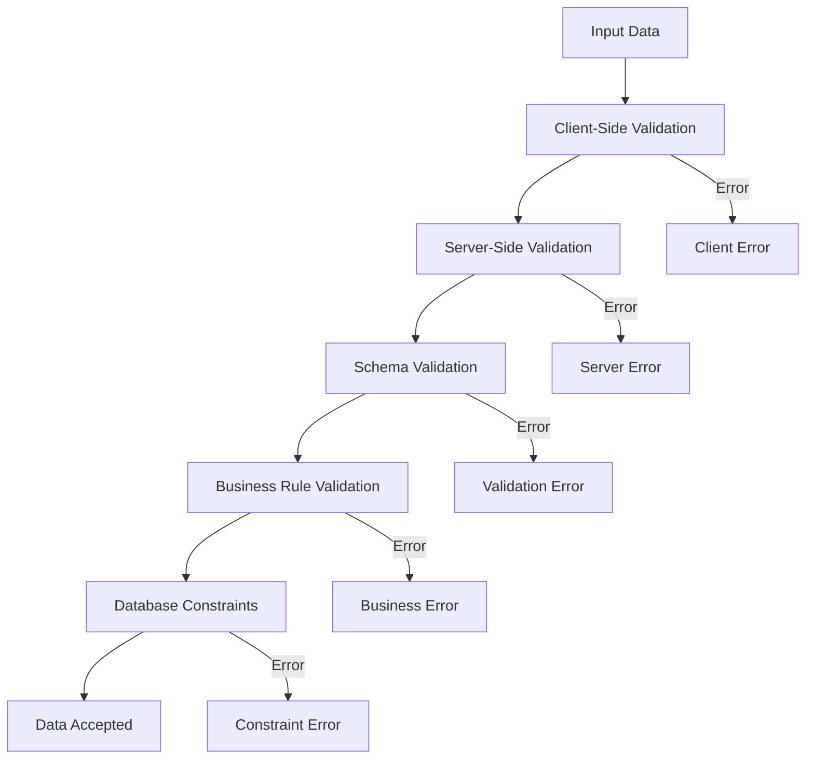
```mermaid
graph TB
    Input[Input Data] --> ClientValidation[Client-Side Validation]
    ClientValidation --> ServerValidation[Server-Side Validation]
    ServerValidation --> SchemaValidation[Schema Validation]
    SchemaValidation --> BusinessValidation[Business Rule Validation]
    BusinessValidation --> DatabaseConstraints[Database Constraints]
    DatabaseConstraints --> Success[Data Accepted]
    
    ClientValidation -->|Error| ClientError[Client Error]
    ServerValidation -->|Error| ServerError[Server Error]
    SchemaValidation -->|Error| ValidationError[Validation Error]
    BusinessValidation -->|Error| BusinessError[Business Error]
    DatabaseConstraints -->|Error| ConstraintError[Constraint Error]
```

## Monitoring and Observability

### 1. Data Flow Monitoring

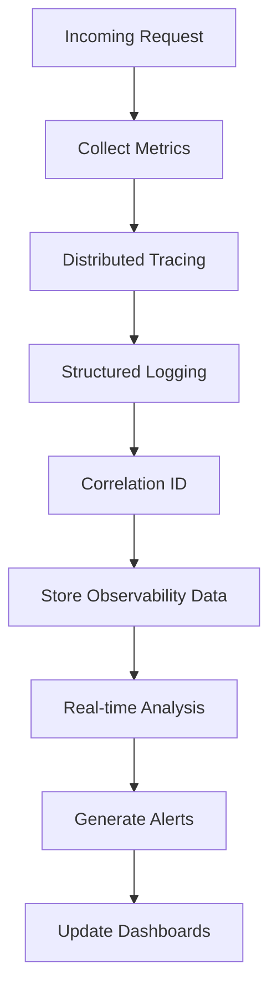
```mermaid
graph TB
    Request[Incoming Request] --> Metrics[Collect Metrics]
    Metrics --> Trace[Distributed Tracing]
    Trace --> Log[Structured Logging]
    Log --> Correlate[Correlation ID]
    Correlate --> Store[Store Observability Data]
    Store --> Analyze[Real-time Analysis]
    Analyze --> Alert[Generate Alerts]
    Alert --> Dashboard[Update Dashboards]
```

### 2. Performance Metrics Flow

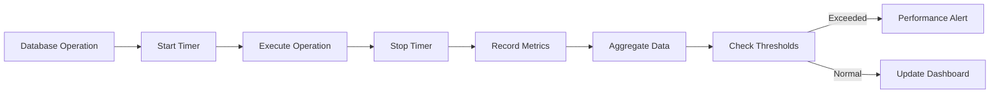
```mermaid
graph LR
    Operation[Database Operation] --> Timer[Start Timer]
    Timer --> Execute[Execute Operation]
    Execute --> StopTimer[Stop Timer]
    StopTimer --> Metrics[Record Metrics]
    Metrics --> Aggregate[Aggregate Data]
    Aggregate --> Threshold[Check Thresholds]
    Threshold -->|Exceeded| Alert[Performance Alert]
    Threshold -->|Normal| Dashboard[Update Dashboard]
```

## Related Documentation

- [System Overview](./system-overview.md) - High-level system architecture
- [Component Architecture](./component-architecture.md) - Component relationships
- [Technology Stack](./tech-stack.md) - Technology choices and implementation
- [Security Documentation](../security/README.md) - Security implementation details
- [API Documentation](../api/README.md) - API endpoints and data formats