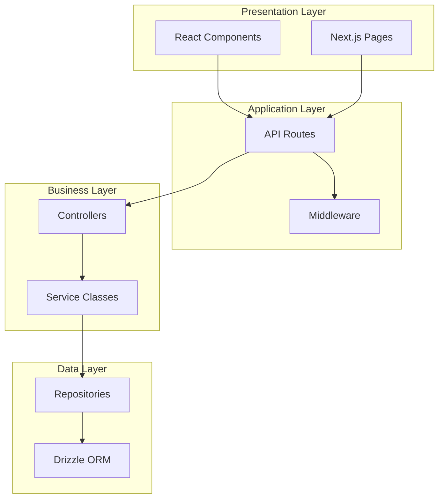

# Design Patterns

This document describes the design patterns and architectural patterns implemented throughout the Kavach system. These patterns ensure consistency, maintainability, and scalability across the codebase.

## Architectural Patterns

### 1. Layered Architecture

The system follows a strict layered architecture with clear separation of concerns:



**Benefits**:
- Clear separation of concerns
- Easy to test individual layers
- Maintainable and scalable
- Consistent data flow

**Implementation**:
```typescript
// Presentation Layer
const LoginPage = () => {
  // UI logic only
};

// Application Layer
export async function POST(request: NextRequest) {
  // HTTP handling only
  return authController.login(request);
}

// Business Layer
export class AuthController {
  async login(request: NextRequest) {
    // Request/response handling
    return this.authService.authenticate(data);
  }
}

// Service Layer
export class AuthService {
  async authenticate(credentials: LoginCredentials) {
    // Business logic
    return this.userRepository.findByEmail(email);
  }
}

// Data Layer
export class UserRepository {
  async findByEmail(email: string) {
    // Data access only
    return this.db.select().from(users);
  }
}
```

### 2. Repository Pattern

Abstracts data access logic and provides a consistent interface for data operations:

```typescript
// Repository Interface
interface IUserRepository {
  findById(id: string): Promise<User | null>;
  findByEmail(email: string): Promise<User | null>;
  create(userData: CreateUserData): Promise<User>;
  update(id: string, data: UpdateUserData): Promise<User | null>;
  delete(id: string): Promise<boolean>;
}

// Repository Implementation
export class UserRepository implements IUserRepository {
  constructor(private readonly database: any = db) {}

  async findById(id: string): Promise<User | null> {
    const [user] = await this.database
      .select()
      .from(users)
      .where(eq(users.id, id))
      .limit(1);
    return user || null;
  }

  // Other methods...
}
```

**Benefits**:
- Testable data access layer
- Database abstraction
- Consistent data operations
- Easy to mock for testing

### 3. Service Layer Pattern

Encapsulates business logic and coordinates between different repositories:

```typescript
export abstract class BaseService {
  protected readonly logger = logger;

  protected audit(event: AuditBase): void {
    emitAudit(event);
  }

  protected handleError(error: unknown, context: string): never {
    const message = error instanceof Error ? error.message : 'Unknown error';
    this.logger.error(`Service error in ${context}: ${message}`, { error, context });
    throw new Error(`${context}: ${message}`);
  }
}

export class AuthenticationService extends BaseService {
  async authenticate(credentials: LoginCredentials): Promise<AuthResult> {
    try {
      // Business logic implementation
      const user = await this.userRepository.findByEmail(credentials.email);
      // ... authentication logic
      this.audit({ action: 'login', userId: user.id });
      return result;
    } catch (error) {
      this.handleError(error, 'authenticate');
    }
  }
}
```

**Benefits**:
- Centralized business logic
- Consistent error handling
- Audit logging
- Reusable across controllers

## Creational Patterns

### 1. Factory Pattern

Used for creating different types of profiles based on user role:

```typescript
interface ProfileFactory {
  createProfile(userData: UserData): Promise<Profile>;
}

class CustomerProfileFactory implements ProfileFactory {
  async createProfile(userData: UserData): Promise<CustomerProfile> {
    return {
      userId: userData.id,
      phoneNumber: userData.phoneNumber,
      // Customer-specific fields
    };
  }
}

class ExpertProfileFactory implements ProfileFactory {
  async createProfile(userData: UserData): Promise<ExpertProfile> {
    return {
      userId: userData.id,
      phoneNumber: userData.phoneNumber,
      areasOfSpecialization: [],
      // Expert-specific fields
    };
  }
}

class ProfileFactoryProvider {
  static getFactory(role: UserRole): ProfileFactory {
    switch (role) {
      case 'customer':
        return new CustomerProfileFactory();
      case 'expert':
        return new ExpertProfileFactory();
      default:
        throw new Error(`Unsupported role: ${role}`);
    }
  }
}
```

### 2. Builder Pattern

Used for constructing complex validation schemas:

```typescript
class ValidationSchemaBuilder {
  private schema: any = z.object({});

  addEmail(): this {
    this.schema = this.schema.extend({
      email: z.string().email('Invalid email format')
    });
    return this;
  }

  addPassword(): this {
    this.schema = this.schema.extend({
      password: z.string()
        .min(8, 'Password must be at least 8 characters')
        .regex(/[A-Z]/, 'Password must contain uppercase letter')
    });
    return this;
  }

  addRole(): this {
    this.schema = this.schema.extend({
      role: z.enum(['customer', 'expert', 'admin'])
    });
    return this;
  }

  build() {
    return this.schema;
  }
}

// Usage
const signupSchema = new ValidationSchemaBuilder()
  .addEmail()
  .addPassword()
  .addRole()
  .build();
```

## Structural Patterns

### 1. Adapter Pattern

Used to adapt external services to internal interfaces:

```typescript
// Internal interface
interface EmailService {
  sendEmail(to: string, subject: string, body: string): Promise<void>;
}

// External service adapter
class NodemailerAdapter implements EmailService {
  constructor(private transporter: nodemailer.Transporter) {}

  async sendEmail(to: string, subject: string, body: string): Promise<void> {
    await this.transporter.sendMail({
      to,
      subject,
      html: body
    });
  }
}

// Usage
const emailService: EmailService = new NodemailerAdapter(transporter);
```

### 2. Decorator Pattern

Used for adding middleware functionality:

```typescript
// Base handler
interface RequestHandler {
  handle(request: NextRequest): Promise<NextResponse>;
}

// Decorators
class RateLimitDecorator implements RequestHandler {
  constructor(private handler: RequestHandler) {}

  async handle(request: NextRequest): Promise<NextResponse> {
    // Rate limiting logic
    if (!this.checkRateLimit(request)) {
      return new NextResponse('Rate limit exceeded', { status: 429 });
    }
    return this.handler.handle(request);
  }
}

class AuthDecorator implements RequestHandler {
  constructor(private handler: RequestHandler) {}

  async handle(request: NextRequest): Promise<NextResponse> {
    // Authentication logic
    if (!this.isAuthenticated(request)) {
      return new NextResponse('Unauthorized', { status: 401 });
    }
    return this.handler.handle(request);
  }
}

// Usage
const handler = new AuthDecorator(
  new RateLimitDecorator(
    new BaseHandler()
  )
);
```

### 3. Facade Pattern

Simplifies complex subsystem interactions:

```typescript
class AuthenticationFacade {
  constructor(
    private userService: UserService,
    private sessionService: SessionService,
    private emailService: EmailService
  ) {}

  async registerUser(userData: SignupData): Promise<AuthResult> {
    // Coordinates multiple services
    const user = await this.userService.createUser(userData);
    const session = await this.sessionService.createSession(user.id);
    await this.emailService.sendVerificationEmail(user.email);
    
    return {
      user,
      tokens: session.tokens
    };
  }
}
```

## Behavioral Patterns

### 1. Strategy Pattern

Used for different authentication strategies:

```typescript
interface AuthStrategy {
  authenticate(credentials: any): Promise<AuthResult>;
}

class EmailPasswordStrategy implements AuthStrategy {
  async authenticate(credentials: LoginCredentials): Promise<AuthResult> {
    // Email/password authentication logic
  }
}

class AdminAuthStrategy implements AuthStrategy {
  async authenticate(credentials: AdminLoginCredentials): Promise<AuthResult> {
    // Admin-specific authentication logic
  }
}

class AuthContext {
  constructor(private strategy: AuthStrategy) {}

  setStrategy(strategy: AuthStrategy): void {
    this.strategy = strategy;
  }

  async authenticate(credentials: any): Promise<AuthResult> {
    return this.strategy.authenticate(credentials);
  }
}
```

### 2. Observer Pattern

Used for audit logging and event handling:

```typescript
interface AuditObserver {
  notify(event: AuditEvent): void;
}

class DatabaseAuditObserver implements AuditObserver {
  notify(event: AuditEvent): void {
    // Log to database
  }
}

class SecurityAuditObserver implements AuditObserver {
  notify(event: AuditEvent): void {
    // Security-specific logging
  }
}

class AuditSubject {
  private observers: AuditObserver[] = [];

  addObserver(observer: AuditObserver): void {
    this.observers.push(observer);
  }

  notifyObservers(event: AuditEvent): void {
    this.observers.forEach(observer => observer.notify(event));
  }
}
```

### 3. Command Pattern

Used for handling different types of user actions:

```typescript
interface Command {
  execute(): Promise<void>;
  undo(): Promise<void>;
}

class BanUserCommand implements Command {
  constructor(
    private userId: string,
    private reason: string,
    private adminService: AdminService
  ) {}

  async execute(): Promise<void> {
    await this.adminService.banUser(this.userId, this.reason);
  }

  async undo(): Promise<void> {
    await this.adminService.unbanUser(this.userId);
  }
}

class CommandInvoker {
  private history: Command[] = [];

  async executeCommand(command: Command): Promise<void> {
    await command.execute();
    this.history.push(command);
  }

  async undoLastCommand(): Promise<void> {
    const command = this.history.pop();
    if (command) {
      await command.undo();
    }
  }
}
```

## Frontend Patterns

### 1. Component Composition Pattern

Building complex components from simpler ones:

```typescript
// Base components
const Button = ({ children, ...props }) => (
  <button className="btn" {...props}>{children}</button>
);

const Input = ({ label, error, ...props }) => (
  <div className="input-group">
    <label>{label}</label>
    <input {...props} />
    {error && <span className="error">{error}</span>}
  </div>
);

// Composed component
const LoginForm = () => {
  return (
    <form>
      <Input label="Email" type="email" />
      <Input label="Password" type="password" />
      <Button type="submit">Login</Button>
    </form>
  );
};
```

### 2. Render Props Pattern

Sharing logic between components:

```typescript
interface AuthProviderProps {
  children: (auth: AuthState) => React.ReactNode;
}

const AuthProvider: React.FC<AuthProviderProps> = ({ children }) => {
  const [auth, setAuth] = useState<AuthState>(initialState);

  return children(auth);
};

// Usage
<AuthProvider>
  {(auth) => (
    <div>
      {auth.isAuthenticated ? <Dashboard /> : <LoginForm />}
    </div>
  )}
</AuthProvider>
```

### 3. Higher-Order Component (HOC) Pattern

Adding functionality to components:

```typescript
function withAuth<P extends object>(
  Component: React.ComponentType<P>
): React.ComponentType<P> {
  return function AuthenticatedComponent(props: P) {
    const { isAuthenticated } = useAuth();

    if (!isAuthenticated) {
      return <LoginForm />;
    }

    return <Component {...props} />;
  };
}

// Usage
const ProtectedDashboard = withAuth(Dashboard);
```

## Data Patterns

### 1. Active Record Pattern

Database records with built-in methods:

```typescript
class User {
  constructor(
    public id: string,
    public email: string,
    public role: UserRole
  ) {}

  async save(): Promise<void> {
    await userRepository.update(this.id, this);
  }

  async delete(): Promise<void> {
    await userRepository.delete(this.id);
  }

  isAdmin(): boolean {
    return this.role === 'admin';
  }

  canAccessAdminPanel(): boolean {
    return this.isAdmin();
  }
}
```

### 2. Data Transfer Object (DTO) Pattern

Transferring data between layers:

```typescript
// API DTOs
export interface CreateUserDTO {
  email: string;
  firstName: string;
  lastName: string;
  role: UserRole;
}

export interface UserResponseDTO {
  id: string;
  email: string;
  firstName: string;
  lastName: string;
  role: UserRole;
  isEmailVerified: boolean;
}

// Mapping functions
export function toUserResponseDTO(user: User): UserResponseDTO {
  return {
    id: user.id,
    email: user.email,
    firstName: user.firstName,
    lastName: user.lastName,
    role: user.role,
    isEmailVerified: user.isEmailVerified
  };
}
```

## Error Handling Patterns

### 1. Result Pattern

Explicit error handling without exceptions:

```typescript
type Result<T, E = Error> = 
  | { success: true; data: T }
  | { success: false; error: E };

export function serviceSuccess<T>(data: T): Result<T> {
  return { success: true, data };
}

export function serviceError<T>(error: string): Result<T> {
  return { success: false, error: new Error(error) };
}

// Usage
async function authenticateUser(credentials: LoginCredentials): Promise<Result<AuthResult>> {
  try {
    const user = await userRepository.findByEmail(credentials.email);
    if (!user) {
      return serviceError('User not found');
    }
    
    const authResult = await validateCredentials(user, credentials);
    return serviceSuccess(authResult);
  } catch (error) {
    return serviceError('Authentication failed');
  }
}
```

### 2. Chain of Responsibility Pattern

Error handling pipeline:

```typescript
abstract class ErrorHandler {
  protected nextHandler?: ErrorHandler;

  setNext(handler: ErrorHandler): ErrorHandler {
    this.nextHandler = handler;
    return handler;
  }

  abstract handle(error: Error): NextResponse | null;
}

class ValidationErrorHandler extends ErrorHandler {
  handle(error: Error): NextResponse | null {
    if (error instanceof ValidationError) {
      return NextResponse.json(
        { error: error.message, code: 'VALIDATION_ERROR' },
        { status: 400 }
      );
    }
    return this.nextHandler?.handle(error) || null;
  }
}

class AuthErrorHandler extends ErrorHandler {
  handle(error: Error): NextResponse | null {
    if (error instanceof AuthenticationError) {
      return NextResponse.json(
        { error: 'Authentication failed', code: 'AUTH_ERROR' },
        { status: 401 }
      );
    }
    return this.nextHandler?.handle(error) || null;
  }
}
```

## Security Patterns

### 1. Secure by Default Pattern

All endpoints require explicit permission:

```typescript
const routeConfig = {
  '/api/v1/auth/login': { requireAuth: false, rateLimit: 'strict' },
  '/api/v1/users/profile': { requireAuth: true, roles: ['customer', 'expert'] },
  '/api/v1/admin/*': { requireAuth: true, roles: ['admin'] }
};

function checkRouteAccess(path: string, user?: User): boolean {
  const config = getRouteConfig(path);
  
  // Secure by default - require auth unless explicitly allowed
  if (config.requireAuth !== false && !user) {
    return false;
  }
  
  // Check role requirements
  if (config.roles && !config.roles.includes(user.role)) {
    return false;
  }
  
  return true;
}
```

### 2. Input Sanitization Pattern

Consistent input validation and sanitization:

```typescript
class InputSanitizer {
  static sanitizeEmail(email: string): string {
    return email.toLowerCase().trim();
  }

  static sanitizeString(input: string): string {
    return input.trim().replace(/[<>]/g, '');
  }

  static validateAndSanitize<T>(
    schema: z.ZodSchema<T>,
    data: unknown
  ): T {
    const parsed = schema.parse(data);
    
    // Apply sanitization based on field types
    if (typeof parsed === 'object' && parsed !== null) {
      Object.keys(parsed).forEach(key => {
        const value = (parsed as any)[key];
        if (typeof value === 'string') {
          (parsed as any)[key] = this.sanitizeString(value);
        }
      });
    }
    
    return parsed;
  }
}
```

## Performance Patterns

### 1. Lazy Loading Pattern

Load resources only when needed:

```typescript
// Component lazy loading
const AdminDashboard = lazy(() => import('./AdminDashboard'));

// Data lazy loading
class UserService {
  private userCache = new Map<string, User>();

  async getUser(id: string): Promise<User> {
    if (this.userCache.has(id)) {
      return this.userCache.get(id)!;
    }

    const user = await this.userRepository.findById(id);
    if (user) {
      this.userCache.set(id, user);
    }
    return user;
  }
}
```

### 2. Connection Pool Pattern

Efficient database connection management:

```typescript
class DatabaseConnectionPool {
  private pool: Connection[] = [];
  private maxConnections = 10;

  async getConnection(): Promise<Connection> {
    if (this.pool.length > 0) {
      return this.pool.pop()!;
    }

    if (this.activeConnections < this.maxConnections) {
      return this.createConnection();
    }

    // Wait for available connection
    return this.waitForConnection();
  }

  releaseConnection(connection: Connection): void {
    this.pool.push(connection);
  }
}
```

## Testing Patterns

### 1. Test Factory Pattern

Creating test data consistently:

```typescript
class UserTestFactory {
  static createUser(overrides: Partial<User> = {}): User {
    return {
      id: uuid(),
      email: 'test@example.com',
      firstName: 'Test',
      lastName: 'User',
      role: 'customer',
      isEmailVerified: true,
      ...overrides
    };
  }

  static createAdmin(): User {
    return this.createUser({ role: 'admin' });
  }

  static createExpert(): User {
    return this.createUser({ role: 'expert' });
  }
}
```

### 2. Mock Pattern

Isolating units under test:

```typescript
class MockUserRepository implements IUserRepository {
  private users: User[] = [];

  async findById(id: string): Promise<User | null> {
    return this.users.find(u => u.id === id) || null;
  }

  async create(userData: CreateUserData): Promise<User> {
    const user = { ...userData, id: uuid() };
    this.users.push(user);
    return user;
  }
}

// Usage in tests
describe('AuthService', () => {
  let authService: AuthService;
  let mockUserRepo: MockUserRepository;

  beforeEach(() => {
    mockUserRepo = new MockUserRepository();
    authService = new AuthService(mockUserRepo);
  });

  it('should authenticate valid user', async () => {
    // Test implementation
  });
});
```

## Related Documentation

- [System Overview](./system-overview.md) - High-level architecture
- [Component Architecture](./component-architecture.md) - Component relationships
- [Technology Stack](./tech-stack.md) - Technology choices
- [Development Standards](../development/coding-standards/README.md) - Coding standards
- [Testing Guide](../development/coding-standards/testing.md) - Testing patterns and practices