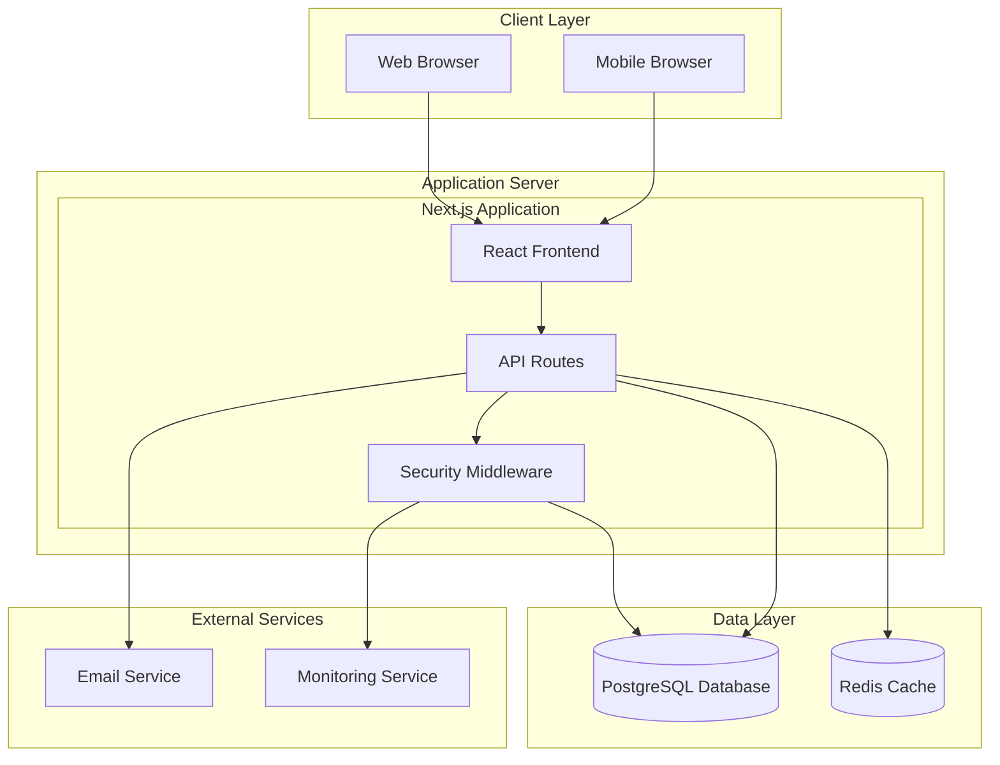

# System Overview

This document provides a high-level overview of the Kavach authentication and user management system architecture, including its core components, design principles, and system boundaries.

## System Purpose

Kavach is a comprehensive authentication and user management platform designed to handle multiple user roles (customers, experts, and administrators) with sophisticated profile management, approval workflows, and security features.

## High-Level Architecture

## Core System Components

### 1. Frontend Application
- **Technology**: React 19 with Next.js 15 App Router
- **Styling**: Tailwind CSS with custom design system
- **State Management**: Zustand for client-side state
- **Form Handling**: React Hook Form with Zod validation
- **UI Components**: Radix UI primitives with custom styling

### 2. Backend API
- **Technology**: Next.js API routes with TypeScript
- **Architecture**: Service-oriented with repository pattern
- **Authentication**: JWT-based with refresh token rotation
- **Validation**: Zod schemas for request/response validation
- **Error Handling**: Centralized error handling with correlation IDs

### 3. Database Layer
- **Primary Database**: PostgreSQL with ACID compliance
- **ORM**: Drizzle ORM for type-safe database operations
- **Migrations**: Version-controlled database schema migrations
- **Connection Management**: Connection pooling for performance

### 4. Security Layer
- **Authentication**: Multi-factor authentication support
- **Authorization**: Role-based access control (RBAC)
- **Rate Limiting**: Configurable rate limiting per endpoint
- **Security Headers**: Comprehensive security header implementation
- **Audit Logging**: Complete audit trail for security events

## System Boundaries

### Internal Components
- React frontend application
- Next.js API routes
- Authentication and authorization services
- User and profile management services
- Database repositories and data access layer
- Security middleware and validation

### External Dependencies
- PostgreSQL database server
- SMTP email service for notifications
- Monitoring and logging services
- CDN for static asset delivery (optional)

## User Roles and Permissions

### Customer Role
- **Purpose**: End users who consume services
- **Permissions**: 
  - Create and manage personal profile
  - Access customer-specific features
  - Update account settings
- **Approval**: Auto-approved upon email verification

### Expert Role
- **Purpose**: Service providers who offer expertise
- **Permissions**:
  - Create detailed professional profile
  - Access expert-specific features
  - Manage availability and preferences
- **Approval**: Manual approval required by administrators

### Admin Role
- **Purpose**: System administrators and moderators
- **Permissions**:
  - Full system access
  - User management (create, update, ban, pause)
  - Expert approval workflow
  - System monitoring and configuration
- **Approval**: Created by other administrators

## Data Flow Overview

### User Registration Flow
1. User submits registration form
2. System validates input and creates user record
3. Email verification sent to user
4. User verifies email and completes profile
5. Profile completion triggers role-specific workflows
6. Expert profiles require admin approval

### Authentication Flow
1. User submits login credentials
2. System validates credentials and user status
3. JWT access and refresh tokens generated
4. User session established with security context
5. Subsequent requests validated via middleware

### Profile Management Flow
1. User updates profile information
2. System validates changes and permissions
3. Changes saved with audit trail
4. Notifications sent for significant changes
5. Expert profile changes may require re-approval

## Security Architecture

### Defense in Depth
- **Perimeter Security**: Rate limiting and DDoS protection
- **Application Security**: Input validation and output encoding
- **Authentication Security**: Strong password policies and MFA
- **Authorization Security**: Principle of least privilege
- **Data Security**: Encryption at rest and in transit

### Security Monitoring
- **Audit Logging**: All security-relevant events logged
- **Anomaly Detection**: Unusual access patterns detected
- **Incident Response**: Automated response to security events
- **Compliance**: Security controls for regulatory compliance

## Performance Characteristics

### Scalability
- **Horizontal Scaling**: Stateless application design
- **Database Scaling**: Read replicas and connection pooling
- **Caching Strategy**: Multi-layer caching implementation
- **CDN Integration**: Static asset optimization

### Performance Targets
- **Page Load Time**: < 2 seconds for initial load
- **API Response Time**: < 500ms for most endpoints
- **Database Query Time**: < 100ms for typical queries
- **Concurrent Users**: Support for 1000+ concurrent users

## Deployment Architecture

### Development Environment
- Local development with hot reloading
- Docker Compose for local services
- Automated testing and validation

### Staging Environment
- Production-like environment for testing
- Automated deployment from main branch
- Integration testing and performance validation

### Production Environment
- High availability deployment
- Load balancing and failover
- Monitoring and alerting
- Backup and disaster recovery

## Integration Points

### Email Service Integration
- **Purpose**: User notifications and verification
- **Protocol**: SMTP with TLS encryption
- **Fallback**: Multiple email service providers
- **Templates**: HTML email templates with branding

### Monitoring Integration
- **Application Monitoring**: Performance and error tracking
- **Security Monitoring**: Security event correlation
- **Infrastructure Monitoring**: Server and database metrics
- **Alerting**: Real-time alerts for critical issues

## Quality Attributes

### Reliability
- **Availability**: 99.9% uptime target
- **Fault Tolerance**: Graceful degradation on failures
- **Data Integrity**: ACID compliance and validation
- **Backup Strategy**: Regular automated backups

### Security
- **Authentication**: Multi-factor authentication
- **Authorization**: Fine-grained access control
- **Data Protection**: Encryption and privacy controls
- **Compliance**: GDPR and security standard compliance

### Maintainability
- **Code Quality**: TypeScript and automated testing
- **Documentation**: Comprehensive technical documentation
- **Monitoring**: Observability and debugging tools
- **Modularity**: Loosely coupled component design

### Performance
- **Response Time**: Fast API and page load times
- **Throughput**: High concurrent user support
- **Resource Usage**: Efficient memory and CPU usage
- **Scalability**: Horizontal and vertical scaling support

## Technology Decisions

### Frontend Technology Stack
- **React 19**: Latest React features and performance improvements
- **Next.js 15**: App Router for modern routing and SSR
- **TypeScript**: Type safety and developer experience
- **Tailwind CSS**: Utility-first styling approach

### Backend Technology Stack
- **Next.js API Routes**: Unified full-stack framework
- **Drizzle ORM**: Type-safe database operations
- **PostgreSQL**: Robust relational database
- **JWT**: Stateless authentication tokens

### Development Tools
- **Vitest**: Fast unit and integration testing
- **ESLint**: Code quality and consistency
- **Docker**: Containerization and deployment
- **Git**: Version control and collaboration

## Future Considerations

### Planned Enhancements
- Microservices migration for specific components
- Real-time features with WebSocket support
- Advanced analytics and reporting
- Mobile application development

### Scalability Roadmap
- Database sharding for large datasets
- Caching layer optimization
- CDN integration for global performance
- Container orchestration with Kubernetes

### Security Roadmap
- Advanced threat detection
- Zero-trust security model
- Enhanced compliance features
- Security automation and orchestration

## Related Documentation

- [Component Architecture](./component-architecture.md) - Detailed component relationships
- [Data Flow](./data-flow.md) - Data processing and flow patterns
- [Technology Stack](./tech-stack.md) - Detailed technology information
- [Security Documentation](../security/README.md) - Security implementation details