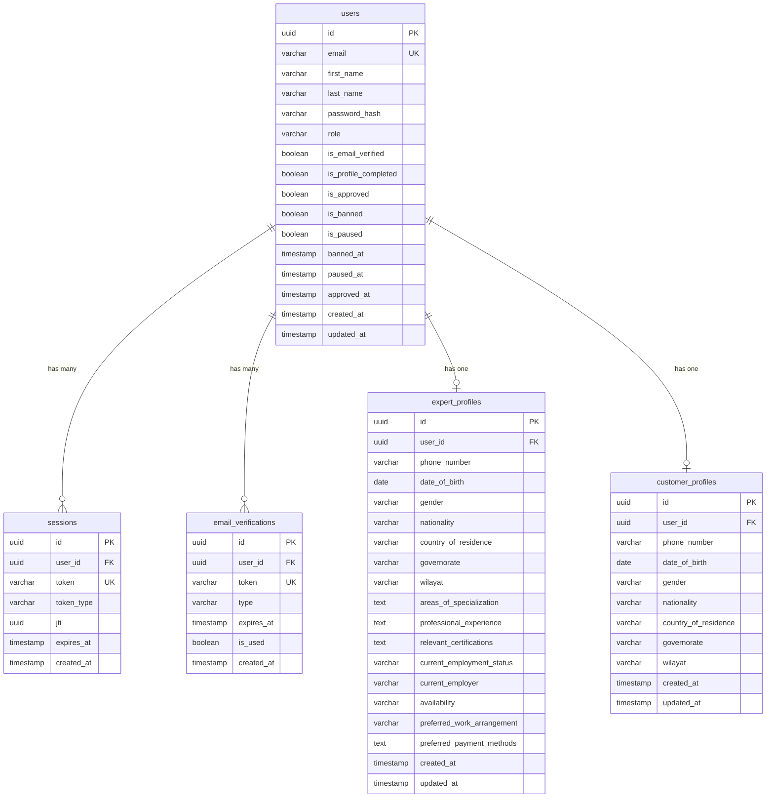

# Database Schema Documentation

## Overview

The Kavach application uses PostgreSQL as its primary database with Drizzle ORM for type-safe database operations. The schema is designed to support a comprehensive authentication and user management system with role-based access control, profile management, and session handling.

## Database Architecture

The database follows a normalized relational design with the following key principles:

- **ACID Compliance** - All operations maintain data consistency
- **Referential Integrity** - Foreign key constraints ensure data relationships
- **Cascade Deletion** - Related records are automatically cleaned up
- **UUID Primary Keys** - Globally unique identifiers for all entities
- **Audit Timestamps** - Created and updated timestamps for all entities

## Schema Overview



## Table Definitions

### users

The central user table containing authentication and basic user information.

```sql
CREATE TABLE "users" (
    "id" uuid PRIMARY KEY DEFAULT gen_random_uuid() NOT NULL,
    "email" varchar(255) NOT NULL UNIQUE,
    "first_name" varchar(100) NOT NULL,
    "last_name" varchar(100) NOT NULL,
    "password_hash" varchar(255) NOT NULL,
    "role" varchar(20) NOT NULL,
    "is_email_verified" boolean DEFAULT false NOT NULL,
    "is_profile_completed" boolean DEFAULT false NOT NULL,
    "is_approved" boolean DEFAULT true NOT NULL,
    "is_banned" boolean DEFAULT false NOT NULL,
    "is_paused" boolean DEFAULT false NOT NULL,
    "banned_at" timestamp,
    "paused_at" timestamp,
    "approved_at" timestamp,
    "created_at" timestamp DEFAULT now() NOT NULL,
    "updated_at" timestamp DEFAULT now() NOT NULL
);
```

**Field Descriptions:**

| Field | Type | Description | Constraints |
|-------|------|-------------|-------------|
| `id` | uuid | Primary key, auto-generated UUID | PRIMARY KEY, NOT NULL |
| `email` | varchar(255) | User's email address | UNIQUE, NOT NULL |
| `first_name` | varchar(100) | User's first name | NOT NULL |
| `last_name` | varchar(100) | User's last name | NOT NULL |
| `password_hash` | varchar(255) | bcrypt hashed password | NOT NULL |
| `role` | varchar(20) | User role: 'customer', 'expert', 'admin' | NOT NULL |
| `is_email_verified` | boolean | Email verification status | DEFAULT false, NOT NULL |
| `is_profile_completed` | boolean | Profile completion status | DEFAULT false, NOT NULL |
| `is_approved` | boolean | Account approval status (for experts) | DEFAULT true, NOT NULL |
| `is_banned` | boolean | Ban status (for experts) | DEFAULT false, NOT NULL |
| `is_paused` | boolean | Pause status (for customers) | DEFAULT false, NOT NULL |
| `banned_at` | timestamp | Timestamp when user was banned | NULL |
| `paused_at` | timestamp | Timestamp when user was paused | NULL |
| `approved_at` | timestamp | Timestamp when user was approved | NULL |
| `created_at` | timestamp | Record creation timestamp | DEFAULT now(), NOT NULL |
| `updated_at` | timestamp | Record last update timestamp | DEFAULT now(), NOT NULL |

**Indexes:**
- Primary key index on `id`
- Unique index on `email`
- Index on `role` for role-based queries
- Index on `is_email_verified` for verification status queries

### sessions

Session management table for JWT token tracking and revocation.

```sql
CREATE TABLE "sessions" (
    "id" uuid PRIMARY KEY DEFAULT gen_random_uuid() NOT NULL,
    "user_id" uuid NOT NULL REFERENCES users(id) ON DELETE CASCADE,
    "token" varchar(1000) NOT NULL UNIQUE,
    "token_type" varchar(20) NOT NULL DEFAULT 'access',
    "jti" uuid,
    "expires_at" timestamp NOT NULL,
    "created_at" timestamp DEFAULT now() NOT NULL
);
```

**Field Descriptions:**

| Field | Type | Description | Constraints |
|-------|------|-------------|-------------|
| `id` | uuid | Primary key, auto-generated UUID | PRIMARY KEY, NOT NULL |
| `user_id` | uuid | Reference to users table | FOREIGN KEY, NOT NULL |
| `token` | varchar(1000) | JWT token string | UNIQUE, NOT NULL |
| `token_type` | varchar(20) | Token type: 'access' or 'refresh' | DEFAULT 'access', NOT NULL |
| `jti` | uuid | JWT ID for token correlation | NULL |
| `expires_at` | timestamp | Token expiration timestamp | NOT NULL |
| `created_at` | timestamp | Record creation timestamp | DEFAULT now(), NOT NULL |

**Indexes:**
- Primary key index on `id`
- Unique index on `token`
- Index on `user_id` for user session queries
- Index on `jti` for JWT correlation
- Index on `expires_at` for cleanup operations

**Foreign Keys:**
- `user_id` → `users.id` (CASCADE DELETE)

### email_verifications

Email verification token management table.

```sql
CREATE TABLE "email_verifications" (
    "id" uuid PRIMARY KEY DEFAULT gen_random_uuid() NOT NULL,
    "user_id" uuid NOT NULL REFERENCES users(id) ON DELETE CASCADE,
    "token" varchar(512) NOT NULL UNIQUE,
    "type" varchar(20) NOT NULL,
    "expires_at" timestamp NOT NULL,
    "is_used" boolean DEFAULT false NOT NULL,
    "created_at" timestamp DEFAULT now() NOT NULL
);
```

**Field Descriptions:**

| Field | Type | Description | Constraints |
|-------|------|-------------|-------------|
| `id` | uuid | Primary key, auto-generated UUID | PRIMARY KEY, NOT NULL |
| `user_id` | uuid | Reference to users table | FOREIGN KEY, NOT NULL |
| `token` | varchar(512) | Verification token (JWT or random) | UNIQUE, NOT NULL |
| `type` | varchar(20) | Token type: 'magic_link' | NOT NULL |
| `expires_at` | timestamp | Token expiration timestamp | NOT NULL |
| `is_used` | boolean | Whether token has been used | DEFAULT false, NOT NULL |
| `created_at` | timestamp | Record creation timestamp | DEFAULT now(), NOT NULL |

**Indexes:**
- Primary key index on `id`
- Unique index on `token`
- Index on `user_id` for user verification queries
- Index on `expires_at` for cleanup operations

**Foreign Keys:**
- `user_id` → `users.id` (CASCADE DELETE)

### expert_profiles

Extended profile information for expert users.

```sql
CREATE TABLE "expert_profiles" (
    "id" uuid PRIMARY KEY DEFAULT gen_random_uuid() NOT NULL,
    "user_id" uuid NOT NULL REFERENCES users(id) ON DELETE CASCADE,
    "phone_number" varchar(20),
    "date_of_birth" date,
    "gender" varchar(20),
    "nationality" varchar(100),
    "country_of_residence" varchar(100),
    "governorate" varchar(100),
    "wilayat" varchar(100),
    "areas_of_specialization" text,
    "professional_experience" text,
    "relevant_certifications" text,
    "current_employment_status" varchar(50),
    "current_employer" varchar(200),
    "availability" varchar(50),
    "preferred_work_arrangement" varchar(50),
    "preferred_payment_methods" text,
    "created_at" timestamp DEFAULT now() NOT NULL,
    "updated_at" timestamp DEFAULT now() NOT NULL
);
```

**Field Descriptions:**

| Field | Type | Description | Constraints |
|-------|------|-------------|-------------|
| `id` | uuid | Primary key, auto-generated UUID | PRIMARY KEY, NOT NULL |
| `user_id` | uuid | Reference to users table | FOREIGN KEY, NOT NULL |
| `phone_number` | varchar(20) | Contact phone number | NULL |
| `date_of_birth` | date | Date of birth | NULL |
| `gender` | varchar(20) | Gender: 'male', 'female', 'prefer-not-to-say' | NULL |
| `nationality` | varchar(100) | Nationality | NULL |
| `country_of_residence` | varchar(100) | Country of residence | NULL |
| `governorate` | varchar(100) | Governorate (for Oman) | NULL |
| `wilayat` | varchar(100) | Wilayat (for Oman) | NULL |
| `areas_of_specialization` | text | JSON array of specializations | NULL |
| `professional_experience` | text | Professional experience description | NULL |
| `relevant_certifications` | text | JSON array of certifications | NULL |
| `current_employment_status` | varchar(50) | Employment status enum | NULL |
| `current_employer` | varchar(200) | Current employer name | NULL |
| `availability` | varchar(50) | Availability preference enum | NULL |
| `preferred_work_arrangement` | varchar(50) | Work arrangement preference | NULL |
| `preferred_payment_methods` | text | JSON array of payment methods | NULL |
| `created_at` | timestamp | Record creation timestamp | DEFAULT now(), NOT NULL |
| `updated_at` | timestamp | Record last update timestamp | DEFAULT now(), NOT NULL |

**Indexes:**
- Primary key index on `id`
- Unique index on `user_id` (one profile per user)
- Index on `availability` for availability queries
- Index on `current_employment_status` for status queries

**Foreign Keys:**
- `user_id` → `users.id` (CASCADE DELETE)

### customer_profiles

Extended profile information for customer users.

```sql
CREATE TABLE "customer_profiles" (
    "id" uuid PRIMARY KEY DEFAULT gen_random_uuid() NOT NULL,
    "user_id" uuid NOT NULL REFERENCES users(id) ON DELETE CASCADE,
    "phone_number" varchar(20),
    "date_of_birth" date,
    "gender" varchar(20),
    "nationality" varchar(100),
    "country_of_residence" varchar(100),
    "governorate" varchar(100),
    "wilayat" varchar(100),
    "created_at" timestamp DEFAULT now() NOT NULL,
    "updated_at" timestamp DEFAULT now() NOT NULL
);
```

**Field Descriptions:**

| Field | Type | Description | Constraints |
|-------|------|-------------|-------------|
| `id` | uuid | Primary key, auto-generated UUID | PRIMARY KEY, NOT NULL |
| `user_id` | uuid | Reference to users table | FOREIGN KEY, NOT NULL |
| `phone_number` | varchar(20) | Contact phone number | NULL |
| `date_of_birth` | date | Date of birth | NULL |
| `gender` | varchar(20) | Gender: 'male', 'female', 'prefer-not-to-say' | NULL |
| `nationality` | varchar(100) | Nationality | NULL |
| `country_of_residence` | varchar(100) | Country of residence | NULL |
| `governorate` | varchar(100) | Governorate (for Oman) | NULL |
| `wilayat` | varchar(100) | Wilayat (for Oman) | NULL |
| `created_at` | timestamp | Record creation timestamp | DEFAULT now(), NOT NULL |
| `updated_at` | timestamp | Record last update timestamp | DEFAULT now(), NOT NULL |

**Indexes:**
- Primary key index on `id`
- Unique index on `user_id` (one profile per user)

**Foreign Keys:**
- `user_id` → `users.id` (CASCADE DELETE)

## Data Types and Enums

### User Roles
```typescript
type UserRole = 'customer' | 'expert' | 'admin';
```

### Gender Options
```typescript
type Gender = 'male' | 'female' | 'prefer-not-to-say';
```

### Employment Status (Expert Profiles)
```typescript
type EmploymentStatus = 
  | 'employed' 
  | 'self-employed' 
  | 'unemployed' 
  | 'student' 
  | 'retired';
```

### Availability Options (Expert Profiles)
```typescript
type Availability = 
  | 'full-time' 
  | 'part-time' 
  | 'contract-based' 
  | 'weekends-only' 
  | 'flexible-hours';
```

### Token Types
```typescript
type TokenType = 'access' | 'refresh';
type VerificationType = 'magic_link';
```

## JSON Field Structures

### areas_of_specialization (Expert Profiles)
```json
[
  "JavaScript",
  "TypeScript",
  "React",
  "Node.js",
  "Python",
  "Data Science"
]
```

### relevant_certifications (Expert Profiles)
```json
[
  "AWS Certified Developer",
  "Google Cloud Professional",
  "Microsoft Azure Fundamentals",
  "Certified Scrum Master"
]
```

### preferred_payment_methods (Expert Profiles)
```json
[
  "bank_transfer",
  "paypal",
  "stripe",
  "cryptocurrency"
]
```

## Relationships and Constraints

### Primary Relationships

1. **User → Sessions** (One-to-Many)
   - One user can have multiple active sessions
   - Sessions are automatically deleted when user is deleted

2. **User → Email Verifications** (One-to-Many)
   - One user can have multiple verification tokens (for resends)
   - Verifications are automatically deleted when user is deleted

3. **User → Expert Profile** (One-to-One)
   - Each expert user has exactly one profile
   - Profile is automatically deleted when user is deleted

4. **User → Customer Profile** (One-to-One)
   - Each customer user has exactly one profile
   - Profile is automatically deleted when user is deleted

### Referential Integrity

All foreign key relationships use CASCADE DELETE to maintain data consistency:

```sql
-- Sessions cascade delete
ALTER TABLE sessions 
ADD CONSTRAINT sessions_user_id_fk 
FOREIGN KEY (user_id) REFERENCES users(id) ON DELETE CASCADE;

-- Email verifications cascade delete
ALTER TABLE email_verifications 
ADD CONSTRAINT email_verifications_user_id_fk 
FOREIGN KEY (user_id) REFERENCES users(id) ON DELETE CASCADE;

-- Expert profiles cascade delete
ALTER TABLE expert_profiles 
ADD CONSTRAINT expert_profiles_user_id_fk 
FOREIGN KEY (user_id) REFERENCES users(id) ON DELETE CASCADE;

-- Customer profiles cascade delete
ALTER TABLE customer_profiles 
ADD CONSTRAINT customer_profiles_user_id_fk 
FOREIGN KEY (user_id) REFERENCES users(id) ON DELETE CASCADE;
```

## Indexes and Performance

### Primary Indexes

All tables have primary key indexes on their `id` fields using UUID type.

### Unique Indexes

- `users.email` - Ensures email uniqueness
- `sessions.token` - Ensures token uniqueness
- `email_verifications.token` - Ensures verification token uniqueness
- `expert_profiles.user_id` - Ensures one profile per expert user
- `customer_profiles.user_id` - Ensures one profile per customer user

### Query Optimization Indexes

```sql
-- User role queries
CREATE INDEX idx_users_role ON users(role);

-- Email verification status queries
CREATE INDEX idx_users_email_verified ON users(is_email_verified);

-- Session cleanup queries
CREATE INDEX idx_sessions_expires_at ON sessions(expires_at);

-- JWT correlation queries
CREATE INDEX idx_sessions_jti ON sessions(jti);

-- User session queries
CREATE INDEX idx_sessions_user_id ON sessions(user_id);

-- Verification cleanup queries
CREATE INDEX idx_email_verifications_expires_at ON email_verifications(expires_at);

-- Expert availability queries
CREATE INDEX idx_expert_profiles_availability ON expert_profiles(availability);

-- Expert employment status queries
CREATE INDEX idx_expert_profiles_employment_status ON expert_profiles(current_employment_status);
```

## Data Validation

### Application-Level Validation

The application enforces additional validation rules beyond database constraints:

1. **Email Format** - Valid email format validation
2. **Password Strength** - Minimum 8 characters with complexity requirements
3. **Phone Number Format** - International phone number format
4. **Date Validation** - Reasonable date ranges for birth dates
5. **JSON Field Validation** - Valid JSON structure for array fields
6. **Enum Validation** - Valid enum values for choice fields

### Database-Level Constraints

1. **NOT NULL Constraints** - Required fields cannot be null
2. **UNIQUE Constraints** - Email addresses and tokens must be unique
3. **FOREIGN KEY Constraints** - Referential integrity enforcement
4. **CHECK Constraints** - Value range and format validation (can be added)

## Security Considerations

### Password Security

- Passwords are hashed using bcrypt with configurable rounds
- Password hashes are stored in the `password_hash` field
- Original passwords are never stored in the database

### Token Security

- JWT tokens are stored with expiration timestamps
- Tokens can be revoked by deleting session records
- JTI (JWT ID) field enables token correlation and revocation

### Data Protection

- Sensitive data is not logged in plain text
- Database connections use SSL/TLS encryption
- Access is controlled through database user permissions

### Audit Trail

- All tables include `created_at` timestamps
- User and profile tables include `updated_at` timestamps
- Application-level audit logging tracks all changes

## Migration History

### Migration 0000: Initial Schema
- Created `users`, `sessions`, and `email_verifications` tables
- Established basic foreign key relationships

### Migration 0001: Session Token Types
- Added `token_type` field to sessions table
- Enables differentiation between access and refresh tokens

### Migration 0002: JWT Correlation
- Added `jti` field to sessions table
- Enables JWT token correlation and revocation tracking

### Migration 0003: User Status Management
- Added `is_banned`, `is_paused`, `banned_at`, `paused_at` fields
- Enables admin control over user account status

### Future Migrations
- Profile tables (expert_profiles, customer_profiles) - To be added
- Additional audit fields as needed
- Performance optimization indexes

## Backup and Recovery

### Backup Strategy

1. **Daily Full Backups** - Complete database backup daily
2. **Continuous WAL Archiving** - Point-in-time recovery capability
3. **Cross-Region Replication** - Disaster recovery preparation

### Recovery Procedures

1. **Point-in-Time Recovery** - Restore to specific timestamp
2. **Table-Level Recovery** - Restore individual tables if needed
3. **Data Validation** - Verify data integrity after recovery

## Performance Monitoring

### Key Metrics

1. **Query Performance** - Monitor slow queries and execution times
2. **Index Usage** - Track index effectiveness and usage patterns
3. **Connection Pool** - Monitor connection pool utilization
4. **Storage Growth** - Track database size and growth patterns

### Optimization Strategies

1. **Query Optimization** - Regular query performance analysis
2. **Index Maintenance** - Regular index rebuilding and optimization
3. **Partitioning** - Consider table partitioning for large datasets
4. **Archiving** - Archive old data to maintain performance

## Development Guidelines

### Schema Changes

1. **Migration Scripts** - All schema changes must use migration scripts
2. **Backward Compatibility** - Ensure changes don't break existing code
3. **Testing** - Test migrations on development and staging environments
4. **Documentation** - Update schema documentation with changes

### Best Practices

1. **Use Transactions** - Wrap related operations in transactions
2. **Validate Input** - Always validate data before database operations
3. **Handle Errors** - Implement proper error handling for database operations
4. **Monitor Performance** - Track query performance and optimize as needed