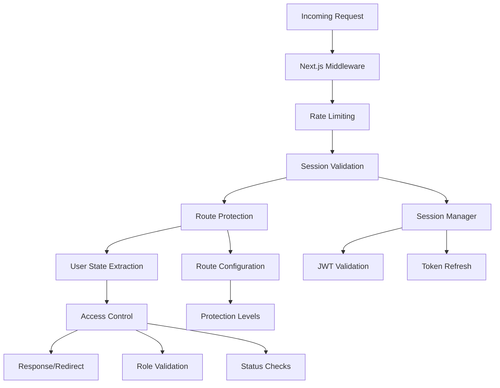

# Authentication Middleware

## Overview

The Authentication Middleware provides comprehensive authentication and authorization functionality for API routes and page access. It implements JWT-based session validation, role-based access control, email verification requirements, and security monitoring with a unified approach to request processing.

## Architecture

The middleware system is built with a layered architecture:



## Core Components

### 1. API Middleware (api-middleware.ts)

Provides middleware functions for API route protection with authentication, authorization, and rate limiting.

#### Key Functions

##### withAuth(handler)

Authenticates requests and adds user data to the request object.

```typescript
export async function withAuth(
  handler: (request: AuthenticatedRequest) => Promise<NextResponse>
) {
  return async (request: NextRequest): Promise<NextResponse> => {
    const session = await getSessionFromRequest(request);
    
    if (!session) {
      return NextResponse.json(
        { error: 'Authentication required', code: 'UNAUTHORIZED' },
        { status: 401 }
      );
    }

    // Add user data to request
    const authenticatedRequest = request as AuthenticatedRequest;
    authenticatedRequest.user = {
      userId: session.userId,
      email: session.email,
      role: session.role,
      isEmailVerified: session.isEmailVerified,
      isProfileCompleted: session.isProfileCompleted,
      isApproved: session.isApproved
    };

    return await handler(authenticatedRequest);
  };
}
```

**Usage Example:**
```typescript
// API route with authentication
export const GET = withAuth(async (request: AuthenticatedRequest) => {
  const userId = request.user?.userId;
  // Handle authenticated request
  return NextResponse.json({ userId });
});
```

##### withRole(roles, handler)

Enforces role-based access control for API endpoints.

```typescript
export function withRole(
  roles: string | string[],
  handler: (request: AuthenticatedRequest) => Promise<NextResponse>
) {
  return withAuth(async (request: AuthenticatedRequest): Promise<NextResponse> => {
    const userRole = request.user?.role;
    const allowedRoles = Array.isArray(roles) ? roles : [roles];

    if (!allowedRoles.includes(userRole)) {
      return NextResponse.json(
        {
          error: `Access denied. Required role(s): ${allowedRoles.join(', ')}`,
          code: 'INSUFFICIENT_PERMISSIONS'
        },
        { status: 403 }
      );
    }

    return await handler(request);
  });
}
```

**Usage Example:**
```typescript
// Admin-only API endpoint
export const DELETE = withRole('admin', async (request: AuthenticatedRequest) => {
  // Handle admin-only request
  return NextResponse.json({ success: true });
});

// Multi-role API endpoint
export const GET = withRole(['admin', 'expert'], async (request: AuthenticatedRequest) => {
  // Handle admin or expert request
  return NextResponse.json({ data: 'sensitive data' });
});
```

##### withEmailVerification(handler)

Requires email verification for API access.

```typescript
export function withEmailVerification(
  handler: (request: AuthenticatedRequest) => Promise<NextResponse>
) {
  return withAuth(async (request: AuthenticatedRequest): Promise<NextResponse> => {
    if (!request.user?.isEmailVerified) {
      return NextResponse.json(
        { error: 'Email verification required', code: 'EMAIL_NOT_VERIFIED' },
        { status: 403 }
      );
    }

    return await handler(request);
  });
}
```

##### withRateLimit(config, handler)

Applies rate limiting to API endpoints.

```typescript
export function withRateLimit(
  config: { windowMs: number; maxAttempts: number } = { windowMs: 15 * 60 * 1000, maxAttempts: 100 },
  handler: (request: NextRequest) => Promise<NextResponse>
) {
  return async (request: NextRequest): Promise<NextResponse> => {
    const result = checkRateLimit(request, { windowMs: config.windowMs, maxAttempts: config.maxAttempts }, 'api-generic');
    
    if (!result.success) {
      return NextResponse.json(
        {
          error: 'Rate limit exceeded',
          code: 'RATE_LIMIT_EXCEEDED',
          resetTime: new Date(result.resetTime).toISOString(),
          remaining: result.remaining
        },
        {
          status: 429,
          headers: {
            'Retry-After': result.retryAfter ? result.retryAfter.toString() : Math.ceil((result.resetTime - Date.now()) / 1000).toString()
          }
        }
      );
    }
    
    return handler(request);
  };
}
```

#### Middleware Combinations

The `apiMiddleware` object provides convenient combinations:

```typescript
export const apiMiddleware = {
  // Public API endpoint (no authentication required)
  public: (handler: (request: NextRequest) => Promise<NextResponse>) => handler,

  // Authenticated API endpoint
  auth: withAuth,

  // Admin-only API endpoint
  admin: withAdmin,

  // Role-based API endpoint
  role: withRole,

  // Email verification required API endpoint
  verified: withEmailVerification,

  // Rate limited API endpoint
  rateLimit: withRateLimit,

  // Authenticated + email verified API endpoint
  authVerified: (handler: (request: AuthenticatedRequest) => Promise<NextResponse>) =>
    withEmailVerification(handler),

  // Admin + rate limited API endpoint
  adminRateLimit: (handler: (request: AuthenticatedRequest) => Promise<NextResponse>) => 
    // Implementation combines admin auth with rate limiting
};
```

**Usage Examples:**
```typescript
// Public endpoint
export const GET = apiMiddleware.public(async (request) => {
  return NextResponse.json({ message: 'Public data' });
});

// Authenticated endpoint
export const POST = apiMiddleware.auth(async (request: AuthenticatedRequest) => {
  return NextResponse.json({ userId: request.user?.userId });
});

// Admin endpoint with rate limiting
export const DELETE = apiMiddleware.adminRateLimit(async (request: AuthenticatedRequest) => {
  return NextResponse.json({ success: true });
});
```

### 2. Global Middleware (middleware.ts)

Handles page-level authentication, routing, and security for the entire application.

#### Key Features

##### Request Correlation Tracking

Every request gets a unique correlation ID for tracking:

```typescript
const REQUEST_ID_HEADER = 'x-request-id';
const CORRELATION_ID_HEADER = 'x-correlation-id';

function addCorrelationHeaders(response: NextResponse, requestId: string): void {
  response.headers.set(REQUEST_ID_HEADER, requestId);
  response.headers.set(CORRELATION_ID_HEADER, requestId);
  response.headers.set('x-timestamp', new Date().toISOString());
}
```

##### Redirect Loop Prevention

Prevents infinite redirects with tracking and limits:

```typescript
const MAX_REDIRECTS = 3;
const REDIRECT_HISTORY_HEADER = 'x-redirect-count';

function createRedirect(request: NextRequest, path: string, requestId: string): NextResponse {
  const redirectCount = parseInt(request.headers.get(REDIRECT_HISTORY_HEADER) || '0', 10);
  
  // Prevent redirect loops
  if (request.nextUrl.pathname === path) {
    logger.warn('Redirect loop prevented - same path', { 
      currentPath: request.nextUrl.pathname, 
      targetPath: path,
      requestId,
      redirectCount
    });
    return NextResponse.next();
  }

  // Prevent excessive redirects
  if (redirectCount >= MAX_REDIRECTS) {
    logger.warn('Redirect loop prevented - max redirects exceeded');
    const fallbackUrl = new URL('/login', request.url);
    const response = NextResponse.redirect(fallbackUrl);
    addCorrelationHeaders(response, requestId, redirectCount + 1);
    return response;
  }

  const url = new URL(path, request.url);
  const response = NextResponse.redirect(url);
  addCorrelationHeaders(response, requestId, redirectCount + 1);
  
  return response;
}
```

##### Unified Rate Limiting

Applies rate limiting based on endpoint patterns:

```typescript
async function applyUnifiedRateLimit(
  request: NextRequest,
  pathname: string,
  requestId: string,
  config: any
): Promise<NextResponse | null> {
  const shouldRateLimit = config.rateLimiting.endpoints.some((endpoint: string) => 
    pathname.startsWith(endpoint)
  );

  if (!shouldRateLimit) {
    return null;
  }

  const rateLimiter = selectRateLimiter(pathname);
  
  if (!rateLimiter) {
    return null;
  }

  const result = rateLimiter(request);
  
  if (!result.success) {
    logger.warn('Rate limit exceeded', {
      pathname,
      requestId,
      clientIP: request.headers.get('x-forwarded-for') || 'unknown',
      blocked: result.blocked,
      retryAfter: result.retryAfter
    });

    return createRateLimitResponse(result, requestId);
  }

  return null;
}
```

##### Session Validation and Renewal

Processes session validation with automatic token refresh:

```typescript
async function processUnifiedSession(
  request: NextRequest,
  requestId: string
): Promise<{
  response: NextResponse;
  session: any;
  isValid: boolean;
}> {
  const initialResponse = NextResponse.next();
  
  try {
    const sessionResult = await sessionValidationMiddleware.processSessionMiddleware(
      request,
      initialResponse,
      requestId
    );

    return sessionResult;
  } catch (error) {
    logger.error('Unified session processing failed', { error, requestId });
    
    return {
      response: initialResponse,
      session: null,
      isValid: false
    };
  }
}
```

##### Route Access Control

Evaluates route access based on user state and requirements:

```typescript
interface UserState {
  isAuthenticated: boolean;
  isEmailVerified: boolean;
  isProfileCompleted: boolean;
  isApproved: boolean;
  userRole?: string;
  session?: any;
}

function evaluateRouteAccess(pathname: string, userState: UserState): RouteAccessResult {
  const routeRequirements = meetsRouteRequirements(
    pathname,
    userState.userRole,
    userState.isAuthenticated,
    userState.isEmailVerified,
    userState.isProfileCompleted,
    userState.isApproved
  );

  return {
    allowed: routeRequirements.allowed,
    reason: routeRequirements.reason,
    redirectTo: routeRequirements.redirectTo,
    statusCode: determineStatusCode(routeRequirements.reason)
  };
}
```

## Security Features

### 1. JWT Token Validation

- **Signature Verification** - Validates JWT signatures using secret keys
- **Expiration Checking** - Ensures tokens haven't expired
- **Payload Validation** - Validates token payload structure and claims
- **Revocation Support** - Checks against revoked token list

### 2. Session Management

- **Automatic Refresh** - Refreshes tokens before expiration
- **Session Cleanup** - Removes expired sessions
- **Multi-device Support** - Handles multiple active sessions per user
- **Secure Storage** - Stores session data securely

### 3. Rate Limiting

- **IP-based Limiting** - Limits requests per IP address
- **Endpoint-specific Limits** - Different limits for different endpoints
- **Sliding Window** - Uses sliding window algorithm for accurate limiting
- **Bypass for Authenticated Users** - Higher limits for authenticated requests

### 4. Security Headers

Adds security headers to all responses:

```typescript
function addSecurityHeaders(response: NextResponse): NextResponse {
  response.headers.set('X-Content-Type-Options', 'nosniff');
  response.headers.set('X-Frame-Options', 'DENY');
  response.headers.set('X-XSS-Protection', '1; mode=block');
  response.headers.set('Referrer-Policy', 'strict-origin-when-cross-origin');
  response.headers.set('Permissions-Policy', 'camera=(), microphone=(), geolocation=()');
  
  return response;
}
```

## Error Handling

### API Error Responses

Standardized error responses for API endpoints:

```typescript
export const apiErrors = {
  unauthorized: (message: string = 'Authentication required') =>
    NextResponse.json(
      { error: message, code: 'UNAUTHORIZED' },
      { status: 401 }
    ),

  forbidden: (message: string = 'Access denied') =>
    NextResponse.json(
      { error: message, code: 'FORBIDDEN' },
      { status: 403 }
    ),

  badRequest: (message: string = 'Bad request') =>
    NextResponse.json(
      { error: message, code: 'BAD_REQUEST' },
      { status: 400 }
    ),

  rateLimit: (resetTime?: number) =>
    NextResponse.json(
      {
        error: 'Rate limit exceeded',
        code: 'RATE_LIMIT_EXCEEDED',
        resetTime: resetTime ? new Date(resetTime).toISOString() : undefined
      },
      {
        status: 429,
        headers: resetTime ? {
          'Retry-After': Math.ceil((resetTime - Date.now()) / 1000).toString()
        } : {}
      }
    )
};
```

### Page Redirects

Handles page-level access control with appropriate redirects:

```typescript
function handleRouteAccessDenied(
  request: NextRequest,
  pathname: string,
  routeAccess: RouteAccessResult,
  requestId: string,
  config: any
): NextResponse {
  const isApiRoute = RouteChecker.isApiRoute(pathname);

  if (isApiRoute) {
    const errorCode = mapReasonToErrorCode(routeAccess.reason);
    
    return createApiErrorResponse(
      routeAccess.reason || 'Access denied',
      errorCode,
      routeAccess.statusCode || 403,
      requestId
    );
  }

  if (routeAccess.redirectTo) {
    return handlePageRedirect(request, pathname, routeAccess.redirectTo, requestId, config);
  }

  return createRedirect(request, '/login', requestId);
}
```

## Configuration

### Middleware Configuration

```typescript
interface MiddlewareConfig {
  rateLimiting: {
    enabled: boolean;
    endpoints: string[];
  };
  logging: {
    logRequests: boolean;
    logSecurity: boolean;
    logLevel: string;
  };
  redirects: {
    preserveQuery: boolean;
  };
}

const config = getMiddlewareConfig();
```

### Route Protection Levels

```typescript
enum ProtectionLevel {
  PUBLIC = 'public',
  AUTHENTICATED = 'authenticated',
  EMAIL_VERIFIED = 'email_verified',
  PROFILE_COMPLETED = 'profile_completed',
  APPROVED = 'approved',
  ADMIN = 'admin'
}
```

### Rate Limit Configurations

```typescript
export const RATE_LIMIT_CONFIGS = {
  LOGIN: {
    windowMs: 15 * 60 * 1000, // 15 minutes
    maxAttempts: 5,
    blockDurationMs: 30 * 60 * 1000 // 30 minutes
  },
  SIGNUP: {
    windowMs: 60 * 60 * 1000, // 1 hour
    maxAttempts: 3,
    blockDurationMs: 60 * 60 * 1000 // 1 hour
  },
  ADMIN_LOGIN: {
    windowMs: 15 * 60 * 1000, // 15 minutes
    maxAttempts: 3,
    blockDurationMs: 60 * 60 * 1000 // 1 hour
  }
};
```

## Usage Examples

### API Route Protection

```typescript
// Public API endpoint
export const GET = apiMiddleware.public(async (request) => {
  return NextResponse.json({ message: 'Public data' });
});

// Authenticated API endpoint
export const POST = apiMiddleware.auth(async (request: AuthenticatedRequest) => {
  const userId = request.user?.userId;
  return NextResponse.json({ userId });
});

// Admin-only API endpoint
export const DELETE = apiMiddleware.admin(async (request: AuthenticatedRequest) => {
  // Admin-only logic
  return NextResponse.json({ success: true });
});

// Role-based API endpoint
export const PUT = apiMiddleware.role(['admin', 'expert'], async (request: AuthenticatedRequest) => {
  // Admin or expert logic
  return NextResponse.json({ data: 'sensitive data' });
});

// Email verification required
export const PATCH = apiMiddleware.verified(async (request: AuthenticatedRequest) => {
  // Verified user logic
  return NextResponse.json({ verified: true });
});
```

### Custom Middleware Combinations

```typescript
// Custom middleware combining multiple requirements
const customMiddleware = (handler: (request: AuthenticatedRequest) => Promise<NextResponse>) =>
  withRateLimit(
    { windowMs: 5 * 60 * 1000, maxAttempts: 10 },
    withEmailVerification(
      withRole(['admin', 'expert'], handler)
    )
  );

export const POST = customMiddleware(async (request: AuthenticatedRequest) => {
  // Rate limited, email verified, admin or expert only
  return NextResponse.json({ success: true });
});
```

## Testing

### Unit Tests

```typescript
describe('Authentication Middleware', () => {
  describe('withAuth', () => {
    it('should authenticate valid JWT tokens', async () => {
      const request = createMockRequest({ 
        headers: { authorization: 'Bearer valid-jwt-token' }
      });
      
      const handler = jest.fn().mockResolvedValue(NextResponse.json({ success: true }));
      const middleware = withAuth(handler);
      
      await middleware(request);
      
      expect(handler).toHaveBeenCalledWith(
        expect.objectContaining({
          user: expect.objectContaining({
            userId: 'user-123',
            email: 'user@example.com'
          })
        })
      );
    });

    it('should reject invalid JWT tokens', async () => {
      const request = createMockRequest({ 
        headers: { authorization: 'Bearer invalid-token' }
      });
      
      const handler = jest.fn();
      const middleware = withAuth(handler);
      
      const response = await middleware(request);
      
      expect(response.status).toBe(401);
      expect(handler).not.toHaveBeenCalled();
    });
  });

  describe('withRole', () => {
    it('should allow access for correct role', async () => {
      const request = createAuthenticatedRequest({ role: 'admin' });
      const handler = jest.fn().mockResolvedValue(NextResponse.json({ success: true }));
      const middleware = withRole('admin', handler);
      
      await middleware(request);
      
      expect(handler).toHaveBeenCalled();
    });

    it('should deny access for incorrect role', async () => {
      const request = createAuthenticatedRequest({ role: 'customer' });
      const handler = jest.fn();
      const middleware = withRole('admin', handler);
      
      const response = await middleware(request);
      
      expect(response.status).toBe(403);
      expect(handler).not.toHaveBeenCalled();
    });
  });
});
```

### Integration Tests

```typescript
describe('Middleware Integration', () => {
  it('should handle complete authentication flow', async () => {
    // Test complete flow from request to response
    const request = createMockRequest({
      url: '/api/admin/users',
      method: 'GET',
      headers: { authorization: 'Bearer admin-token' }
    });

    const response = await runMiddleware(request);
    
    expect(response.status).toBe(200);
    expect(response.headers.get('x-correlation-id')).toBeDefined();
  });
});
```

## Performance Considerations

### Optimization Strategies

1. **Token Caching** - Cache validated tokens to reduce JWT verification overhead
2. **Session Pooling** - Reuse database connections for session validation
3. **Rate Limit Storage** - Use efficient in-memory storage for rate limiting
4. **Middleware Ordering** - Order middleware by performance impact

### Monitoring Metrics

- Authentication success/failure rates
- Token validation times
- Rate limit hit rates
- Middleware execution times
- Memory usage patterns

## Troubleshooting

### Common Issues

1. **Token Validation Failures**
   - Check JWT secret configuration
   - Verify token format and structure
   - Check token expiration settings

2. **Rate Limit Issues**
   - Verify IP address detection
   - Check rate limit configuration
   - Review rate limit storage

3. **Redirect Loops**
   - Check route configuration
   - Verify user state requirements
   - Review redirect logic

4. **Session Issues**
   - Verify session storage configuration
   - Check session cleanup processes
   - Review token refresh logic

### Debug Logging

Enable debug logging for troubleshooting:

```bash
DEBUG=auth:middleware npm run dev
```

This provides detailed logging for:
- Request processing steps
- Authentication validation
- Authorization checks
- Rate limiting decisions
- Redirect logic
- Error handling flows