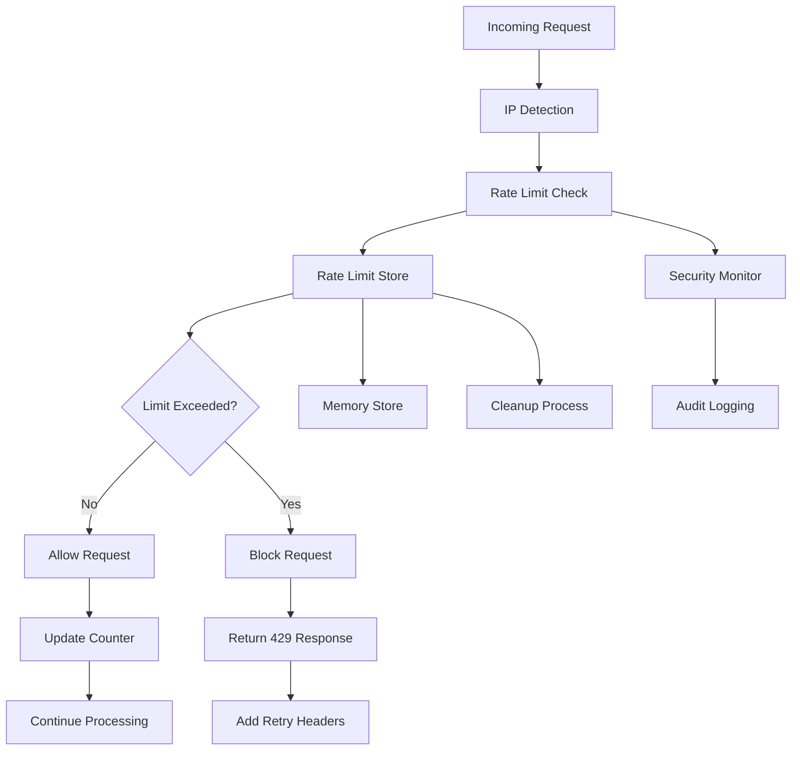

# Rate Limiting Middleware

## Overview

The Rate Limiting Middleware provides comprehensive protection against abuse, brute force attacks, and excessive API usage. It implements a sliding window algorithm with configurable limits per endpoint, IP-based tracking, and automatic blocking capabilities with detailed monitoring and logging.

## Architecture

The rate limiting system uses a multi-layered approach:



## Core Components

### 1. Rate Limiter (rate-limiter.ts)

The main rate limiting engine that handles request counting, limit enforcement, and blocking logic.

#### Configuration Structure

```typescript
interface RateLimitConfig {
  windowMs: number;           // Time window in milliseconds
  maxAttempts: number;        // Maximum attempts per window
  blockDurationMs?: number;   // How long to block after exceeding limit
  keyGenerator?: (request: NextRequest) => string; // Custom key generator
}
```

#### Default Configurations

```typescript
export const RATE_LIMIT_CONFIGS = {
  LOGIN: {
    windowMs: 15 * 60 * 1000,      // 15 minutes
    maxAttempts: 5,                 // 5 attempts per 15 minutes
    blockDurationMs: 30 * 60 * 1000 // Block for 30 minutes after exceeding
  },
  SIGNUP: {
    windowMs: 60 * 60 * 1000,      // 1 hour
    maxAttempts: 3,                 // 3 signups per hour per IP
    blockDurationMs: 60 * 60 * 1000 // Block for 1 hour
  },
  EMAIL_VERIFICATION: {
    windowMs: 60 * 60 * 1000,      // 1 hour
    maxAttempts: 10,                // 10 verification attempts per hour
    blockDurationMs: 60 * 60 * 1000 // Block for 1 hour
  },
  RESEND_VERIFICATION: {
    windowMs: 60 * 60 * 1000,      // 1 hour
    maxAttempts: 3,                 // 3 resend attempts per hour
    blockDurationMs: 2 * 60 * 60 * 1000 // Block for 2 hours
  },
  ADMIN_LOGIN: {
    windowMs: 15 * 60 * 1000,      // 15 minutes
    maxAttempts: 3,                 // 3 attempts per 15 minutes (stricter for admin)
    blockDurationMs: 60 * 60 * 1000 // Block for 1 hour
  }
};
```

#### Rate Limit Result

```typescript
export interface RateLimitResult {
  success: boolean;        // Whether request is allowed
  limit: number;          // Maximum allowed attempts
  remaining: number;      // Remaining attempts in current window
  resetTime: number;      // When the window resets (timestamp)
  retryAfter?: number;    // Seconds until next attempt allowed
  blocked: boolean;       // Whether IP is currently blocked
  blockedUntil?: number;  // When block expires (timestamp)
}
```

### 2. Rate Limit Store (rate-limit-store.ts)

Manages the storage and retrieval of rate limit data with automatic cleanup.

#### Store Interface

```typescript
export interface RateLimitStore {
  get(key: string): RateLimitEntry | undefined;
  set(key: string, entry: RateLimitEntry): void;
  delete(key: string): void;
  clear(): void;
  size(): number;
}

export interface RateLimitEntry {
  attempts: number;
  resetTime: number;
  blockedUntil?: number;
}
```

#### Default Memory Store

```typescript
class MemoryRateLimitStore implements RateLimitStore {
  private store = new Map<string, RateLimitEntry>();
  private cleanupInterval: NodeJS.Timeout;

  constructor() {
    // Cleanup expired entries every 5 minutes
    this.cleanupInterval = setInterval(() => {
      this.cleanup();
    }, 5 * 60 * 1000);
  }

  get(key: string): RateLimitEntry | undefined {
    const entry = this.store.get(key);
    
    // Return undefined if entry is expired
    if (entry && entry.resetTime <= Date.now()) {
      this.store.delete(key);
      return undefined;
    }
    
    return entry;
  }

  set(key: string, entry: RateLimitEntry): void {
    this.store.set(key, entry);
  }

  private cleanup(): void {
    const now = Date.now();
    
    for (const [key, entry] of this.store) {
      // Remove expired entries
      if (entry.resetTime <= now && (!entry.blockedUntil || entry.blockedUntil <= now)) {
        this.store.delete(key);
      }
    }
  }
}
```

## Core Functions

### checkRateLimit(request, config, identifier)

Main function that checks and enforces rate limits.

```typescript
export function checkRateLimit(
  request: NextRequest,
  config: RateLimitConfig,
  identifier: string = 'default'
): RateLimitResult {
  const now = Date.now();
  const key = generateRateLimitKey(request, identifier, config.keyGenerator);
  const entry = rateLimitStore.get(key) as RateLimitEntry | undefined;

  // Check if currently blocked
  if (entry?.blockedUntil && entry.blockedUntil > now) {
    return {
      success: false,
      limit: config.maxAttempts,
      remaining: 0,
      resetTime: entry.resetTime,
      retryAfter: Math.ceil((entry.blockedUntil - now) / 1000),
      blocked: true,
      blockedUntil: entry.blockedUntil
    };
  }

  // Initialize or reset if window has passed
  if (!entry || entry.resetTime <= now) {
    const newEntry: RateLimitEntry = {
      attempts: 1,
      resetTime: now + config.windowMs
    };
    rateLimitStore.set(key, newEntry);

    return {
      success: true,
      limit: config.maxAttempts,
      remaining: config.maxAttempts - 1,
      resetTime: newEntry.resetTime,
      blocked: false
    };
  }

  // Increment attempts
  entry.attempts += 1;

  // Check if limit exceeded
  if (entry.attempts > config.maxAttempts) {
    // Set block duration if configured
    if (config.blockDurationMs) {
      entry.blockedUntil = now + config.blockDurationMs;
    }

    rateLimitStore.set(key, entry);

    return {
      success: false,
      limit: config.maxAttempts,
      remaining: 0,
      resetTime: entry.resetTime,
      retryAfter: config.blockDurationMs ? Math.ceil(config.blockDurationMs / 1000) : Math.ceil((entry.resetTime - now) / 1000),
      blocked: true,
      blockedUntil: entry.blockedUntil
    };
  }

  // Update entry
  rateLimitStore.set(key, entry);

  return {
    success: true,
    limit: config.maxAttempts,
    remaining: config.maxAttempts - entry.attempts,
    resetTime: entry.resetTime,
    blocked: false
  };
}
```

### IP Address Detection

Robust IP address detection that handles various proxy configurations:

```typescript
function getClientIP(request: NextRequest): string {
  // Check various headers for the real IP
  const forwarded = request.headers.get('x-forwarded-for');
  const realIP = request.headers.get('x-real-ip');
  const cfConnectingIP = request.headers.get('cf-connecting-ip');

  if (forwarded) {
    return forwarded.split(',')[0].trim();
  }

  if (realIP) {
    return realIP;
  }

  if (cfConnectingIP) {
    return cfConnectingIP;
  }

  // Fallback to a default value if no IP is found
  return 'unknown';
}
```

### Key Generation

Generates unique keys for rate limit tracking:

```typescript
function generateRateLimitKey(
  request: NextRequest, 
  prefix: string, 
  customKeyGenerator?: (req: NextRequest) => string
): string {
  if (customKeyGenerator) {
    return `${prefix}:${customKeyGenerator(request)}`;
  }

  // Use IP address as default key
  const ip = getClientIP(request);
  return `${prefix}:${ip}`;
}
```

## Predefined Rate Limiters

The system provides predefined rate limiters for common authentication endpoints:

```typescript
export const rateLimiters = {
  login: (request: NextRequest) => 
    checkRateLimit(request, RATE_LIMIT_CONFIGS.LOGIN, 'login'),
    
  signup: (request: NextRequest) => 
    checkRateLimit(request, RATE_LIMIT_CONFIGS.SIGNUP, 'signup'),
    
  emailVerification: (request: NextRequest) => 
    checkRateLimit(request, RATE_LIMIT_CONFIGS.EMAIL_VERIFICATION, 'email-verify'),
    
  resendVerification: (request: NextRequest) => 
    checkRateLimit(request, RATE_LIMIT_CONFIGS.RESEND_VERIFICATION, 'resend-verify'),
    
  adminLogin: (request: NextRequest) => 
    checkRateLimit(request, RATE_LIMIT_CONFIGS.ADMIN_LOGIN, 'admin-login')
};
```

## HTTP Headers

### Standard Rate Limit Headers

The system implements standard rate limit headers as per draft-ietf-httpapi-ratelimit-headers:

```typescript
export function getRateLimitHeaders(result: RateLimitResult): Record<string, string> {
  const headers: Record<string, string> = {
    'X-RateLimit-Limit': result.limit.toString(),
    'X-RateLimit-Remaining': result.remaining.toString(),
    'X-RateLimit-Reset': Math.ceil(result.resetTime / 1000).toString()
  };

  if (result.retryAfter) {
    headers['Retry-After'] = result.retryAfter.toString();
  }

  if (result.blocked && result.blockedUntil) {
    headers['X-RateLimit-Blocked-Until'] = Math.ceil(result.blockedUntil / 1000).toString();
  }

  return headers;
}
```

### Header Descriptions

| Header | Description | Example |
|--------|-------------|---------|
| `X-RateLimit-Limit` | Maximum requests allowed in window | `5` |
| `X-RateLimit-Remaining` | Remaining requests in current window | `3` |
| `X-RateLimit-Reset` | Unix timestamp when window resets | `1640995200` |
| `Retry-After` | Seconds until next request allowed | `1800` |
| `X-RateLimit-Blocked-Until` | Unix timestamp when block expires | `1640997000` |

## Error Responses

### Rate Limit Exceeded Response

```typescript
export function createRateLimitErrorResponse(result: RateLimitResult): {
  error: string;
  message: string;
  retryAfter?: number;
  blockedUntil?: number;
} {
  if (result.blocked) {
    return {
      error: 'RATE_LIMIT_EXCEEDED',
      message: 'Too many attempts. Please try again later.',
      retryAfter: result.retryAfter,
      blockedUntil: result.blockedUntil
    };
  }

  return {
    error: 'RATE_LIMIT_EXCEEDED',
    message: `Too many attempts. You have ${result.remaining} attempts remaining.`,
    retryAfter: result.retryAfter
  };
}
```

### HTTP Response Format

```json
{
  "success": false,
  "error": "RATE_LIMIT_EXCEEDED",
  "message": "Too many login attempts. Please try again later.",
  "retryAfter": 1800,
  "blockedUntil": 1640997000,
  "timestamp": "2024-01-01T12:00:00Z",
  "requestId": "req_123456"
}
```

## Integration Examples

### API Route Integration

```typescript
// Using predefined rate limiter
export async function POST(request: NextRequest) {
  const rateLimitResult = rateLimiters.login(request);
  
  if (!rateLimitResult.success) {
    const headers = getRateLimitHeaders(rateLimitResult);
    const errorResponse = createRateLimitErrorResponse(rateLimitResult);
    
    return NextResponse.json(errorResponse, {
      status: 429,
      headers
    });
  }

  // Process login request
  return NextResponse.json({ success: true });
}
```

### Custom Rate Limiter

```typescript
// Custom rate limiter for specific endpoint
const customConfig: RateLimitConfig = {
  windowMs: 5 * 60 * 1000,    // 5 minutes
  maxAttempts: 20,            // 20 attempts
  blockDurationMs: 10 * 60 * 1000, // 10 minute block
  keyGenerator: (request) => {
    // Custom key based on user ID if authenticated
    const userId = getUserIdFromRequest(request);
    return userId || getClientIP(request);
  }
};

export async function POST(request: NextRequest) {
  const rateLimitResult = checkRateLimit(request, customConfig, 'custom-endpoint');
  
  if (!rateLimitResult.success) {
    return NextResponse.json(
      createRateLimitErrorResponse(rateLimitResult),
      { 
        status: 429,
        headers: getRateLimitHeaders(rateLimitResult)
      }
    );
  }

  // Process request
  return NextResponse.json({ success: true });
}
```

### Middleware Integration

```typescript
// Rate limiting middleware
export function withRateLimit(
  config: RateLimitConfig,
  identifier: string
) {
  return (handler: (request: NextRequest) => Promise<NextResponse>) => {
    return async (request: NextRequest): Promise<NextResponse> => {
      const result = checkRateLimit(request, config, identifier);
      
      if (!result.success) {
        return NextResponse.json(
          createRateLimitErrorResponse(result),
          {
            status: 429,
            headers: getRateLimitHeaders(result)
          }
        );
      }
      
      return handler(request);
    };
  };
}

// Usage
export const POST = withRateLimit(
  RATE_LIMIT_CONFIGS.LOGIN,
  'login'
)(async (request: NextRequest) => {
  // Handle login
  return NextResponse.json({ success: true });
});
```

## Security Features

### Brute Force Protection

The rate limiter provides multiple layers of brute force protection:

1. **Request Limiting** - Limits requests per time window
2. **Progressive Blocking** - Increases block duration for repeated violations
3. **IP-based Tracking** - Tracks attempts per IP address
4. **Automatic Cleanup** - Removes expired entries to prevent memory leaks

### Attack Mitigation

1. **DDoS Protection** - Limits requests to prevent service overload
2. **Credential Stuffing** - Prevents automated login attempts
3. **Account Enumeration** - Limits signup and verification attempts
4. **API Abuse** - Protects against excessive API usage

### Monitoring and Alerting

```typescript
// Security event logging
if (!result.success) {
  securityMonitor.recordEvent({
    type: SecurityEventType.RATE_LIMIT_EXCEEDED,
    severity: result.blocked ? 'high' : 'medium',
    ip: getClientIP(request),
    requestId: correlationId,
    details: { 
      endpoint: identifier, 
      attempts: result.limit,
      blocked: result.blocked,
      blockedUntil: result.blockedUntil
    }
  });
}
```

## Performance Considerations

### Memory Management

1. **Automatic Cleanup** - Expired entries are automatically removed
2. **Memory Limits** - Store size is monitored and limited
3. **Efficient Storage** - Uses Map for O(1) lookup performance
4. **Garbage Collection** - Proper cleanup prevents memory leaks

### Optimization Strategies

1. **Key Compression** - Use efficient key generation
2. **Batch Cleanup** - Clean up expired entries in batches
3. **Memory Monitoring** - Monitor store size and performance
4. **Configurable Intervals** - Adjust cleanup intervals based on load

### Scalability

For high-traffic applications, consider:

1. **Redis Store** - Use Redis for distributed rate limiting
2. **Database Store** - Persistent storage for rate limit data
3. **Clustering** - Coordinate rate limits across multiple instances
4. **Load Balancing** - Distribute rate limiting across servers

## Configuration

### Environment Variables

```bash
# Rate Limiting Configuration
RATE_LIMIT_ENABLED=true
RATE_LIMIT_CLEANUP_INTERVAL=300000  # 5 minutes
RATE_LIMIT_MAX_STORE_SIZE=10000

# Login Rate Limiting
LOGIN_RATE_LIMIT_WINDOW=900000      # 15 minutes
LOGIN_RATE_LIMIT_MAX=5
LOGIN_RATE_LIMIT_BLOCK=1800000      # 30 minutes

# Signup Rate Limiting
SIGNUP_RATE_LIMIT_WINDOW=3600000    # 1 hour
SIGNUP_RATE_LIMIT_MAX=3
SIGNUP_RATE_LIMIT_BLOCK=3600000     # 1 hour
```

### Dynamic Configuration

```typescript
// Load configuration from environment or database
function loadRateLimitConfig(): Record<string, RateLimitConfig> {
  return {
    login: {
      windowMs: parseInt(process.env.LOGIN_RATE_LIMIT_WINDOW || '900000'),
      maxAttempts: parseInt(process.env.LOGIN_RATE_LIMIT_MAX || '5'),
      blockDurationMs: parseInt(process.env.LOGIN_RATE_LIMIT_BLOCK || '1800000')
    },
    signup: {
      windowMs: parseInt(process.env.SIGNUP_RATE_LIMIT_WINDOW || '3600000'),
      maxAttempts: parseInt(process.env.SIGNUP_RATE_LIMIT_MAX || '3'),
      blockDurationMs: parseInt(process.env.SIGNUP_RATE_LIMIT_BLOCK || '3600000')
    }
  };
}
```

## Testing

### Unit Tests

```typescript
describe('Rate Limiter', () => {
  beforeEach(() => {
    // Reset rate limit store
    rateLimitStore.clear();
  });

  describe('checkRateLimit', () => {
    it('should allow requests within limit', () => {
      const request = createMockRequest();
      const config = { windowMs: 60000, maxAttempts: 5 };
      
      const result = checkRateLimit(request, config, 'test');
      
      expect(result.success).toBe(true);
      expect(result.remaining).toBe(4);
    });

    it('should block requests exceeding limit', () => {
      const request = createMockRequest();
      const config = { windowMs: 60000, maxAttempts: 2 };
      
      // Make requests up to limit
      checkRateLimit(request, config, 'test');
      checkRateLimit(request, config, 'test');
      
      // This should be blocked
      const result = checkRateLimit(request, config, 'test');
      
      expect(result.success).toBe(false);
      expect(result.remaining).toBe(0);
    });

    it('should reset after window expires', async () => {
      const request = createMockRequest();
      const config = { windowMs: 100, maxAttempts: 1 };
      
      // Exceed limit
      checkRateLimit(request, config, 'test');
      const blockedResult = checkRateLimit(request, config, 'test');
      expect(blockedResult.success).toBe(false);
      
      // Wait for window to expire
      await new Promise(resolve => setTimeout(resolve, 150));
      
      // Should be allowed again
      const allowedResult = checkRateLimit(request, config, 'test');
      expect(allowedResult.success).toBe(true);
    });
  });

  describe('IP Detection', () => {
    it('should extract IP from x-forwarded-for header', () => {
      const request = createMockRequest({
        headers: { 'x-forwarded-for': '192.168.1.1, 10.0.0.1' }
      });
      
      const ip = getClientIP(request);
      expect(ip).toBe('192.168.1.1');
    });

    it('should extract IP from x-real-ip header', () => {
      const request = createMockRequest({
        headers: { 'x-real-ip': '192.168.1.2' }
      });
      
      const ip = getClientIP(request);
      expect(ip).toBe('192.168.1.2');
    });
  });
});
```

### Integration Tests

```typescript
describe('Rate Limiting Integration', () => {
  it('should rate limit login attempts', async () => {
    const loginEndpoint = '/api/auth/login';
    
    // Make requests up to limit
    for (let i = 0; i < 5; i++) {
      const response = await fetch(loginEndpoint, {
        method: 'POST',
        body: JSON.stringify({ email: 'test@example.com', password: 'wrong' })
      });
      expect(response.status).toBe(401); // Invalid credentials
    }
    
    // Next request should be rate limited
    const response = await fetch(loginEndpoint, {
      method: 'POST',
      body: JSON.stringify({ email: 'test@example.com', password: 'wrong' })
    });
    
    expect(response.status).toBe(429);
    expect(response.headers.get('X-RateLimit-Remaining')).toBe('0');
  });
});
```

## Monitoring and Metrics

### Key Metrics

1. **Rate Limit Hit Rate** - Percentage of requests that hit rate limits
2. **Block Rate** - Percentage of IPs that get blocked
3. **Average Attempts** - Average attempts per IP before hitting limit
4. **Store Size** - Number of entries in rate limit store
5. **Cleanup Efficiency** - Rate of expired entry cleanup

### Monitoring Implementation

```typescript
class RateLimitMonitor {
  private metrics = {
    totalRequests: 0,
    blockedRequests: 0,
    rateLimitHits: 0,
    storeSize: 0
  };

  recordRequest(result: RateLimitResult): void {
    this.metrics.totalRequests++;
    
    if (!result.success) {
      this.metrics.rateLimitHits++;
      
      if (result.blocked) {
        this.metrics.blockedRequests++;
      }
    }
    
    this.metrics.storeSize = rateLimitStore.size();
  }

  getMetrics() {
    return {
      ...this.metrics,
      hitRate: (this.metrics.rateLimitHits / this.metrics.totalRequests) * 100,
      blockRate: (this.metrics.blockedRequests / this.metrics.totalRequests) * 100
    };
  }
}
```

## Troubleshooting

### Common Issues

1. **Rate Limits Too Strict**
   - Increase `maxAttempts` or `windowMs`
   - Review legitimate usage patterns
   - Consider user-specific limits

2. **Memory Usage High**
   - Reduce cleanup interval
   - Implement store size limits
   - Consider external storage

3. **IP Detection Issues**
   - Verify proxy configuration
   - Check header forwarding
   - Test with different client setups

4. **False Positives**
   - Review rate limit configurations
   - Consider whitelisting trusted IPs
   - Implement user-based limiting

### Debug Information

Enable debug logging:

```bash
DEBUG=rate-limit:* npm run dev
```

This provides detailed information about:
- Rate limit checks and results
- IP address detection
- Store operations and cleanup
- Block and unblock events
- Performance metrics