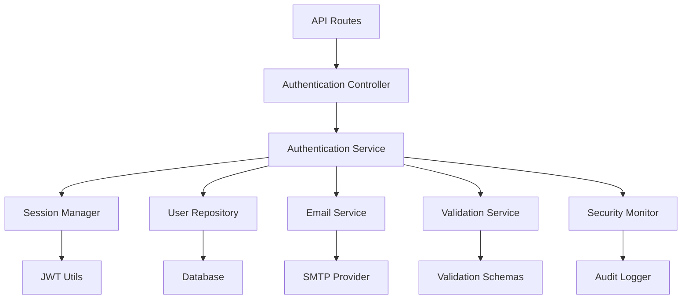

# Authentication Service

## Overview

The Authentication Service is the core component responsible for user authentication, registration, email verification, and session management. It provides a comprehensive authentication system with security features including rate limiting, anomaly detection, and audit logging.

## Architecture

The Authentication Service follows a layered architecture pattern:



## Core Features

### User Registration (Signup)

Handles new user registration with comprehensive validation and security measures.

**Process Flow:**
1. Input validation using unified validation service
2. Rate limiting check to prevent abuse
3. Email uniqueness verification
4. Password hashing with bcrypt
5. User creation in database
6. Email verification token generation
7. Verification email sending
8. Audit logging and metrics recording

**Security Features:**
- Rate limiting (configurable attempts per time window)
- Password strength validation
- Email format validation
- Duplicate email prevention
- Audit trail logging

### User Authentication (Login)

Authenticates users and creates secure sessions with role-based access control.

**Process Flow:**
1. Input validation and sanitization
2. Rate limiting enforcement
3. User lookup by email
4. Password verification
5. Role-based access validation
6. Account status checks (banned/paused)
7. Session creation with JWT tokens
8. Security event logging

**Security Features:**
- Brute force protection via rate limiting
- Account lockout for banned/paused users
- Role-based access control
- Anomaly detection for suspicious login patterns
- Failed login attempt tracking

### Email Verification

Secure email verification system using JWT-based magic links.

**Process Flow:**
1. Token validation and expiration check
2. JWT signature verification
3. User ID and email matching
4. Email verification status update
5. Verification token cleanup
6. Audit logging

**Security Features:**
- JWT token validation with signature verification
- Token expiration enforcement
- Token manipulation detection
- Single-use token system

### Session Management

Unified session management with automatic cleanup and refresh capabilities.

**Features:**
- JWT-based access and refresh tokens
- Automatic token refresh
- Session invalidation
- Multi-device session support
- Session cleanup on logout

### Password Security

Comprehensive password handling with security best practices.

**Features:**
- bcrypt hashing with configurable rounds
- Password strength validation
- Secure password comparison
- Password change with current password verification

## API Methods

### signup(data, context)

Registers a new user account.

**Parameters:**
- `data: SignupData` - User registration data
- `context: RequestContext` - Request context with correlation ID and client info

**Returns:** `ServiceResult<SignupResult>`

**Example:**
```typescript
const result = await authenticationService.signup({
  email: 'user@example.com',
  firstName: 'John',
  lastName: 'Doe',
  password: 'securePassword123',
  role: 'customer'
}, {
  correlationId: 'req_123',
  clientIP: '192.168.1.1',
  userAgent: 'Mozilla/5.0...',
  timestamp: new Date()
});
```

### login(data, context)

Authenticates a user and creates a session.

**Parameters:**
- `data: LoginData` - Login credentials
- `context: RequestContext` - Request context

**Returns:** `ServiceResult<AuthResult>`

**Example:**
```typescript
const result = await authenticationService.login({
  email: 'user@example.com',
  password: 'securePassword123',
  role: 'customer' // Optional role validation
}, {
  correlationId: 'req_124',
  clientIP: '192.168.1.1',
  timestamp: new Date()
});
```

### verifyEmail(data, context)

Verifies a user's email address using a verification token.

**Parameters:**
- `data: VerifyEmailData` - Verification token data
- `context: RequestContext` - Request context

**Returns:** `ServiceResult<VerifyEmailResult>`

### resendVerificationEmail(email, context)

Resends email verification for a user.

**Parameters:**
- `email: string` - User's email address
- `context: RequestContext` - Request context

**Returns:** `ServiceResult<VerifyEmailResult>`

### logout(context)

Logs out a user and invalidates their session.

**Parameters:**
- `context: AuthenticatedContext` - Authenticated request context

**Returns:** `ServiceResult<LogoutResult>`

### refreshToken(refreshToken, context)

Refreshes an access token using a refresh token.

**Parameters:**
- `refreshToken: string` - Refresh token
- `context: RequestContext` - Request context

**Returns:** `ServiceResult<RefreshTokenResult>`

### refreshUserSession(userId, context)

Creates a new session with updated user data.

**Parameters:**
- `userId: string` - User ID
- `context: RequestContext` - Request context

**Returns:** `ServiceResult<AuthResult>`

## Data Types

### SignupData
```typescript
interface SignupData {
  email: string;
  firstName: string;
  lastName: string;
  password: string;
  role?: 'customer' | 'expert';
}
```

### LoginData
```typescript
interface LoginData {
  email: string;
  password: string;
  role?: 'customer' | 'expert' | 'admin';
}
```

### AuthResult
```typescript
interface AuthResult {
  user: UserResponse;
  accessToken: string;
  refreshToken: string;
}
```

### RequestContext
```typescript
interface RequestContext {
  correlationId: string;
  clientIP: string;
  userAgent?: string;
  timestamp: Date;
}
```

## Security Features

### Rate Limiting

The service implements configurable rate limiting for different operations:

```typescript
const RATE_LIMIT_CONFIGS = {
  SIGNUP: { windowMs: 15 * 60 * 1000, max: 5 }, // 5 attempts per 15 minutes
  LOGIN: { windowMs: 15 * 60 * 1000, max: 10 }, // 10 attempts per 15 minutes
  RESEND_VERIFICATION: { windowMs: 5 * 60 * 1000, max: 3 } // 3 attempts per 5 minutes
};
```

### Anomaly Detection

The service includes anomaly detection for:
- Failed login attempts
- Suspicious login patterns
- Token manipulation attempts
- Unauthorized access attempts

### Audit Logging

Comprehensive audit logging for:
- User registration events
- Login/logout events
- Email verification events
- Security violations
- Administrative actions

## Error Handling

The service uses structured error handling with:

### Error Types
- `ValidationError` - Input validation failures
- `AuthenticationError` - Authentication failures
- `ExternalServiceError` - Email service failures

### Error Codes
- `INVALID_CREDENTIALS` - Invalid login credentials
- `RATE_LIMITED` - Rate limit exceeded
- `ACCOUNT_BANNED` - Account is banned
- `ACCOUNT_PAUSED` - Account is paused
- `TOKEN_EXPIRED` - Token has expired
- `INVALID_TOKEN` - Invalid or malformed token

### Error Response Format
```typescript
{
  success: false,
  error: "Error message",
  code: "ERROR_CODE",
  correlationId: "req_123"
}
```

## Configuration

### Environment Variables

```bash
# JWT Configuration
JWT_SECRET=your-jwt-secret-key
JWT_ACCESS_TOKEN_EXPIRES_IN=15m
JWT_REFRESH_TOKEN_EXPIRES_IN=7d

# Password Hashing
BCRYPT_ROUNDS=12

# Rate Limiting
RATE_LIMIT_WINDOW_MS=900000  # 15 minutes
RATE_LIMIT_MAX_REQUESTS=10

# Email Configuration
SMTP_HOST=smtp.example.com
SMTP_PORT=587
SMTP_USER=your-smtp-user
SMTP_PASS=your-smtp-password
```

### Rate Limit Configuration

Rate limits can be configured per operation type:

```typescript
export const RATE_LIMIT_CONFIGS = {
  SIGNUP: {
    windowMs: 15 * 60 * 1000, // 15 minutes
    max: 5, // 5 attempts
    message: 'Too many signup attempts'
  },
  LOGIN: {
    windowMs: 15 * 60 * 1000, // 15 minutes
    max: 10, // 10 attempts
    message: 'Too many login attempts'
  }
};
```

## Testing

### Unit Tests

The service includes comprehensive unit tests covering:

```typescript
describe('AuthenticationService', () => {
  describe('signup', () => {
    it('should create user successfully with valid data');
    it('should reject duplicate email addresses');
    it('should enforce rate limiting');
    it('should validate input data');
  });

  describe('login', () => {
    it('should authenticate valid credentials');
    it('should reject invalid credentials');
    it('should enforce role-based access');
    it('should handle banned/paused accounts');
  });

  describe('verifyEmail', () => {
    it('should verify valid tokens');
    it('should reject expired tokens');
    it('should detect token manipulation');
  });
});
```

### Integration Tests

Integration tests verify:
- Database operations
- Email service integration
- Session management
- Security monitoring

## Performance Considerations

### Optimization Strategies

1. **Password Hashing** - Configurable bcrypt rounds for performance tuning
2. **Database Queries** - Optimized queries with proper indexing
3. **Token Generation** - Efficient JWT token creation and validation
4. **Rate Limiting** - Memory-efficient rate limit storage
5. **Session Management** - Optimized session storage and cleanup

### Monitoring Metrics

- Authentication success/failure rates
- Response times for auth operations
- Rate limit hit rates
- Token refresh rates
- Email verification completion rates

## Dependencies

### Internal Dependencies
- `BaseService` - Base service class with common functionality
- `sessionManager` - Unified session management
- `ValidationService` - Input validation service
- `userRepository` - User data access layer
- `emailService` - Email sending service

### External Dependencies
- `bcrypt` - Password hashing
- `jsonwebtoken` - JWT token handling
- `drizzle-orm` - Database ORM
- `nodemailer` - Email sending

## Usage Examples

### Basic Authentication Flow

```typescript
// User registration
const signupResult = await authenticationService.signup({
  email: 'user@example.com',
  firstName: 'John',
  lastName: 'Doe',
  password: 'securePassword123',
  role: 'customer'
}, requestContext);

if (signupResult.success) {
  console.log('User registered:', signupResult.data.user);
}

// User login
const loginResult = await authenticationService.login({
  email: 'user@example.com',
  password: 'securePassword123'
}, requestContext);

if (loginResult.success) {
  console.log('Login successful:', loginResult.data.accessToken);
}

// Email verification
const verifyResult = await authenticationService.verifyEmail({
  token: 'verification-token'
}, requestContext);

if (verifyResult.success) {
  console.log('Email verified successfully');
}
```

### Error Handling

```typescript
const result = await authenticationService.login(loginData, context);

if (!result.success) {
  switch (result.error.code) {
    case 'INVALID_CREDENTIALS':
      console.log('Invalid email or password');
      break;
    case 'RATE_LIMITED':
      console.log('Too many attempts, try again later');
      break;
    case 'ACCOUNT_BANNED':
      console.log('Account has been banned');
      break;
    default:
      console.log('Authentication failed:', result.error.message);
  }
}
```

## Best Practices

### Security Best Practices

1. **Always validate input** - Use the validation service for all inputs
2. **Implement rate limiting** - Protect against brute force attacks
3. **Log security events** - Maintain comprehensive audit logs
4. **Use correlation IDs** - Track requests across services
5. **Handle errors gracefully** - Don't expose sensitive information

### Development Best Practices

1. **Write comprehensive tests** - Cover all authentication scenarios
2. **Use TypeScript strictly** - Leverage type safety
3. **Follow error handling patterns** - Use structured error responses
4. **Document security considerations** - Explain security decisions
5. **Monitor performance** - Track authentication metrics

## Troubleshooting

### Common Issues

1. **Rate Limit Exceeded**
   - Check rate limit configuration
   - Verify client IP detection
   - Review rate limit storage

2. **Email Verification Failures**
   - Verify SMTP configuration
   - Check token expiration settings
   - Validate JWT secret configuration

3. **Session Issues**
   - Verify JWT secret consistency
   - Check token expiration settings
   - Review session storage configuration

4. **Database Connection Issues**
   - Verify database connection string
   - Check database permissions
   - Review connection pool settings

### Debug Logging

Enable debug logging for troubleshooting:

```bash
DEBUG=auth:* npm run dev
```

This will provide detailed logging for authentication operations, including:
- Request validation steps
- Database query execution
- Token generation and validation
- Security event detection
- Error handling flows