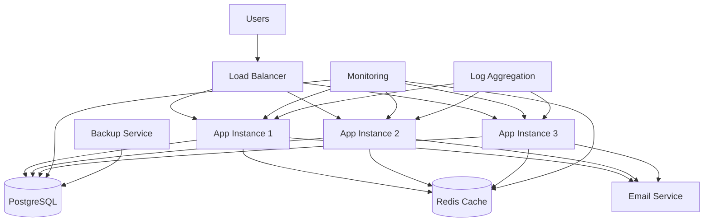

# Operations Guide

This section provides comprehensive operational documentation for maintaining, monitoring, and troubleshooting the Kavach authentication and user management system in production environments.

## Quick Reference

### Emergency Contacts
- **System Administrator**: [admin@yourdomain.com]
- **Database Administrator**: [dba@yourdomain.com]
- **Security Team**: [security@yourdomain.com]
- **On-Call Engineer**: [oncall@yourdomain.com]

### Critical System Status
- **Application Health**: `/api/v1/health`
- **Database Status**: Check connection and query performance
- **Redis Status**: Check cache availability and memory usage
- **Load Balancer**: Monitor request distribution and response times

## Operations Overview

The Kavach authentication system requires ongoing operational support to ensure:

- **High Availability**: 99.9% uptime target
- **Performance**: Sub-200ms response times for authentication
- **Security**: Continuous monitoring for threats and vulnerabilities
- **Data Integrity**: Regular backups and data validation
- **Scalability**: Automatic scaling based on demand

## System Architecture



## Key Operational Areas

### 1. System Maintenance
- **[Database Maintenance](maintenance/database-maintenance.md)** - Regular database operations, backups, and optimization
- **[Application Updates](maintenance/application-updates.md)** - Deployment procedures and rollback strategies
- **[Security Updates](maintenance/security-updates.md)** - Security patches and vulnerability management
- **[Performance Optimization](maintenance/performance-optimization.md)** - System tuning and optimization

### 2. Monitoring and Alerting
- **[Health Monitoring](../deployment/monitoring/health-checks.md)** - Application and infrastructure health checks
- **[Performance Monitoring](../deployment/monitoring/metrics.md)** - Performance metrics and KPIs
- **[Log Management](../deployment/monitoring/logging.md)** - Centralized logging and analysis
- **[Alert Configuration](../deployment/monitoring/alerting.md)** - Alert rules and escalation procedures

### 3. Troubleshooting
- **[Common Issues](troubleshooting/common-issues.md)** - Frequently encountered problems and solutions
- **[Performance Issues](troubleshooting/performance-issues.md)** - Performance degradation troubleshooting
- **[Database Issues](troubleshooting/database-issues.md)** - Database-related problems
- **[Authentication Issues](troubleshooting/authentication-issues.md)** - Authentication and authorization problems

### 4. Incident Response
- **[Incident Response](runbooks/incident-response.md)** - Emergency response procedures
- **[Disaster Recovery](runbooks/disaster-recovery.md)** - Business continuity and disaster recovery
- **[Scaling Procedures](runbooks/scaling.md)** - Manual and automatic scaling operations

## Daily Operations Checklist

### Morning Checks (9:00 AM)
- [ ] Review overnight alerts and incidents
- [ ] Check system health dashboard
- [ ] Verify backup completion status
- [ ] Review performance metrics from previous day
- [ ] Check error rates and response times
- [ ] Validate SSL certificate expiration dates

### Midday Checks (1:00 PM)
- [ ] Monitor current system load
- [ ] Check database performance metrics
- [ ] Review security alerts
- [ ] Validate email service functionality
- [ ] Check disk space and resource utilization

### Evening Checks (6:00 PM)
- [ ] Review daily performance summary
- [ ] Check for any pending security updates
- [ ] Validate backup schedules
- [ ] Review capacity planning metrics
- [ ] Update incident log if applicable

## Weekly Operations Tasks

### Monday
- [ ] Review weekly performance report
- [ ] Check SSL certificate renewal status
- [ ] Validate disaster recovery procedures
- [ ] Review security audit logs

### Wednesday
- [ ] Database maintenance window (if scheduled)
- [ ] Performance optimization review
- [ ] Capacity planning assessment
- [ ] Security vulnerability scan

### Friday
- [ ] Weekly backup verification
- [ ] System update planning
- [ ] Documentation updates
- [ ] Team knowledge sharing session

## Monthly Operations Tasks

### First Week
- [ ] Comprehensive security audit
- [ ] Database performance tuning
- [ ] Capacity planning review
- [ ] Disaster recovery testing

### Second Week
- [ ] SSL certificate renewal (if needed)
- [ ] System dependency updates
- [ ] Performance baseline review
- [ ] Monitoring alert tuning

### Third Week
- [ ] Full system backup verification
- [ ] Security policy review
- [ ] Incident response drill
- [ ] Documentation audit

### Fourth Week
- [ ] Monthly performance report
- [ ] Cost optimization review
- [ ] System architecture review
- [ ] Team training and development

## Key Performance Indicators (KPIs)

### Availability Metrics
- **System Uptime**: Target 99.9% (8.76 hours downtime/year)
- **API Availability**: Target 99.95%
- **Database Availability**: Target 99.99%
- **Mean Time to Recovery (MTTR)**: Target < 15 minutes

### Performance Metrics
- **Response Time**: Target < 200ms (95th percentile)
- **Authentication Time**: Target < 100ms
- **Database Query Time**: Target < 50ms
- **Throughput**: Target 1000 requests/second

### Security Metrics
- **Failed Authentication Rate**: Monitor < 5%
- **Security Incidents**: Target 0 critical incidents
- **Vulnerability Remediation**: Target < 24 hours for critical
- **Compliance Score**: Target 100%

### Business Metrics
- **User Registration Rate**: Track daily/weekly trends
- **Active User Sessions**: Monitor concurrent users
- **Email Delivery Rate**: Target > 99%
- **Support Ticket Volume**: Track and trend

## Escalation Procedures

### Severity Levels

**Critical (P1)**
- System completely down
- Data breach or security incident
- Database corruption
- **Response Time**: Immediate (< 15 minutes)
- **Escalation**: Immediately notify on-call engineer and management

**High (P2)**
- Significant performance degradation
- Partial system outage
- Authentication failures affecting multiple users
- **Response Time**: < 1 hour
- **Escalation**: Notify on-call engineer within 30 minutes

**Medium (P3)**
- Minor performance issues
- Non-critical feature failures
- Monitoring alerts
- **Response Time**: < 4 hours
- **Escalation**: Standard business hours support

**Low (P4)**
- Documentation updates
- Enhancement requests
- Non-urgent maintenance
- **Response Time**: < 24 hours
- **Escalation**: Standard support queue

### Contact Information

```
Primary On-Call: +1-555-0123 (24/7)
Secondary On-Call: +1-555-0124 (24/7)
Database Team: +1-555-0125 (Business hours)
Security Team: +1-555-0126 (24/7)
Management: +1-555-0127 (Business hours)
```

## Tools and Access

### Monitoring Tools
- **Application Monitoring**: New Relic / DataDog
- **Infrastructure Monitoring**: CloudWatch / Prometheus
- **Log Aggregation**: ELK Stack / Splunk
- **Uptime Monitoring**: Pingdom / StatusPage

### Access Requirements
- **Production Systems**: VPN + MFA required
- **Database Access**: Bastion host + database credentials
- **AWS Console**: IAM roles with MFA
- **Monitoring Dashboards**: SSO authentication

### Emergency Access
- **Break-glass Procedures**: Document emergency access procedures
- **Emergency Contacts**: Maintain updated contact list
- **Backup Access Methods**: Alternative authentication methods

## Documentation Standards

### Incident Documentation
- **Incident Reports**: Use standardized incident report template
- **Post-Mortem Reviews**: Conduct within 48 hours of resolution
- **Action Items**: Track and assign ownership
- **Knowledge Base**: Update with lessons learned

### Change Management
- **Change Requests**: Use formal change request process
- **Testing Requirements**: Define testing criteria
- **Rollback Procedures**: Document rollback steps
- **Communication Plan**: Notify stakeholders

## Training and Knowledge Transfer

### Required Training
- **System Architecture**: Understanding of all system components
- **Incident Response**: Emergency response procedures
- **Security Protocols**: Security policies and procedures
- **Tool Usage**: Monitoring and management tools

### Knowledge Transfer
- **Documentation**: Maintain up-to-date operational documentation
- **Cross-Training**: Ensure multiple team members can handle each area
- **Regular Reviews**: Quarterly knowledge transfer sessions
- **External Dependencies**: Document third-party service contacts

## Compliance and Auditing

### Compliance Requirements
- **Data Protection**: GDPR, CCPA compliance
- **Security Standards**: SOC 2, ISO 27001
- **Industry Regulations**: Relevant industry standards
- **Internal Policies**: Company security and operational policies

### Audit Procedures
- **Regular Audits**: Quarterly internal audits
- **External Audits**: Annual third-party audits
- **Compliance Monitoring**: Continuous compliance monitoring
- **Remediation Tracking**: Track and resolve compliance issues

## Cost Management

### Cost Monitoring
- **Resource Utilization**: Monitor and optimize resource usage
- **Cost Alerts**: Set up cost threshold alerts
- **Regular Reviews**: Monthly cost optimization reviews
- **Capacity Planning**: Right-size resources based on usage

### Optimization Strategies
- **Auto-scaling**: Implement automatic scaling policies
- **Reserved Instances**: Use reserved instances for predictable workloads
- **Spot Instances**: Use spot instances for non-critical workloads
- **Resource Cleanup**: Regular cleanup of unused resources

## Next Steps

For specific operational procedures, refer to the detailed documentation in each section:

1. **Start with [Common Issues](troubleshooting/common-issues.md)** for immediate troubleshooting needs
2. **Review [Database Maintenance](maintenance/database-maintenance.md)** for regular maintenance procedures
3. **Set up [Health Monitoring](../deployment/monitoring/health-checks.md)** for proactive monitoring
4. **Familiarize with [Incident Response](runbooks/incident-response.md)** procedures for emergency situations

## Support and Feedback

- **Operations Team**: [ops@yourdomain.com]
- **Documentation Issues**: Create issue in repository
- **Process Improvements**: Submit suggestions to operations team
- **Emergency Support**: Follow escalation procedures above