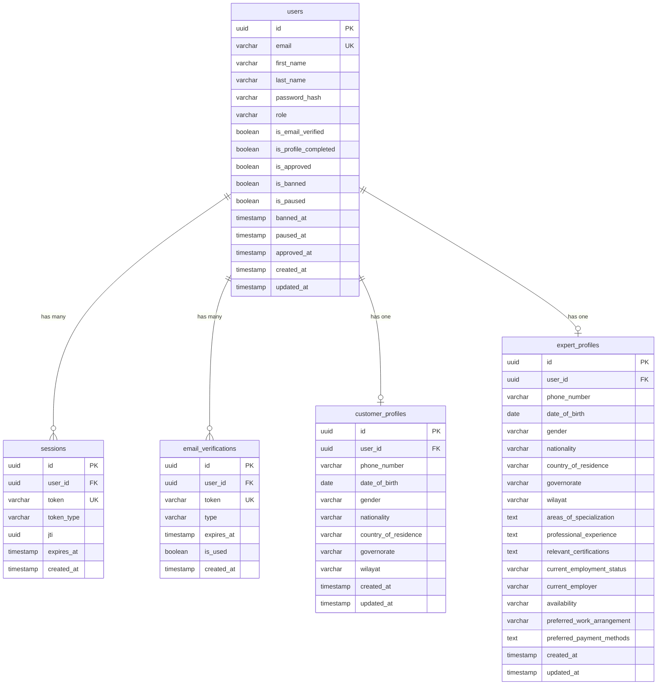

# Database Schema Reference

This document provides a comprehensive reference for the complete database schema of the Kavach authentication and user management system.

## Schema Overview

The database uses PostgreSQL and is managed through Drizzle ORM. The schema consists of five main tables that handle user management, authentication, and profile data.

### Entity Relationship Diagram



## Table Definitions

### users

**Description**: Core user table containing authentication and basic user information.

**Location**: `src/lib/database/schema/users.ts`

| Column | Type | Constraints | Description |
|--------|------|-------------|-------------|
| `id` | `uuid` | PRIMARY KEY, DEFAULT random | Unique user identifier |
| `email` | `varchar(255)` | NOT NULL, UNIQUE | User's email address (login identifier) |
| `first_name` | `varchar(100)` | NOT NULL | User's first name |
| `last_name` | `varchar(100)` | NOT NULL | User's last name |
| `password_hash` | `varchar(255)` | NOT NULL | Bcrypt hashed password |
| `role` | `varchar(20)` | NOT NULL | User role: 'customer', 'expert', 'admin' |
| `is_email_verified` | `boolean` | NOT NULL, DEFAULT false | Email verification status |
| `is_profile_completed` | `boolean` | NOT NULL, DEFAULT false | Profile completion status |
| `is_approved` | `boolean` | NOT NULL, DEFAULT true | Account approval status |
| `is_banned` | `boolean` | NOT NULL, DEFAULT false | Account ban status (experts) |
| `is_paused` | `boolean` | NOT NULL, DEFAULT false | Account pause status (customers) |
| `banned_at` | `timestamp` | NULL | Timestamp when account was banned |
| `paused_at` | `timestamp` | NULL | Timestamp when account was paused |
| `approved_at` | `timestamp` | NULL | Timestamp when account was approved |
| `created_at` | `timestamp` | NOT NULL, DEFAULT now() | Account creation timestamp |
| `updated_at` | `timestamp` | NOT NULL, DEFAULT now() | Last update timestamp |

**Indexes**:
- Primary key on `id`
- Unique index on `email`
- Index on `role` for role-based queries
- Index on `created_at` for chronological queries

**Business Rules**:
- Email must be unique across all users
- Role determines access permissions and available features
- Customers and admins are auto-approved (`is_approved = true`)
- Experts require manual approval (`is_approved = false` initially)
- Only experts can be banned (`is_banned`)
- Only customers can be paused (`is_paused`)

### sessions

**Description**: Manages user authentication sessions and JWT tokens.

**Location**: `src/lib/database/schema/sessions.ts`

| Column | Type | Constraints | Description |
|--------|------|-------------|-------------|
| `id` | `uuid` | PRIMARY KEY, DEFAULT random | Unique session identifier |
| `user_id` | `uuid` | NOT NULL, FOREIGN KEY → users.id, CASCADE DELETE | Associated user |
| `token` | `varchar(1000)` | NOT NULL, UNIQUE | JWT token or session token |
| `token_type` | `varchar(20)` | NOT NULL, DEFAULT 'access' | Token type: 'access', 'refresh' |
| `jti` | `uuid` | NULL | JWT ID for token correlation and revocation |
| `expires_at` | `timestamp` | NOT NULL | Token expiration timestamp |
| `created_at` | `timestamp` | NOT NULL, DEFAULT now() | Session creation timestamp |

**Indexes**:
- Primary key on `id`
- Unique index on `token`
- Index on `user_id` for user session queries
- Index on `expires_at` for cleanup operations
- Index on `jti` for JWT correlation

**Business Rules**:
- Sessions are automatically deleted when user is deleted (CASCADE)
- Expired sessions are cleaned up by maintenance scripts
- Maximum 5 active sessions per user (enforced by application logic)
- JWT tokens are stored for revocation and correlation purposes

### email_verifications

**Description**: Manages email verification tokens and magic links.

**Location**: `src/lib/database/schema/email-verifications.ts`

| Column | Type | Constraints | Description |
|--------|------|-------------|-------------|
| `id` | `uuid` | PRIMARY KEY, DEFAULT random | Unique verification identifier |
| `user_id` | `uuid` | NOT NULL, FOREIGN KEY → users.id, CASCADE DELETE | Associated user |
| `token` | `varchar(512)` | NOT NULL, UNIQUE | Verification token (magic link) |
| `type` | `varchar(20)` | NOT NULL | Verification type: 'magic_link' |
| `expires_at` | `timestamp` | NOT NULL | Token expiration timestamp |
| `is_used` | `boolean` | NOT NULL, DEFAULT false | Whether token has been used |
| `created_at` | `timestamp` | NOT NULL, DEFAULT now() | Token creation timestamp |

**Indexes**:
- Primary key on `id`
- Unique index on `token`
- Index on `user_id` for user verification queries
- Index on `expires_at` for cleanup operations
- Composite index on `(is_used, expires_at)` for cleanup queries

**Business Rules**:
- Tokens are automatically deleted when user is deleted (CASCADE)
- Expired and used tokens are cleaned up by maintenance scripts
- Only one active verification token per user at a time
- Magic links expire after configurable time (default: 24 hours)

### customer_profiles

**Description**: Extended profile information for customer users.

**Location**: `src/lib/database/schema/customer-profiles.ts`

| Column | Type | Constraints | Description |
|--------|------|-------------|-------------|
| `id` | `uuid` | PRIMARY KEY, DEFAULT random | Unique profile identifier |
| `user_id` | `uuid` | NOT NULL, FOREIGN KEY → users.id, CASCADE DELETE | Associated user |
| `phone_number` | `varchar(20)` | NULL | Customer's phone number |
| `date_of_birth` | `date` | NULL | Customer's date of birth |
| `gender` | `varchar(20)` | NULL | Gender: 'male', 'female', 'prefer-not-to-say' |
| `nationality` | `varchar(100)` | NULL | Customer's nationality |
| `country_of_residence` | `varchar(100)` | NULL | Current country of residence |
| `governorate` | `varchar(100)` | NULL | Governorate (for Oman) |
| `wilayat` | `varchar(100)` | NULL | Wilayat (for Oman) |
| `created_at` | `timestamp` | NOT NULL, DEFAULT now() | Profile creation timestamp |
| `updated_at` | `timestamp` | NOT NULL, DEFAULT now() | Last update timestamp |

**Indexes**:
- Primary key on `id`
- Unique index on `user_id` (one profile per user)
- Index on `country_of_residence` for geographic queries
- Index on `governorate` for regional queries

**Business Rules**:
- One profile per customer user
- Profile is automatically deleted when user is deleted (CASCADE)
- All fields are optional (customers can complete profile gradually)
- Governorate and Wilayat are specific to Oman geography

### expert_profiles

**Description**: Extended profile information for expert users with professional details.

**Location**: `src/lib/database/schema/expert-profiles.ts`

| Column | Type | Constraints | Description |
|--------|------|-------------|-------------|
| `id` | `uuid` | PRIMARY KEY, DEFAULT random | Unique profile identifier |
| `user_id` | `uuid` | NOT NULL, FOREIGN KEY → users.id, CASCADE DELETE | Associated user |
| `phone_number` | `varchar(20)` | NULL | Expert's phone number |
| `date_of_birth` | `date` | NULL | Expert's date of birth |
| `gender` | `varchar(20)` | NULL | Gender: 'male', 'female', 'prefer-not-to-say' |
| `nationality` | `varchar(100)` | NULL | Expert's nationality |
| `country_of_residence` | `varchar(100)` | NULL | Current country of residence |
| `governorate` | `varchar(100)` | NULL | Governorate (for Oman) |
| `wilayat` | `varchar(100)` | NULL | Wilayat (for Oman) |
| `areas_of_specialization` | `text` | NULL | JSON array of specialization areas |
| `professional_experience` | `text` | NULL | Detailed professional experience |
| `relevant_certifications` | `text` | NULL | JSON array of certifications |
| `current_employment_status` | `varchar(50)` | NULL | Employment status enum |
| `current_employer` | `varchar(200)` | NULL | Current employer name |
| `availability` | `varchar(50)` | NULL | Availability preference enum |
| `preferred_work_arrangement` | `varchar(50)` | NULL | Work arrangement preference enum |
| `preferred_payment_methods` | `text` | NULL | JSON array of payment methods |
| `created_at` | `timestamp` | NOT NULL, DEFAULT now() | Profile creation timestamp |
| `updated_at` | `timestamp` | NOT NULL, DEFAULT now() | Last update timestamp |

**Indexes**:
- Primary key on `id`
- Unique index on `user_id` (one profile per user)
- Index on `country_of_residence` for geographic queries
- Index on `current_employment_status` for filtering
- Index on `availability` for matching queries

**Business Rules**:
- One profile per expert user
- Profile is automatically deleted when user is deleted (CASCADE)
- All fields are optional but profile completion affects approval process
- JSON fields store arrays for multi-select options
- Employment status affects availability and work arrangement options

## Data Types and Enums

### User Roles

```typescript
type UserRole = 'customer' | 'expert' | 'admin';
```

**Values**:
- `customer`: End users who consume services
- `expert`: Service providers who offer expertise
- `admin`: System administrators with full access

### Gender Options

```typescript
type Gender = 'male' | 'female' | 'prefer-not-to-say';
```

### Employment Status

```typescript
type EmploymentStatus = 
  | 'employed' 
  | 'self-employed' 
  | 'unemployed' 
  | 'student' 
  | 'retired';
```

### Availability Options

```typescript
type Availability = 
  | 'full-time' 
  | 'part-time' 
  | 'contract-based' 
  | 'weekends-only' 
  | 'flexible-hours';
```

### Work Arrangement Options

```typescript
type WorkArrangement = 
  | 'full-time' 
  | 'part-time' 
  | 'contract-based' 
  | 'weekends-only' 
  | 'flexible-hours';
```

### Token Types

```typescript
type TokenType = 'access' | 'refresh';
```

### Verification Types

```typescript
type VerificationType = 'magic_link';
```

## JSON Field Structures

### areas_of_specialization

```json
[
  "Software Development",
  "Data Analysis",
  "Digital Marketing",
  "Graphic Design"
]
```

### relevant_certifications

```json
[
  {
    "name": "AWS Certified Solutions Architect",
    "issuer": "Amazon Web Services",
    "year": 2023
  },
  {
    "name": "Google Analytics Certified",
    "issuer": "Google",
    "year": 2022
  }
]
```

### preferred_payment_methods

```json
[
  "Bank Transfer",
  "PayPal",
  "Cryptocurrency",
  "Cash"
]
```

## Database Constraints and Relationships

### Foreign Key Relationships

1. **sessions.user_id → users.id**
   - Cascade delete: Sessions deleted when user is deleted
   - One user can have multiple sessions

2. **email_verifications.user_id → users.id**
   - Cascade delete: Verifications deleted when user is deleted
   - One user can have multiple verification attempts

3. **customer_profiles.user_id → users.id**
   - Cascade delete: Profile deleted when user is deleted
   - One-to-one relationship: One profile per customer user

4. **expert_profiles.user_id → users.id**
   - Cascade delete: Profile deleted when user is deleted
   - One-to-one relationship: One profile per expert user

### Unique Constraints

- `users.email`: Ensures unique email addresses
- `sessions.token`: Ensures unique session tokens
- `email_verifications.token`: Ensures unique verification tokens
- `customer_profiles.user_id`: One profile per customer
- `expert_profiles.user_id`: One profile per expert

### Check Constraints

- `users.role`: Must be one of 'customer', 'expert', 'admin'
- `sessions.token_type`: Must be one of 'access', 'refresh'
- `email_verifications.type`: Must be 'magic_link'
- Profile gender fields: Must be valid gender enum values
- Profile employment/availability fields: Must be valid enum values

## Database Maintenance

### Automatic Cleanup

The system includes automatic cleanup for:

1. **Expired Sessions**: Removed by maintenance scripts
2. **Expired Verification Tokens**: Cleaned up regularly
3. **Used Verification Tokens**: Removed after 24 hours
4. **Orphaned Records**: Sessions/verifications without valid users

### Maintenance Commands

```bash
# Clean expired data
bun run db:maintenance cleanup

# Full maintenance routine
bun run db:maintenance full

# Database health check
bun run db:maintenance health
```

### Performance Considerations

1. **Indexing Strategy**:
   - Primary keys for fast lookups
   - Foreign keys for join performance
   - Composite indexes for common query patterns

2. **Query Optimization**:
   - Use prepared statements
   - Limit result sets appropriately
   - Use appropriate WHERE clauses

3. **Connection Pooling**:
   - Maximum 20 connections
   - Connection timeout: 5 seconds
   - Idle timeout: 30 seconds

## Migration Management

### Migration Files

**Location**: `src/lib/database/migrations/`

**Current Migrations**:
1. `0000_bumpy_bulldozer.sql`: Initial schema creation
2. `0001_add_token_type_to_sessions.sql`: Add token type support
3. `0002_add_jti_to_sessions.sql`: Add JWT ID support
4. `0003_add_ban_pause_fields.sql`: Add user status fields

### Migration Commands

```bash
# Generate new migration
bun run db:generate

# Run pending migrations
bun run db:migrate

# Push schema changes (development only)
bun run db:push
```

### Migration Best Practices

1. **Always backup before migrations**
2. **Test migrations on staging first**
3. **Use transactions for complex migrations**
4. **Document breaking changes**
5. **Plan rollback strategies**

## Security Considerations

### Data Protection

1. **Password Hashing**: Bcrypt with salt rounds
2. **Token Security**: Cryptographically secure random tokens
3. **PII Handling**: Minimal collection, secure storage
4. **Access Control**: Role-based permissions

### Audit Trail

- All user actions are logged
- Database changes are tracked
- Authentication events are recorded
- Profile updates are monitored

### Compliance

- GDPR compliance for EU users
- Data retention policies
- Right to deletion support
- Data export capabilities

## Backup and Recovery

### Backup Strategy

1. **Daily automated backups**
2. **Point-in-time recovery capability**
3. **Cross-region backup replication**
4. **Regular backup testing**

### Recovery Procedures

1. **Database restoration from backup**
2. **Point-in-time recovery**
3. **Partial data recovery**
4. **Disaster recovery protocols**

## Related Documentation

- [Database Setup Guide](../backend/database/README.md)
- [Migration Guide](../backend/database/migrations.md)
- [Environment Variables](./environment-variables.md)
- [CLI Commands](./cli-commands.md)

---

*Database schema reference last updated: January 2025*