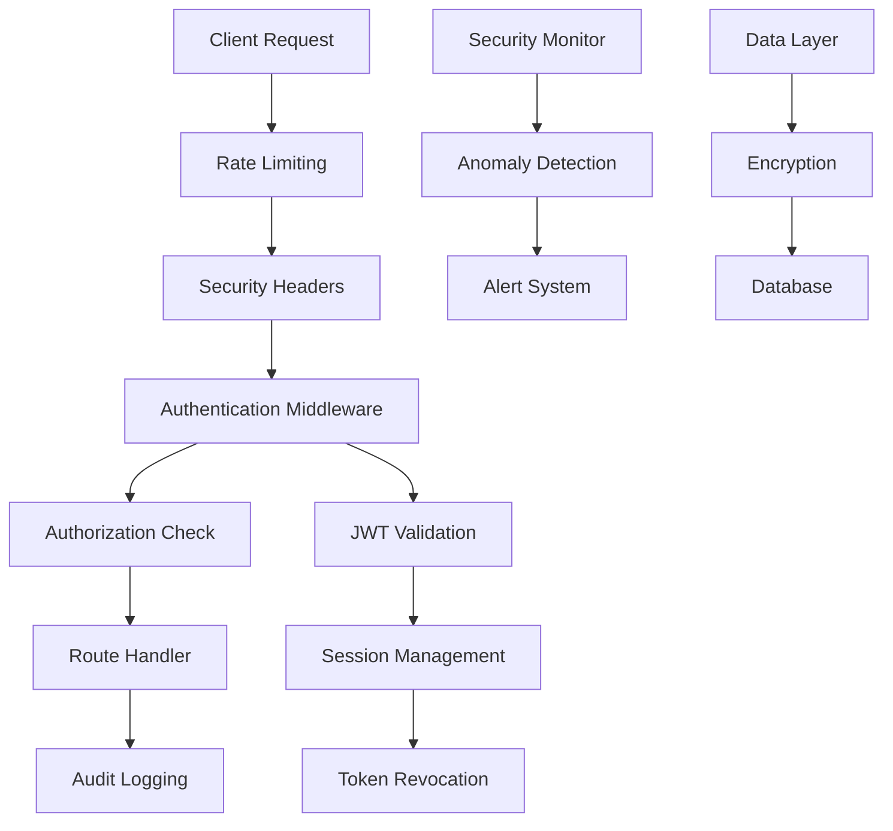

# Security Documentation

This section provides comprehensive security documentation for the Kavach authentication and user management system. Our security implementation follows industry best practices and includes multiple layers of protection to ensure data integrity, user privacy, and system resilience.

## Security Overview

The Kavach system implements a multi-layered security architecture that includes:

- **Authentication Security**: JWT-based authentication with secure session management
- **Authorization**: Role-based access control (RBAC) with granular permissions
- **Data Protection**: Encryption at rest and in transit, secure password handling
- **Monitoring & Auditing**: Comprehensive security event logging and anomaly detection
- **Best Practices**: Secure coding standards and deployment security measures

## Security Architecture



## Security Components

### 1. Authentication & Authorization
- [JWT Security](./authentication/jwt-security.md) - JWT implementation and best practices
- [Session Management](./authentication/session-management.md) - Secure session handling
- [Role-Based Access Control](./authorization/role-based-access.md) - RBAC implementation

### 2. Data Protection
- [Encryption](./data-protection/encryption.md) - Data encryption practices
- [Privacy Measures](./data-protection/privacy.md) - User privacy protection
- [Compliance](./data-protection/compliance.md) - Regulatory compliance

### 3. Security Monitoring
- [Audit Logging](./monitoring/audit-logging.md) - Comprehensive audit trails
- [Anomaly Detection](./monitoring/anomaly-detection.md) - Threat detection system
- [Incident Response](./monitoring/incident-response.md) - Security incident handling

### 4. Best Practices
- [Secure Coding](./best-practices/secure-coding.md) - Development security guidelines
- [Deployment Security](./best-practices/deployment-security.md) - Production security
- [Penetration Testing](./best-practices/penetration-testing.md) - Security testing

## Security Features

### Authentication Features
- **Multi-factor Authentication**: Support for MFA (planned)
- **Password Policies**: Strong password requirements with complexity validation
- **Account Lockout**: Automatic account lockout after failed attempts
- **Session Security**: Secure session cookies with proper flags
- **Token Rotation**: Automatic refresh token rotation

### Authorization Features
- **Role-Based Access**: Customer, Expert, and Admin roles with specific permissions
- **Route Protection**: Middleware-based route protection
- **API Security**: Endpoint-level authorization checks
- **Admin Controls**: Administrative user management capabilities

### Monitoring Features
- **Real-time Monitoring**: Live security event monitoring
- **Anomaly Detection**: Automated threat detection
- **Audit Trails**: Comprehensive logging of all security events
- **Alert System**: Automated security alerts and notifications
- **IP Blocking**: Automatic IP blocking for suspicious activity

## Security Metrics

The system tracks various security metrics:

- **Authentication Events**: Login attempts, failures, successes
- **Authorization Events**: Access attempts, permission denials
- **Security Incidents**: Detected threats, blocked IPs, locked accounts
- **System Health**: Security component status and performance

## Compliance & Standards

Our security implementation adheres to:

- **OWASP Top 10**: Protection against common web vulnerabilities
- **NIST Cybersecurity Framework**: Comprehensive security controls
- **GDPR**: Data protection and privacy compliance
- **SOC 2**: Security, availability, and confidentiality controls

## Security Configuration

### Environment Variables

Key security-related environment variables:

```bash
# JWT Configuration
JWT_SECRET=your-secure-jwt-secret
JWT_EXPIRES_IN=7d
REFRESH_TOKEN_EXPIRES_IN=30d

# Security Features
ENABLE_RATE_LIMITING=true
ENABLE_SECURITY_HEADERS=true
ENABLE_AUDIT_LOGGING=true

# Monitoring
SECURITY_ALERT_WEBHOOK=https://your-alert-endpoint
AUDIT_LOG_LEVEL=info
```

### Security Headers

The system automatically applies security headers:

- **Content Security Policy (CSP)**: Prevents XSS attacks
- **HTTP Strict Transport Security (HSTS)**: Enforces HTTPS
- **X-Frame-Options**: Prevents clickjacking
- **X-Content-Type-Options**: Prevents MIME sniffing
- **Referrer-Policy**: Controls referrer information

## Quick Security Checklist

### Development
- [ ] Use secure coding practices
- [ ] Validate all inputs
- [ ] Implement proper error handling
- [ ] Use parameterized queries
- [ ] Apply principle of least privilege

### Deployment
- [ ] Enable HTTPS/TLS
- [ ] Configure security headers
- [ ] Set up monitoring and alerting
- [ ] Implement backup and recovery
- [ ] Regular security updates

### Operations
- [ ] Monitor security events
- [ ] Review audit logs regularly
- [ ] Respond to security alerts
- [ ] Conduct security assessments
- [ ] Maintain incident response plan

## Getting Help

For security-related questions or to report security vulnerabilities:

1. **Documentation**: Review the detailed security guides in this section
2. **Security Issues**: Report security vulnerabilities through proper channels
3. **Best Practices**: Follow the secure coding guidelines
4. **Monitoring**: Use the security monitoring dashboard

## Related Documentation

- [API Security](../api/authentication.md) - API authentication and authorization
- [Deployment Security](../deployment/platforms/docker.md) - Secure deployment practices
- [Development Security](../development/coding-standards/typescript.md) - Secure development practices
- [Operations Security](../operations/troubleshooting/common-issues.md) - Security troubleshooting

---

**Note**: Security is an ongoing process. Regularly review and update security measures as the system evolves and new threats emerge.