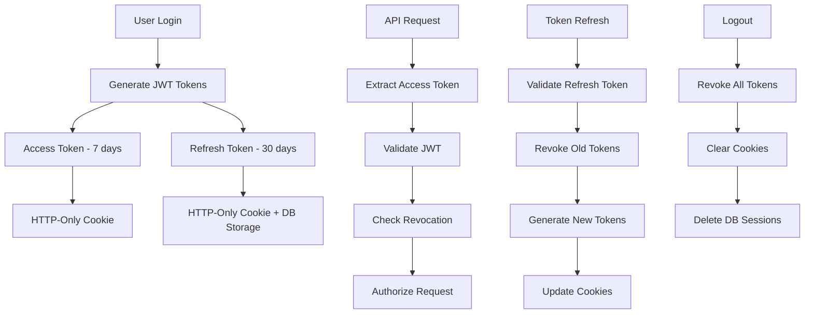

# Session Management Security

This document details the secure session management implementation in the Kavach system, covering session lifecycle, security measures, and best practices.

## Overview

The Kavach system implements a hybrid session management approach combining JWT tokens with secure cookie storage and server-side session tracking for refresh tokens. This provides both stateless authentication benefits and the ability to revoke sessions when needed.

## Session Architecture



## Session Data Structure

```typescript
export interface SessionData {
  userId: string;              // User identifier
  email: string;              // User email
  role: 'customer' | 'expert' | 'admin'; // User role
  isEmailVerified: boolean;   // Email verification status
  isProfileCompleted: boolean; // Profile completion status
  isApproved: boolean;        // Account approval status
}

interface SessionCookie {
  name: string;               // Cookie name
  value: string;              // JWT token
  options: CookieOptions;     // Security options
}
```

## Session Lifecycle

### 1. Session Creation

```typescript
export async function createSession(sessionData: SessionData): Promise<void> {
  try {
    // Generate access token (7 days)
    const accessToken = await generateToken(sessionData);
    
    // Generate refresh token (30 days)
    const refreshToken = await generateRefreshToken(sessionData);

    // Set secure cookies
    const cookieStore = await cookies();
    cookieStore.set(SESSION_COOKIE_NAME, accessToken, getSecureCookieOptions());
    cookieStore.set(REFRESH_COOKIE_NAME, refreshToken, getSecureCookieOptions(REFRESH_DURATION / 1000));

    // Persist refresh token for revocation capability
    const refreshPayload = await verifyToken(refreshToken);
    if (refreshPayload?.exp) {
      await sessionRepository.create({
        userId: sessionData.userId,
        token: refreshToken,
        tokenType: 'refresh',
        jti: refreshPayload.jti,
        expiresAt: new Date(refreshPayload.exp * 1000)
      });
    }
  } catch (error) {
    console.error('Failed to create session:', error);
    throw new Error('Session creation failed');
  }
}
```

### 2. Session Retrieval

```typescript
export async function getSession(): Promise<SessionData | null> {
  try {
    const cookieStore = await cookies();
    const sessionCookie = cookieStore.get(SESSION_COOKIE_NAME);
    
    if (!sessionCookie?.value) {
      return null;
    }

    // Verify and decode the access token
    const payload = await verifyToken(sessionCookie.value);
    if (!payload) {
      return null;
    }

    // Ensure token type is access
    if (payload.tokenType && payload.tokenType !== 'access') {
      return null;
    }

    return {
      userId: payload.userId,
      email: payload.email,
      role: payload.role,
      isEmailVerified: payload.isEmailVerified,
      isProfileCompleted: payload.isProfileCompleted ?? false,
      isApproved: payload.isApproved ?? false
    };
  } catch (error) {
    console.error('Failed to get session:', error);
    return null;
  }
}
```

### 3. Session Update

```typescript
export async function updateSession(updates: Partial<SessionData>): Promise<void> {
  try {
    const currentSession = await getSession();
    if (!currentSession) {
      throw new Error('No active session to update');
    }

    // Merge updates with current session data
    const updatedSession = { ...currentSession, ...updates };
    
    // Create new session with updated data
    await createSession(updatedSession);
  } catch (error) {
    console.error('Failed to update session:', error);
    throw new Error('Session update failed');
  }
}
```

### 4. Session Destruction

```typescript
export async function destroySession(): Promise<void> {
  try {
    const cookieStore = await cookies();

    // Get refresh token for revocation
    const existingRefresh = cookieStore.get(REFRESH_COOKIE_NAME);
    if (existingRefresh?.value) {
      try {
        const payload = await verifyToken(existingRefresh.value);
        if (payload?.jti) {
          // Revoke the JTI
          revokeJti(payload.jti);
        }
        // Delete from database
        await sessionRepository.deleteByToken(existingRefresh.value);
      } catch {
        // Ignore errors during cleanup
      }
    }

    // Clear cookies
    cookieStore.set(SESSION_COOKIE_NAME, '', {
      ...getSecureCookieOptions(),
      maxAge: 0
    });
    
    cookieStore.set(REFRESH_COOKIE_NAME, '', {
      ...getSecureCookieOptions(),
      maxAge: 0
    });
  } catch (error) {
    console.error('Failed to destroy session:', error);
    throw new Error('Session destruction failed');
  }
}
```

## Cookie Security Configuration

```typescript
function getSecureCookieOptions(maxAge?: number): CookieOptions {
  const isProduction = process.env.NODE_ENV === 'production';

  return {
    httpOnly: true,        // Prevent XSS attacks
    secure: isProduction,  // HTTPS only in production
    sameSite: 'strict',    // CSRF protection
    maxAge: maxAge || SESSION_DURATION / 1000, // Convert to seconds
    path: '/'              // Available site-wide
  };
}
```

### Cookie Security Features

1. **HttpOnly Flag**: Prevents JavaScript access to cookies, mitigating XSS attacks
2. **Secure Flag**: Ensures cookies are only sent over HTTPS in production
3. **SameSite=Strict**: Provides strong CSRF protection
4. **Path Restriction**: Limits cookie scope to necessary paths
5. **Expiration**: Automatic cleanup of expired cookies

## Token Refresh Mechanism

```typescript
export async function rotateRefreshToken(): Promise<SessionData | null> {
  try {
    const cookieStore = await cookies();
    const refreshCookie = cookieStore.get(REFRESH_COOKIE_NAME);
    
    if (!refreshCookie?.value) return null;
    
    // Validate refresh token
    const payload = await verifyToken(refreshCookie.value);
    if (!payload || payload.tokenType !== 'refresh') return null;
    
    // Revoke old refresh token (single-use)
    if (payload.jti) revokeJti(payload.jti);
    await sessionRepository.deleteByToken(refreshCookie.value);
    
    // Extract session data
    const sessionData: SessionData = {
      userId: payload.userId,
      email: payload.email,
      role: payload.role,
      isEmailVerified: payload.isEmailVerified,
      isProfileCompleted: payload.isProfileCompleted ?? false,
      isApproved: payload.isApproved ?? false
    };
    
    // Generate new tokens
    const newAccess = await generateToken(sessionData);
    const newRefresh = await generateRefreshToken(sessionData);
    
    // Set new cookies
    cookieStore.set(SESSION_COOKIE_NAME, newAccess, getSecureCookieOptions());
    cookieStore.set(REFRESH_COOKIE_NAME, newRefresh, getSecureCookieOptions(REFRESH_DURATION / 1000));
    
    // Persist new refresh session
    const newPayload = await verifyToken(newRefresh);
    if (newPayload?.exp) {
      await sessionRepository.create({
        userId: sessionData.userId,
        token: newRefresh,
        tokenType: 'refresh',
        jti: newPayload.jti,
        expiresAt: new Date(newPayload.exp * 1000)
      });
    }
    
    return sessionData;
  } catch (error) {
    console.error('Failed to rotate refresh token', error);
    return null;
  }
}
```

## Middleware Integration

### Session Validation Middleware

```typescript
export async function validateSessionMiddleware(request: NextRequest): Promise<{
  isValid: boolean;
  session: SessionData | null;
  needsRefresh: boolean;
}> {
  const session = await getSessionFromRequest(request);

  if (!session) {
    return {
      isValid: false,
      session: null,
      needsRefresh: false
    };
  }

  // Additional validation logic can be added here
  // For example, checking if token is close to expiration
  
  return {
    isValid: true,
    session,
    needsRefresh: false // Implement refresh logic as needed
  };
}
```

### Request Session Extraction

```typescript
export async function getSessionFromRequest(request: NextRequest): Promise<SessionData | null> {
  try {
    const sessionCookie = request.cookies.get(SESSION_COOKIE_NAME);
    if (!sessionCookie?.value) {
      return null;
    }

    const payload = await verifyToken(sessionCookie.value);
    if (!payload || payload.tokenType !== 'access') {
      return null;
    }

    return {
      userId: payload.userId,
      email: payload.email,
      role: payload.role,
      isEmailVerified: payload.isEmailVerified,
      isProfileCompleted: payload.isProfileCompleted ?? false,
      isApproved: payload.isApproved ?? false
    };
  } catch (error) {
    console.error('Failed to get session from request:', error);
    return null;
  }
}
```

## Session Security Features

### 1. Automatic Session Cleanup

```typescript
// Database cleanup of expired sessions
export async function cleanupExpiredSessions(): Promise<void> {
  try {
    const expiredSessions = await sessionRepository.findExpired();
    
    for (const session of expiredSessions) {
      // Revoke JTI if present
      if (session.jti) {
        revokeJti(session.jti);
      }
      
      // Delete from database
      await sessionRepository.delete(session.id);
    }
    
    console.log(`Cleaned up ${expiredSessions.length} expired sessions`);
  } catch (error) {
    console.error('Failed to cleanup expired sessions:', error);
  }
}

// Run cleanup periodically
setInterval(cleanupExpiredSessions, 60 * 60 * 1000); // Every hour
```

### 2. Concurrent Session Management

```typescript
export async function invalidateUserSessions(userId: string): Promise<void> {
  try {
    // Get all active sessions for user
    const userSessions = await sessionRepository.findByUserId(userId);
    
    // Revoke all JTIs
    for (const session of userSessions) {
      if (session.jti) {
        revokeJti(session.jti);
      }
    }
    
    // Delete all sessions from database
    await sessionRepository.deleteByUserId(userId);
    
    console.log(`Invalidated ${userSessions.length} sessions for user ${userId}`);
  } catch (error) {
    console.error('Failed to invalidate user sessions:', error);
  }
}
```

### 3. Session Hijacking Protection

```typescript
// Detect potential session hijacking
export function detectSessionAnomaly(
  currentRequest: NextRequest,
  sessionData: SessionData
): boolean {
  // Check for suspicious patterns
  const userAgent = currentRequest.headers.get('user-agent');
  const clientIP = getClientIP(currentRequest);
  
  // Store and compare session fingerprints
  const fingerprint = createSessionFingerprint(userAgent, clientIP);
  
  // Implementation would check against stored fingerprints
  // and flag suspicious changes
  
  return false; // Placeholder
}

function createSessionFingerprint(userAgent?: string, clientIP?: string): string {
  const components = [
    userAgent || 'unknown',
    clientIP || 'unknown'
  ];
  
  return Buffer.from(components.join('|')).toString('base64');
}
```

## Security Monitoring

Session-related security events are monitored and logged:

```typescript
// Session creation audit
auditAuth({
  event: 'auth.session.created',
  userId: sessionData.userId,
  email: sessionData.email,
  ip: clientIP,
  requestId: correlationId,
  severity: 'low'
});

// Session invalidation audit
auditAuth({
  event: 'auth.session.invalidated',
  userId: sessionData.userId,
  ip: clientIP,
  requestId: correlationId,
  severity: 'medium'
});

// Suspicious session activity
recordSuspiciousActivity({
  userId: sessionData.userId,
  ip: clientIP,
  requestId: correlationId,
  details: { reason: 'session_anomaly_detected' }
});
```

## Session Configuration

### Environment Variables

```bash
# Session Configuration
SESSION_COOKIE_NAME=auth-session
REFRESH_COOKIE_NAME=auth-refresh
SESSION_DURATION=604800000    # 7 days in milliseconds
REFRESH_DURATION=2592000000   # 30 days in milliseconds

# Security Settings
SECURE_COOKIES=true           # Enable secure flag in production
SAME_SITE_STRICT=true        # Enable strict SameSite policy
HTTP_ONLY_COOKIES=true       # Enable HttpOnly flag
```

### Session Timeouts

```typescript
const SESSION_TIMEOUTS = {
  ACCESS_TOKEN: 7 * 24 * 60 * 60 * 1000,    // 7 days
  REFRESH_TOKEN: 30 * 24 * 60 * 60 * 1000,  // 30 days
  EMAIL_VERIFICATION: 60 * 60 * 1000,       // 1 hour
  PASSWORD_RESET: 60 * 60 * 1000,           // 1 hour
  REMEMBER_ME: 90 * 24 * 60 * 60 * 1000     // 90 days (future feature)
};
```

## Best Practices

### 1. Session Security Checklist

- [ ] Use HTTP-only cookies for token storage
- [ ] Enable secure flag in production (HTTPS)
- [ ] Implement SameSite=Strict for CSRF protection
- [ ] Set appropriate expiration times
- [ ] Implement token rotation on refresh
- [ ] Monitor for session anomalies
- [ ] Clean up expired sessions regularly
- [ ] Revoke sessions on logout
- [ ] Implement concurrent session limits (if needed)

### 2. Development Guidelines

```typescript
// Always validate session before use
const session = await getSession();
if (!session) {
  return redirect('/login');
}

// Update session when user data changes
await updateSession({
  isEmailVerified: true,
  isProfileCompleted: true
});

// Properly handle session errors
try {
  await createSession(sessionData);
} catch (error) {
  console.error('Session creation failed:', error);
  // Handle error appropriately
}
```

### 3. Testing Session Security

```typescript
describe('Session Security', () => {
  test('should create secure session cookies', async () => {
    await createSession(mockSessionData);
    
    const cookies = getCookies();
    expect(cookies[SESSION_COOKIE_NAME]).toHaveProperty('httpOnly', true);
    expect(cookies[SESSION_COOKIE_NAME]).toHaveProperty('secure', true);
    expect(cookies[SESSION_COOKIE_NAME]).toHaveProperty('sameSite', 'strict');
  });

  test('should invalidate session on logout', async () => {
    await createSession(mockSessionData);
    await destroySession();
    
    const session = await getSession();
    expect(session).toBeNull();
  });

  test('should rotate refresh tokens', async () => {
    const originalRefresh = await getRefreshToken();
    const newSession = await rotateRefreshToken();
    const newRefresh = await getRefreshToken();
    
    expect(newRefresh).not.toBe(originalRefresh);
    expect(newSession).toBeTruthy();
  });
});
```

## Common Security Issues & Mitigations

### 1. Session Fixation
**Mitigation**: Generate new session tokens after authentication

### 2. Session Hijacking
**Mitigation**: Use HTTPS, secure cookies, and session fingerprinting

### 3. CSRF Attacks
**Mitigation**: SameSite=Strict cookies and CSRF tokens for state-changing operations

### 4. XSS Attacks
**Mitigation**: HTTP-only cookies prevent JavaScript access to tokens

### 5. Token Replay
**Mitigation**: JTI-based revocation and token rotation

## Related Documentation

- [JWT Security](./jwt-security.md) - JWT implementation details
- [Authentication Service](../../backend/services/authentication.md) - Authentication service implementation
- [Middleware Configuration](../../backend/middleware/authentication.md) - Authentication middleware
- [Security Monitoring](../monitoring/audit-logging.md) - Session monitoring and auditing