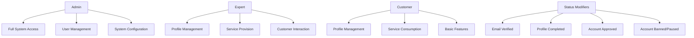

# Role-Based Access Control (RBAC)

This document details the Role-Based Access Control implementation in the Kavach system, covering user roles, permissions, route protection, and authorization mechanisms.

## Overview

The Kavach system implements a hierarchical RBAC system with three primary roles:

- **Customer**: End users who consume services
- **Expert**: Service providers who offer expertise
- **Admin**: System administrators with full access

Each role has specific permissions and access levels, with additional status-based restrictions for enhanced security.

## Role Hierarchy



## User Roles Definition

### 1. Customer Role

```typescript
interface CustomerPermissions {
  // Profile management
  canViewOwnProfile: true;
  canUpdateOwnProfile: true;
  canDeleteOwnAccount: true;
  
  // Service consumption
  canBrowseServices: true;
  canBookServices: true;
  canRateServices: true;
  
  // Communication
  canContactExperts: true;
  canReceiveNotifications: true;
  
  // Restrictions
  canAccessAdminPanel: false;
  canManageOtherUsers: false;
  canModifySystemSettings: false;
}
```

**Customer Status Modifiers:**
- `isPaused`: Temporarily restricts account access
- `isEmailVerified`: Required for most features
- `isProfileCompleted`: Required for service booking

### 2. Expert Role

```typescript
interface ExpertPermissions {
  // Profile management
  canViewOwnProfile: true;
  canUpdateOwnProfile: true;
  canDeleteOwnAccount: true;
  
  // Service provision
  canCreateServices: true;
  canManageServices: true;
  canViewBookings: true;
  canManageBookings: true;
  
  // Customer interaction
  canCommunicateWithCustomers: true;
  canViewCustomerProfiles: true;
  
  // Restrictions
  canAccessAdminPanel: false;
  canManageOtherUsers: false;
  canModifySystemSettings: false;
}
```

**Expert Status Modifiers:**
- `isBanned`: Permanently restricts account access
- `isApproved`: Required for service provision (manual approval)
- `isEmailVerified`: Required for all features
- `isProfileCompleted`: Required for approval process

### 3. Admin Role

```typescript
interface AdminPermissions {
  // Full system access
  canAccessAdminPanel: true;
  canViewSystemMetrics: true;
  canModifySystemSettings: true;
  
  // User management
  canViewAllUsers: true;
  canCreateUsers: true;
  canUpdateUsers: true;
  canDeleteUsers: true;
  canBanUsers: true;
  canPauseUsers: true;
  canApproveExperts: true;
  
  // System operations
  canViewAuditLogs: true;
  canManageSecuritySettings: true;
  canPerformMaintenance: true;
}
```

**Admin Status Modifiers:**
- Admins bypass most status restrictions
- `isEmailVerified`: Still required for security
- Cannot be banned or paused through normal means

## Database Schema

```sql
-- Users table with role and status fields
CREATE TABLE users (
  id UUID PRIMARY KEY DEFAULT gen_random_uuid(),
  email VARCHAR(255) NOT NULL UNIQUE,
  first_name VARCHAR(100) NOT NULL,
  last_name VARCHAR(100) NOT NULL,
  password_hash VARCHAR(255) NOT NULL,
  role VARCHAR(20) NOT NULL CHECK (role IN ('customer', 'expert', 'admin')),
  
  -- Status flags
  is_email_verified BOOLEAN DEFAULT FALSE NOT NULL,
  is_profile_completed BOOLEAN DEFAULT FALSE NOT NULL,
  is_approved BOOLEAN DEFAULT TRUE NOT NULL,  -- Auto-approved for customers/admins
  is_banned BOOLEAN DEFAULT FALSE NOT NULL,   -- For experts
  is_paused BOOLEAN DEFAULT FALSE NOT NULL,   -- For customers
  
  -- Timestamps
  banned_at TIMESTAMP,
  paused_at TIMESTAMP,
  approved_at TIMESTAMP,
  created_at TIMESTAMP DEFAULT NOW() NOT NULL,
  updated_at TIMESTAMP DEFAULT NOW() NOT NULL
);
```

## Authorization Implementation

### 1. Route Protection Configuration

```typescript
export enum ProtectionLevel {
  PUBLIC = 'public',
  AUTHENTICATED = 'authenticated',
  EMAIL_VERIFIED = 'email_verified',
  PROFILE_COMPLETED = 'profile_completed',
  APPROVED = 'approved',
  ADMIN = 'admin'
}

export interface RouteProtection {
  path: string;
  level: ProtectionLevel;
  roles?: string[];
  redirectTo?: string;
  apiRoute?: boolean;
}

export const ROUTE_PROTECTIONS: RouteProtection[] = [
  // Public routes
  { path: '/', level: ProtectionLevel.PUBLIC },
  { path: '/login', level: ProtectionLevel.PUBLIC },
  { path: '/signup', level: ProtectionLevel.PUBLIC },
  
  // Admin routes
  { path: '/admin', level: ProtectionLevel.ADMIN, roles: ['admin'] },
  { path: '/api/v1/admin', level: ProtectionLevel.ADMIN, roles: ['admin'], apiRoute: true },
  
  // Authenticated routes
  { path: '/dashboard', level: ProtectionLevel.PROFILE_COMPLETED },
  { path: '/profile', level: ProtectionLevel.EMAIL_VERIFIED },
  { path: '/complete-profile', level: ProtectionLevel.EMAIL_VERIFIED },
  
  // Expert-specific routes
  { path: '/pending-approval', level: ProtectionLevel.PROFILE_COMPLETED, roles: ['expert'] },
  
  // API routes
  { path: '/api/v1/users', level: ProtectionLevel.EMAIL_VERIFIED, apiRoute: true },
  { path: '/api/v1/profile', level: ProtectionLevel.EMAIL_VERIFIED, apiRoute: true }
];
```

### 2. Authorization Middleware

```typescript
export function meetsRouteRequirements(
  pathname: string,
  userRole: string | undefined,
  isAuthenticated: boolean,
  isEmailVerified: boolean,
  isProfileCompleted: boolean,
  isApproved: boolean
): { allowed: boolean; reason?: string; redirectTo?: string } {
  const protection = getRouteProtection(pathname);
  
  if (!protection || protection.level === ProtectionLevel.PUBLIC) {
    return { allowed: true };
  }
  
  // Check authentication
  if (!isAuthenticated) {
    return { 
      allowed: false, 
      reason: 'Authentication required',
      redirectTo: '/login'
    };
  }
  
  // Check admin access
  if (protection.level === ProtectionLevel.ADMIN) {
    if (userRole !== 'admin') {
      return { 
        allowed: false, 
        reason: 'Admin access required',
        redirectTo: userRole ? '/dashboard' : '/login'
      };
    }
    return { allowed: true };
  }
  
  // Check role requirements
  if (protection.roles && protection.roles.length > 0) {
    if (!userRole || !protection.roles.includes(userRole)) {
      return { 
        allowed: false, 
        reason: `Role ${protection.roles.join(' or ')} required`,
        redirectTo: '/dashboard'
      };
    }
  }
  
  // Check status requirements based on protection level
  const levelHierarchy = [
    ProtectionLevel.PUBLIC,
    ProtectionLevel.AUTHENTICATED,
    ProtectionLevel.EMAIL_VERIFIED,
    ProtectionLevel.PROFILE_COMPLETED,
    ProtectionLevel.APPROVED,
    ProtectionLevel.ADMIN
  ];
  
  const requiredIndex = levelHierarchy.indexOf(protection.level);
  
  // Email verification check
  if (requiredIndex >= levelHierarchy.indexOf(ProtectionLevel.EMAIL_VERIFIED) && !isEmailVerified) {
    return { 
      allowed: false, 
      reason: 'Email verification required',
      redirectTo: '/verify-email'
    };
  }
  
  // Profile completion check
  if (requiredIndex >= levelHierarchy.indexOf(ProtectionLevel.PROFILE_COMPLETED) && !isProfileCompleted) {
    return { 
      allowed: false, 
      reason: 'Profile completion required',
      redirectTo: '/complete-profile'
    };
  }
  
  // Approval check (for experts)
  if (requiredIndex >= levelHierarchy.indexOf(ProtectionLevel.APPROVED) && userRole === 'expert' && !isApproved) {
    return { 
      allowed: false, 
      reason: 'Account approval required',
      redirectTo: '/pending-approval'
    };
  }
  
  return { allowed: true };
}
```

### 3. Session-Based Authorization

```typescript
export async function hasRole(requiredRole: string | string[]): Promise<boolean> {
  const session = await getSession();
  if (!session) {
    return false;
  }

  if (Array.isArray(requiredRole)) {
    return requiredRole.includes(session.role);
  }

  return session.role === requiredRole;
}

export async function hasPermission(permission: string): Promise<boolean> {
  const session = await getSession();
  if (!session) {
    return false;
  }

  // Admin has all permissions
  if (session.role === 'admin') {
    return true;
  }

  // Check role-specific permissions
  return checkRolePermission(session.role, permission, session);
}

function checkRolePermission(role: string, permission: string, session: SessionData): boolean {
  const rolePermissions = {
    customer: [
      'view_own_profile',
      'update_own_profile',
      'browse_services',
      'book_services',
      'contact_experts'
    ],
    expert: [
      'view_own_profile',
      'update_own_profile',
      'create_services',
      'manage_services',
      'view_bookings',
      'communicate_with_customers'
    ],
    admin: ['*'] // All permissions
  };

  const permissions = rolePermissions[role as keyof typeof rolePermissions] || [];
  
  // Admin wildcard check
  if (permissions.includes('*')) {
    return true;
  }

  // Direct permission check
  if (permissions.includes(permission)) {
    // Additional status checks for certain permissions
    return checkStatusRequirements(permission, session);
  }

  return false;
}

function checkStatusRequirements(permission: string, session: SessionData): boolean {
  // Permissions that require email verification
  const emailVerificationRequired = [
    'update_own_profile',
    'book_services',
    'create_services',
    'manage_services'
  ];

  if (emailVerificationRequired.includes(permission) && !session.isEmailVerified) {
    return false;
  }

  // Permissions that require profile completion
  const profileCompletionRequired = [
    'book_services',
    'create_services',
    'manage_services'
  ];

  if (profileCompletionRequired.includes(permission) && !session.isProfileCompleted) {
    return false;
  }

  // Expert-specific approval requirement
  if (session.role === 'expert') {
    const approvalRequired = [
      'create_services',
      'manage_services',
      'view_bookings'
    ];

    if (approvalRequired.includes(permission) && !session.isApproved) {
      return false;
    }
  }

  return true;
}
```

## Account Status Management

### 1. Customer Account Pausing

```typescript
export async function pauseCustomerAccount(userId: string, reason: string): Promise<void> {
  // Verify user is a customer
  const user = await userRepository.findById(userId);
  if (!user || user.role !== 'customer') {
    throw new Error('User not found or not a customer');
  }

  // Update user status
  await userRepository.update(userId, {
    isPaused: true,
    pausedAt: new Date()
  });

  // Invalidate all user sessions
  await invalidateUserSessions(userId);

  // Audit log
  auditAdmin({
    event: 'admin.user.paused',
    userId,
    email: user.email,
    reason,
    severity: 'medium'
  });
}

export async function unpauseCustomerAccount(userId: string): Promise<void> {
  await userRepository.update(userId, {
    isPaused: false,
    pausedAt: null
  });

  auditAdmin({
    event: 'admin.user.unpaused',
    userId,
    severity: 'low'
  });
}
```

### 2. Expert Account Banning

```typescript
export async function banExpertAccount(userId: string, reason: string): Promise<void> {
  // Verify user is an expert
  const user = await userRepository.findById(userId);
  if (!user || user.role !== 'expert') {
    throw new Error('User not found or not an expert');
  }

  // Update user status
  await userRepository.update(userId, {
    isBanned: true,
    bannedAt: new Date()
  });

  // Invalidate all user sessions
  await invalidateUserSessions(userId);

  // Additional cleanup (cancel services, notify customers, etc.)
  await cleanupBannedExpertData(userId);

  // Audit log
  auditAdmin({
    event: 'admin.user.banned',
    userId,
    email: user.email,
    reason,
    severity: 'high'
  });
}

export async function unbanExpertAccount(userId: string): Promise<void> {
  await userRepository.update(userId, {
    isBanned: false,
    bannedAt: null
  });

  auditAdmin({
    event: 'admin.user.unbanned',
    userId,
    severity: 'medium'
  });
}
```

### 3. Expert Approval Process

```typescript
export async function approveExpert(userId: string, adminId: string): Promise<void> {
  // Verify user is an expert
  const user = await userRepository.findById(userId);
  if (!user || user.role !== 'expert') {
    throw new Error('User not found or not an expert');
  }

  // Check if profile is completed
  if (!user.isProfileCompleted) {
    throw new Error('Expert profile must be completed before approval');
  }

  // Update approval status
  await userRepository.update(userId, {
    isApproved: true,
    approvedAt: new Date()
  });

  // Send approval notification
  await emailService.sendExpertApprovalEmail({
    to: user.email,
    firstName: user.firstName
  });

  // Audit log
  auditAdmin({
    event: 'admin.user.approved',
    userId,
    email: user.email,
    adminId,
    severity: 'low'
  });
}
```

## API Authorization

### 1. Route-Level Authorization

```typescript
// API route protection decorator
export function requireRole(roles: string | string[]) {
  return function(target: any, propertyKey: string, descriptor: PropertyDescriptor) {
    const originalMethod = descriptor.value;

    descriptor.value = async function(...args: any[]) {
      const session = await getSession();
      
      if (!session) {
        return NextResponse.json(
          { error: 'Authentication required' },
          { status: 401 }
        );
      }

      const requiredRoles = Array.isArray(roles) ? roles : [roles];
      if (!requiredRoles.includes(session.role)) {
        return NextResponse.json(
          { error: 'Insufficient permissions' },
          { status: 403 }
        );
      }

      return originalMethod.apply(this, args);
    };
  };
}

// Usage example
export class UserController {
  @requireRole(['admin'])
  async getAllUsers() {
    // Admin-only endpoint
  }

  @requireRole(['customer', 'expert'])
  async updateProfile() {
    // Customer and expert endpoint
  }
}
```

### 2. Resource-Level Authorization

```typescript
export async function canAccessResource(
  userId: string,
  resourceType: string,
  resourceId: string,
  action: string
): Promise<boolean> {
  const session = await getSession();
  if (!session) return false;

  // Admin can access everything
  if (session.role === 'admin') return true;

  // Owner can access their own resources
  if (session.userId === userId) return true;

  // Resource-specific authorization logic
  switch (resourceType) {
    case 'profile':
      return await canAccessProfile(session, resourceId, action);
    case 'booking':
      return await canAccessBooking(session, resourceId, action);
    case 'service':
      return await canAccessService(session, resourceId, action);
    default:
      return false;
  }
}

async function canAccessProfile(session: SessionData, profileId: string, action: string): Promise<boolean> {
  // Users can only access their own profile
  if (action === 'read' || action === 'update') {
    return session.userId === profileId;
  }
  
  // Only admins can delete profiles
  if (action === 'delete') {
    return session.role === 'admin';
  }
  
  return false;
}
```

## Security Monitoring

Authorization events are monitored and logged:

```typescript
// Unauthorized access attempt
recordUnauthorizedAccess({
  userId: session?.userId,
  email: session?.email,
  ip: clientIP,
  requestId: correlationId,
  details: { 
    reason: 'insufficient_permissions',
    requiredRole: requiredRoles,
    actualRole: session?.role,
    resource: resourcePath
  }
});

// Role-based access granted
auditAuth({
  event: 'auth.authorization.granted',
  userId: session.userId,
  email: session.email,
  role: session.role,
  resource: resourcePath,
  action: requestedAction,
  severity: 'low'
});

// Admin action performed
auditAdmin({
  event: 'admin.user.updated',
  userId: targetUserId,
  adminId: session.userId,
  action: 'role_change',
  metadata: { oldRole, newRole },
  severity: 'medium'
});
```

## Testing Authorization

```typescript
describe('RBAC Authorization', () => {
  test('should allow admin access to all routes', async () => {
    const adminSession = createMockSession({ role: 'admin' });
    const result = meetsRouteRequirements('/admin/users', 'admin', true, true, true, true);
    expect(result.allowed).toBe(true);
  });

  test('should deny customer access to admin routes', async () => {
    const result = meetsRouteRequirements('/admin/users', 'customer', true, true, true, true);
    expect(result.allowed).toBe(false);
    expect(result.reason).toBe('Admin access required');
  });

  test('should require email verification for profile access', async () => {
    const result = meetsRouteRequirements('/profile', 'customer', true, false, true, true);
    expect(result.allowed).toBe(false);
    expect(result.redirectTo).toBe('/verify-email');
  });

  test('should require approval for expert service creation', async () => {
    const result = meetsRouteRequirements('/create-service', 'expert', true, true, true, false);
    expect(result.allowed).toBe(false);
    expect(result.redirectTo).toBe('/pending-approval');
  });
});
```

## Best Practices

### 1. Authorization Checklist

- [ ] Implement role-based route protection
- [ ] Validate user status before granting access
- [ ] Use principle of least privilege
- [ ] Implement resource-level authorization
- [ ] Monitor unauthorized access attempts
- [ ] Audit all administrative actions
- [ ] Test authorization logic thoroughly
- [ ] Handle edge cases gracefully

### 2. Security Guidelines

```typescript
// Always check authorization at multiple levels
export async function updateUserProfile(userId: string, updates: any) {
  // 1. Check if user is authenticated
  const session = await getSession();
  if (!session) throw new UnauthorizedError();

  // 2. Check if user can access this resource
  if (session.userId !== userId && session.role !== 'admin') {
    throw new ForbiddenError();
  }

  // 3. Check specific permissions
  if (!await hasPermission('update_profile')) {
    throw new ForbiddenError();
  }

  // 4. Perform the operation
  return await userRepository.update(userId, updates);
}
```

### 3. Error Handling

```typescript
// Consistent error responses for authorization failures
export function handleAuthorizationError(error: Error): NextResponse {
  if (error instanceof UnauthorizedError) {
    return NextResponse.json(
      { error: 'Authentication required' },
      { status: 401 }
    );
  }

  if (error instanceof ForbiddenError) {
    return NextResponse.json(
      { error: 'Insufficient permissions' },
      { status: 403 }
    );
  }

  // Log unexpected errors
  console.error('Authorization error:', error);
  return NextResponse.json(
    { error: 'Internal server error' },
    { status: 500 }
  );
}
```

## Related Documentation

- [JWT Security](../authentication/jwt-security.md) - Token-based authentication
- [Session Management](../authentication/session-management.md) - Session handling
- [Authentication Service](../../backend/services/authentication.md) - Authentication implementation
- [User Management API](../../api/user-management.md) - User management endpoints
- [Security Monitoring](../monitoring/audit-logging.md) - Authorization monitoring