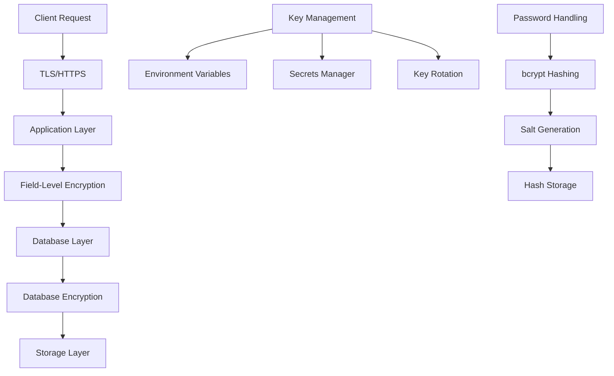

# Data Encryption Practices

This document details the data encryption practices implemented in the Kavach system, covering encryption at rest, in transit, and application-level encryption for sensitive data.

## Overview

The Kavach system implements comprehensive encryption practices to protect sensitive data throughout its lifecycle:

- **Encryption in Transit**: TLS/HTTPS for all network communications
- **Encryption at Rest**: Database-level encryption and application-level encryption for sensitive fields
- **Password Security**: Strong hashing algorithms with salt
- **Token Security**: Cryptographically secure token generation and validation
- **Key Management**: Secure key storage and rotation practices

## Encryption Architecture



## Encryption in Transit

### 1. TLS/HTTPS Configuration

All network communications are encrypted using TLS 1.2 or higher:

```typescript
// Next.js production configuration
const nextConfig = {
  // Force HTTPS in production
  async headers() {
    return [
      {
        source: '/(.*)',
        headers: [
          {
            key: 'Strict-Transport-Security',
            value: 'max-age=31536000; includeSubDomains; preload'
          },
          {
            key: 'X-Content-Type-Options',
            value: 'nosniff'
          },
          {
            key: 'X-Frame-Options',
            value: 'DENY'
          }
        ]
      }
    ];
  }
};
```

### 2. Security Headers

```typescript
// Security headers middleware
export function securityHeaders(response: NextResponse): void {
  // HSTS - Force HTTPS
  response.headers.set(
    'Strict-Transport-Security',
    'max-age=31536000; includeSubDomains; preload'
  );
  
  // Content Security Policy
  response.headers.set(
    'Content-Security-Policy',
    "default-src 'self'; script-src 'self' 'unsafe-inline'; style-src 'self' 'unsafe-inline'"
  );
  
  // Prevent MIME sniffing
  response.headers.set('X-Content-Type-Options', 'nosniff');
  
  // Prevent clickjacking
  response.headers.set('X-Frame-Options', 'DENY');
  
  // Referrer policy
  response.headers.set('Referrer-Policy', 'strict-origin-when-cross-origin');
}
```

### 3. API Communication Security

```typescript
// Secure API client configuration
export class SecureApiClient {
  private baseURL: string;
  private timeout: number = 30000;

  constructor(baseURL: string) {
    this.baseURL = baseURL;
  }

  async request<T>(endpoint: string, options: RequestOptions = {}): Promise<T> {
    const url = `${this.baseURL}${endpoint}`;
    
    const config: RequestInit = {
      method: options.method || 'GET',
      headers: {
        'Content-Type': 'application/json',
        'User-Agent': 'Kavach-Client/1.0',
        ...options.headers
      },
      body: options.body ? JSON.stringify(options.body) : undefined,
      // Ensure secure connections
      mode: 'cors',
      credentials: 'include'
    };

    // Add authentication if available
    const token = await this.getAuthToken();
    if (token) {
      config.headers = {
        ...config.headers,
        'Authorization': `Bearer ${token}`
      };
    }

    const response = await fetch(url, config);
    
    if (!response.ok) {
      throw new Error(`HTTP ${response.status}: ${response.statusText}`);
    }

    return response.json();
  }
}
```

## Encryption at Rest

### 1. Database Encryption

```sql
-- PostgreSQL encryption configuration
-- Enable transparent data encryption (TDE) at database level
ALTER SYSTEM SET ssl = on;
ALTER SYSTEM SET ssl_cert_file = '/path/to/server.crt';
ALTER SYSTEM SET ssl_key_file = '/path/to/server.key';

-- Enable encryption for specific columns (if supported)
CREATE TABLE users (
  id UUID PRIMARY KEY DEFAULT gen_random_uuid(),
  email VARCHAR(255) NOT NULL UNIQUE,
  -- Sensitive fields can be encrypted at application level
  password_hash VARCHAR(255) NOT NULL,
  created_at TIMESTAMP DEFAULT NOW() NOT NULL
);
```

### 2. Application-Level Field Encryption

```typescript
import { createCipher, createDecipher, randomBytes } from 'crypto';

export class FieldEncryption {
  private algorithm = 'aes-256-gcm';
  private key: Buffer;

  constructor() {
    const encryptionKey = process.env.FIELD_ENCRYPTION_KEY;
    if (!encryptionKey) {
      throw new Error('FIELD_ENCRYPTION_KEY environment variable is required');
    }
    this.key = Buffer.from(encryptionKey, 'hex');
  }

  encrypt(text: string): string {
    try {
      const iv = randomBytes(16);
      const cipher = createCipher(this.algorithm, this.key);
      cipher.setAAD(Buffer.from('kavach-auth', 'utf8'));
      
      let encrypted = cipher.update(text, 'utf8', 'hex');
      encrypted += cipher.final('hex');
      
      const authTag = cipher.getAuthTag();
      
      // Combine IV, auth tag, and encrypted data
      return `${iv.toString('hex')}:${authTag.toString('hex')}:${encrypted}`;
    } catch (error) {
      console.error('Encryption failed:', error);
      throw new Error('Failed to encrypt data');
    }
  }

  decrypt(encryptedText: string): string {
    try {
      const [ivHex, authTagHex, encrypted] = encryptedText.split(':');
      
      if (!ivHex || !authTagHex || !encrypted) {
        throw new Error('Invalid encrypted data format');
      }
      
      const iv = Buffer.from(ivHex, 'hex');
      const authTag = Buffer.from(authTagHex, 'hex');
      
      const decipher = createDecipher(this.algorithm, this.key);
      decipher.setAAD(Buffer.from('kavach-auth', 'utf8'));
      decipher.setAuthTag(authTag);
      
      let decrypted = decipher.update(encrypted, 'hex', 'utf8');
      decrypted += decipher.final('utf8');
      
      return decrypted;
    } catch (error) {
      console.error('Decryption failed:', error);
      throw new Error('Failed to decrypt data');
    }
  }
}

// Singleton instance
export const fieldEncryption = new FieldEncryption();
```

### 3. Sensitive Data Handling

```typescript
// Example: Encrypting sensitive profile data
export interface EncryptedProfileData {
  phoneNumber?: string;
  address?: string;
  socialSecurityNumber?: string;
  bankAccountDetails?: string;
}

export class ProfileEncryption {
  static encryptSensitiveFields(data: any): any {
    const sensitiveFields = ['phoneNumber', 'address', 'socialSecurityNumber', 'bankAccountDetails'];
    const encrypted = { ...data };

    for (const field of sensitiveFields) {
      if (encrypted[field]) {
        encrypted[field] = fieldEncryption.encrypt(encrypted[field]);
      }
    }

    return encrypted;
  }

  static decryptSensitiveFields(data: any): any {
    const sensitiveFields = ['phoneNumber', 'address', 'socialSecurityNumber', 'bankAccountDetails'];
    const decrypted = { ...data };

    for (const field of sensitiveFields) {
      if (decrypted[field]) {
        try {
          decrypted[field] = fieldEncryption.decrypt(decrypted[field]);
        } catch (error) {
          console.error(`Failed to decrypt field ${field}:`, error);
          // Handle decryption failure gracefully
          decrypted[field] = '[ENCRYPTED]';
        }
      }
    }

    return decrypted;
  }
}
```

## Password Security

### 1. Password Hashing

```typescript
import * as bcrypt from 'bcryptjs';

export class PasswordSecurity {
  private static readonly SALT_ROUNDS = 12; // Secure salt rounds for production

  static async hashPassword(password: string): Promise<string> {
    try {
      // Generate salt and hash password
      const salt = await bcrypt.genSalt(this.SALT_ROUNDS);
      const hash = await bcrypt.hash(password, salt);
      return hash;
    } catch (error) {
      console.error('Password hashing failed:', error);
      throw new Error('Failed to hash password');
    }
  }

  static async verifyPassword(password: string, hash: string): Promise<boolean> {
    try {
      return await bcrypt.compare(password, hash);
    } catch (error) {
      console.error('Password verification failed:', error);
      return false;
    }
  }

  static async needsRehash(hash: string): Promise<boolean> {
    try {
      // Check if hash was created with current salt rounds
      const rounds = bcrypt.getRounds(hash);
      return rounds < this.SALT_ROUNDS;
    } catch (error) {
      console.error('Hash check failed:', error);
      return true; // Assume rehash needed on error
    }
  }
}
```

### 2. Password Strength Validation

```typescript
export enum PasswordStrength {
  WEAK = 'weak',
  FAIR = 'fair',
  GOOD = 'good',
  STRONG = 'strong'
}

export interface PasswordValidationResult {
  isValid: boolean;
  strength: PasswordStrength;
  errors: string[];
  score: number;
}

export function validatePasswordStrength(password: string): PasswordValidationResult {
  const errors: string[] = [];
  let score = 0;

  // Length checks
  if (password.length < 8) {
    errors.push('Password must be at least 8 characters long');
  } else {
    score += 1;
    if (password.length >= 12) score += 1;
    if (password.length >= 16) score += 1;
  }

  // Character type checks
  if (!/[a-z]/.test(password)) {
    errors.push('Password must contain at least one lowercase letter');
  } else {
    score += 1;
  }

  if (!/[A-Z]/.test(password)) {
    errors.push('Password must contain at least one uppercase letter');
  } else {
    score += 1;
  }

  if (!/\d/.test(password)) {
    errors.push('Password must contain at least one number');
  } else {
    score += 1;
  }

  if (!/[!@#$%^&*(),.?":{}|<>]/.test(password)) {
    errors.push('Password must contain at least one special character');
  } else {
    score += 1;
  }

  // Additional strength indicators
  if (/[!@#$%^&*(),.?":{}|<>]{2,}/.test(password)) score += 1; // Multiple special chars
  if (!/(.)\1{2,}/.test(password)) score += 1; // No repeated characters
  if (!/^(.{1,2})\1+$/.test(password)) score += 1; // No simple patterns

  // Determine strength
  let strength: PasswordStrength;
  if (score <= 2) {
    strength = PasswordStrength.WEAK;
  } else if (score <= 4) {
    strength = PasswordStrength.FAIR;
  } else if (score <= 6) {
    strength = PasswordStrength.GOOD;
  } else {
    strength = PasswordStrength.STRONG;
  }

  return {
    isValid: errors.length === 0,
    strength,
    errors,
    score
  };
}
```

## Token Security

### 1. Cryptographically Secure Token Generation

```typescript
import { randomBytes, createHash } from 'crypto';

export class TokenSecurity {
  /**
   * Generate cryptographically secure random token
   */
  static generateSecureToken(length: number = 32): string {
    return randomBytes(length).toString('hex');
  }

  /**
   * Generate UUID v4 using crypto.randomUUID or fallback
   */
  static generateSecureUUID(): string {
    if (typeof globalThis.crypto?.randomUUID === 'function') {
      return globalThis.crypto.randomUUID();
    }
    
    // Fallback implementation
    const bytes = new Uint8Array(16);
    globalThis.crypto.getRandomValues(bytes);
    
    // Set version (4) and variant bits
    bytes[6] = (bytes[6] & 0x0f) | 0x40;
    bytes[8] = (bytes[8] & 0x3f) | 0x80;
    
    const hex = Array.from(bytes, b => b.toString(16).padStart(2, '0')).join('');
    return `${hex.slice(0, 8)}-${hex.slice(8, 12)}-${hex.slice(12, 16)}-${hex.slice(16, 20)}-${hex.slice(20)}`;
  }

  /**
   * Generate secure session ID
   */
  static generateSessionId(): string {
    const timestamp = Date.now().toString();
    const randomData = this.generateSecureToken(16);
    const combined = `${timestamp}-${randomData}`;
    
    return createHash('sha256').update(combined).digest('hex');
  }

  /**
   * Generate API key with prefix
   */
  static generateApiKey(prefix: string = 'zl'): string {
    const keyData = this.generateSecureToken(24);
    return `${prefix}_${keyData}`;
  }
}
```

### 2. Token Validation and Sanitization

```typescript
export class TokenValidator {
  /**
   * Validate token format and structure
   */
  static validateTokenFormat(token: string, expectedLength?: number): boolean {
    if (!token || typeof token !== 'string') {
      return false;
    }

    // Check for basic format (hex string)
    if (!/^[a-f0-9]+$/i.test(token)) {
      return false;
    }

    // Check length if specified
    if (expectedLength && token.length !== expectedLength) {
      return false;
    }

    return true;
  }

  /**
   * Sanitize token input
   */
  static sanitizeToken(token: string): string {
    if (!token) return '';
    
    // Remove whitespace and convert to lowercase
    return token.trim().toLowerCase();
  }

  /**
   * Validate UUID format
   */
  static validateUUID(uuid: string): boolean {
    const uuidRegex = /^[0-9a-f]{8}-[0-9a-f]{4}-4[0-9a-f]{3}-[89ab][0-9a-f]{3}-[0-9a-f]{12}$/i;
    return uuidRegex.test(uuid);
  }
}
```

## Key Management

### 1. Environment-Based Key Storage

```typescript
export class KeyManager {
  private static keys: Map<string, string> = new Map();

  static initialize(): void {
    // Load encryption keys from environment
    const requiredKeys = [
      'JWT_SECRET',
      'FIELD_ENCRYPTION_KEY',
      'SESSION_SECRET',
      'API_ENCRYPTION_KEY'
    ];

    for (const keyName of requiredKeys) {
      const keyValue = process.env[keyName];
      if (!keyValue) {
        throw new Error(`Required encryption key ${keyName} is not set`);
      }

      // Validate key strength
      if (keyValue.length < 32) {
        throw new Error(`Encryption key ${keyName} must be at least 32 characters`);
      }

      this.keys.set(keyName, keyValue);
    }
  }

  static getKey(keyName: string): string {
    const key = this.keys.get(keyName);
    if (!key) {
      throw new Error(`Encryption key ${keyName} not found`);
    }
    return key;
  }

  static rotateKey(keyName: string, newKey: string): void {
    // Validate new key
    if (newKey.length < 32) {
      throw new Error('New key must be at least 32 characters');
    }

    // Store old key for decryption of existing data
    const oldKey = this.keys.get(keyName);
    if (oldKey) {
      this.keys.set(`${keyName}_OLD`, oldKey);
    }

    // Set new key
    this.keys.set(keyName, newKey);

    console.log(`Key ${keyName} rotated successfully`);
  }
}

// Initialize keys on startup
KeyManager.initialize();
```

### 2. Key Rotation Strategy

```typescript
export class KeyRotationService {
  private rotationSchedule: Map<string, number> = new Map();

  constructor() {
    // Set rotation intervals (in milliseconds)
    this.rotationSchedule.set('JWT_SECRET', 90 * 24 * 60 * 60 * 1000); // 90 days
    this.rotationSchedule.set('FIELD_ENCRYPTION_KEY', 180 * 24 * 60 * 60 * 1000); // 180 days
    this.rotationSchedule.set('SESSION_SECRET', 30 * 24 * 60 * 60 * 1000); // 30 days
  }

  async scheduleRotation(): Promise<void> {
    for (const [keyName, interval] of this.rotationSchedule) {
      setTimeout(async () => {
        await this.rotateKey(keyName);
        // Reschedule next rotation
        this.scheduleRotation();
      }, interval);
    }
  }

  private async rotateKey(keyName: string): Promise<void> {
    try {
      // Generate new key
      const newKey = TokenSecurity.generateSecureToken(32);
      
      // Rotate the key
      KeyManager.rotateKey(keyName, newKey);
      
      // Log rotation event
      console.log(`Automated key rotation completed for ${keyName}`);
      
      // Audit log
      auditSecurity({
        event: 'security.key.rotated',
        severity: 'medium',
        metadata: { keyName, automated: true }
      });
    } catch (error) {
      console.error(`Key rotation failed for ${keyName}:`, error);
      
      // Alert on rotation failure
      auditSecurity({
        event: 'security.key.rotation.failed',
        severity: 'high',
        error: error.message,
        metadata: { keyName }
      });
    }
  }
}
```

## Data Classification and Handling

### 1. Data Classification Levels

```typescript
export enum DataClassification {
  PUBLIC = 'public',           // No encryption required
  INTERNAL = 'internal',       // Basic encryption
  CONFIDENTIAL = 'confidential', // Strong encryption
  RESTRICTED = 'restricted'    // Highest level encryption + access controls
}

export interface DataField {
  name: string;
  classification: DataClassification;
  encryptionRequired: boolean;
  accessControls: string[];
}

export const DATA_CLASSIFICATION_MAP: Record<string, DataField> = {
  // Public data
  firstName: {
    name: 'firstName',
    classification: DataClassification.PUBLIC,
    encryptionRequired: false,
    accessControls: ['self', 'admin']
  },
  lastName: {
    name: 'lastName',
    classification: DataClassification.PUBLIC,
    encryptionRequired: false,
    accessControls: ['self', 'admin']
  },
  
  // Internal data
  email: {
    name: 'email',
    classification: DataClassification.INTERNAL,
    encryptionRequired: false,
    accessControls: ['self', 'admin']
  },
  
  // Confidential data
  phoneNumber: {
    name: 'phoneNumber',
    classification: DataClassification.CONFIDENTIAL,
    encryptionRequired: true,
    accessControls: ['self', 'admin']
  },
  address: {
    name: 'address',
    classification: DataClassification.CONFIDENTIAL,
    encryptionRequired: true,
    accessControls: ['self', 'admin']
  },
  
  // Restricted data
  socialSecurityNumber: {
    name: 'socialSecurityNumber',
    classification: DataClassification.RESTRICTED,
    encryptionRequired: true,
    accessControls: ['admin']
  },
  bankAccountDetails: {
    name: 'bankAccountDetails',
    classification: DataClassification.RESTRICTED,
    encryptionRequired: true,
    accessControls: ['admin']
  }
};
```

### 2. Automated Data Handling

```typescript
export class DataProtectionService {
  static processDataForStorage(data: any): any {
    const processed = { ...data };

    for (const [fieldName, fieldConfig] of Object.entries(DATA_CLASSIFICATION_MAP)) {
      if (processed[fieldName] && fieldConfig.encryptionRequired) {
        processed[fieldName] = fieldEncryption.encrypt(processed[fieldName]);
      }
    }

    return processed;
  }

  static processDataForRetrieval(data: any, userRole: string): any {
    const processed = { ...data };

    for (const [fieldName, fieldConfig] of Object.entries(DATA_CLASSIFICATION_MAP)) {
      if (processed[fieldName]) {
        // Check access controls
        if (!fieldConfig.accessControls.includes(userRole) && !fieldConfig.accessControls.includes('self')) {
          delete processed[fieldName];
          continue;
        }

        // Decrypt if necessary
        if (fieldConfig.encryptionRequired) {
          try {
            processed[fieldName] = fieldEncryption.decrypt(processed[fieldName]);
          } catch (error) {
            console.error(`Failed to decrypt field ${fieldName}:`, error);
            processed[fieldName] = '[ENCRYPTED]';
          }
        }
      }
    }

    return processed;
  }
}
```

## Compliance and Standards

### 1. GDPR Compliance

```typescript
export class GDPRCompliance {
  /**
   * Anonymize personal data for GDPR compliance
   */
  static anonymizePersonalData(data: any): any {
    const anonymized = { ...data };
    
    // Remove or hash personally identifiable information
    const piiFields = ['email', 'firstName', 'lastName', 'phoneNumber', 'address'];
    
    for (const field of piiFields) {
      if (anonymized[field]) {
        anonymized[field] = this.hashPII(anonymized[field]);
      }
    }

    return anonymized;
  }

  private static hashPII(value: string): string {
    return createHash('sha256').update(value).digest('hex').substring(0, 8);
  }

  /**
   * Generate data export for GDPR data portability
   */
  static async generateDataExport(userId: string): Promise<any> {
    // Collect all user data from various sources
    const userData = await this.collectUserData(userId);
    
    // Decrypt sensitive fields for export
    const decryptedData = DataProtectionService.processDataForRetrieval(userData, 'self');
    
    return {
      exportDate: new Date().toISOString(),
      userId,
      data: decryptedData,
      dataClassification: this.classifyExportData(decryptedData)
    };
  }

  private static async collectUserData(userId: string): Promise<any> {
    // Implementation would collect data from all relevant tables
    return {};
  }

  private static classifyExportData(data: any): Record<string, DataClassification> {
    const classification: Record<string, DataClassification> = {};
    
    for (const [fieldName, value] of Object.entries(data)) {
      const fieldConfig = DATA_CLASSIFICATION_MAP[fieldName];
      if (fieldConfig) {
        classification[fieldName] = fieldConfig.classification;
      }
    }

    return classification;
  }
}
```

### 2. Encryption Standards Compliance

```typescript
export class EncryptionStandards {
  /**
   * Validate encryption implementation against standards
   */
  static validateCompliance(): ComplianceReport {
    const report: ComplianceReport = {
      compliant: true,
      issues: [],
      recommendations: []
    };

    // Check TLS version
    if (!this.checkTLSVersion()) {
      report.compliant = false;
      report.issues.push('TLS version below 1.2 detected');
    }

    // Check encryption algorithms
    if (!this.checkEncryptionAlgorithms()) {
      report.compliant = false;
      report.issues.push('Weak encryption algorithms in use');
    }

    // Check key strength
    if (!this.checkKeyStrength()) {
      report.compliant = false;
      report.issues.push('Encryption keys below minimum strength requirements');
    }

    return report;
  }

  private static checkTLSVersion(): boolean {
    // Implementation would check actual TLS configuration
    return true;
  }

  private static checkEncryptionAlgorithms(): boolean {
    // Verify we're using approved algorithms
    const approvedAlgorithms = ['aes-256-gcm', 'aes-256-cbc'];
    // Implementation would check actual algorithm usage
    return true;
  }

  private static checkKeyStrength(): boolean {
    // Verify key lengths meet minimum requirements
    try {
      const jwtSecret = process.env.JWT_SECRET;
      const encryptionKey = process.env.FIELD_ENCRYPTION_KEY;
      
      return (jwtSecret?.length || 0) >= 32 && (encryptionKey?.length || 0) >= 32;
    } catch {
      return false;
    }
  }
}

interface ComplianceReport {
  compliant: boolean;
  issues: string[];
  recommendations: string[];
}
```

## Security Testing

### 1. Encryption Testing

```typescript
describe('Encryption Security', () => {
  test('should encrypt and decrypt data correctly', () => {
    const originalData = 'sensitive information';
    const encrypted = fieldEncryption.encrypt(originalData);
    const decrypted = fieldEncryption.decrypt(encrypted);
    
    expect(encrypted).not.toBe(originalData);
    expect(decrypted).toBe(originalData);
  });

  test('should fail gracefully with invalid encrypted data', () => {
    expect(() => {
      fieldEncryption.decrypt('invalid:encrypted:data');
    }).toThrow('Failed to decrypt data');
  });

  test('should generate cryptographically secure tokens', () => {
    const token1 = TokenSecurity.generateSecureToken();
    const token2 = TokenSecurity.generateSecureToken();
    
    expect(token1).not.toBe(token2);
    expect(token1).toHaveLength(64); // 32 bytes = 64 hex chars
    expect(/^[a-f0-9]+$/i.test(token1)).toBe(true);
  });

  test('should validate password strength correctly', () => {
    const weakPassword = validatePasswordStrength('123');
    const strongPassword = validatePasswordStrength('MyStr0ng!P@ssw0rd');
    
    expect(weakPassword.strength).toBe(PasswordStrength.WEAK);
    expect(strongPassword.strength).toBe(PasswordStrength.STRONG);
  });
});
```

## Production Checklist

### Encryption in Transit
- [ ] TLS 1.2+ enabled for all connections
- [ ] HSTS headers configured
- [ ] Certificate management automated
- [ ] Security headers implemented

### Encryption at Rest
- [ ] Database encryption enabled
- [ ] Sensitive fields encrypted at application level
- [ ] Encryption keys properly managed
- [ ] Key rotation scheduled

### Password Security
- [ ] Strong hashing algorithm (bcrypt with 12+ rounds)
- [ ] Password strength validation implemented
- [ ] Password rehashing on login if needed
- [ ] Secure password reset process

### Key Management
- [ ] Keys stored securely (environment variables/secrets manager)
- [ ] Minimum key length enforced (256 bits)
- [ ] Key rotation strategy implemented
- [ ] Old keys retained for decryption

### Compliance
- [ ] GDPR data handling implemented
- [ ] Data classification system in place
- [ ] Audit logging for encryption operations
- [ ] Regular compliance validation

## Related Documentation

- [JWT Security](../authentication/jwt-security.md) - Token encryption and security
- [Security Monitoring](../monitoring/audit-logging.md) - Encryption event monitoring
- [Database Security](../../backend/database/schema.md) - Database encryption practices
- [API Security](../../api/authentication.md) - API encryption and security