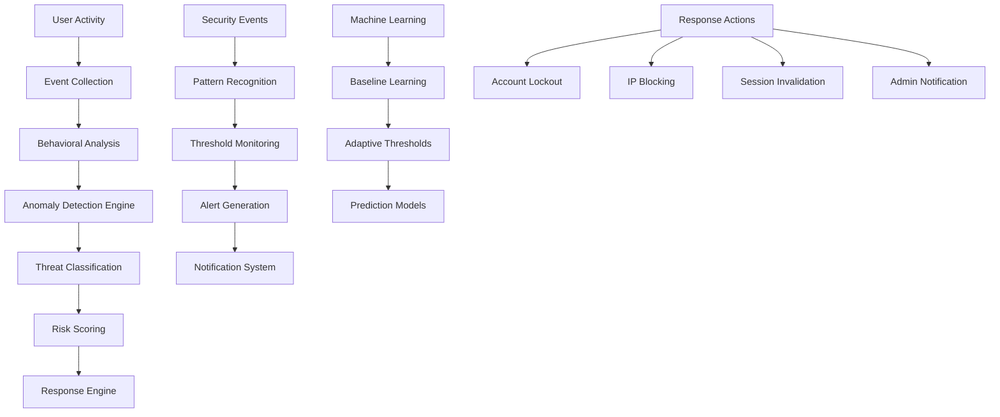

# Anomaly Detection and Threat Monitoring

This document details the anomaly detection and threat monitoring system implemented in the Kavach system, covering real-time threat detection, behavioral analysis, and automated response mechanisms.

## Overview

The Kavach system implements a comprehensive anomaly detection system that monitors user behavior, system activities, and security events to identify potential threats and suspicious activities. The system provides:

- **Real-time Monitoring**: Continuous monitoring of authentication and user activities
- **Behavioral Analysis**: Pattern recognition for unusual user behavior
- **Threat Detection**: Automated identification of security threats
- **Adaptive Thresholds**: Dynamic adjustment of detection thresholds
- **Automated Response**: Immediate response to detected threats
- **Alert Management**: Comprehensive alerting and notification system

## Anomaly Detection Architecture



## Security Event Types

### 1. Authentication Anomalies

```typescript
export enum AuthenticationAnomalyType {
  MULTIPLE_FAILED_ATTEMPTS = 'multiple_failed_attempts',
  UNUSUAL_LOGIN_TIME = 'unusual_login_time',
  NEW_DEVICE_LOGIN = 'new_device_login',
  GEOLOCATION_ANOMALY = 'geolocation_anomaly',
  RAPID_LOGIN_ATTEMPTS = 'rapid_login_attempts',
  CREDENTIAL_STUFFING = 'credential_stuffing',
  BRUTE_FORCE_ATTACK = 'brute_force_attack'
}

interface AuthenticationAnomaly {
  type: AuthenticationAnomalyType;
  userId?: string;
  email?: string;
  ip: string;
  timestamp: Date;
  riskScore: number;
  indicators: string[];
  metadata: Record<string, any>;
}
```

### 2. Behavioral Anomalies

```typescript
export enum BehaviorAnomalyType {
  UNUSUAL_ACCESS_PATTERN = 'unusual_access_pattern',
  EXCESSIVE_API_USAGE = 'excessive_api_usage',
  PRIVILEGE_ESCALATION_ATTEMPT = 'privilege_escalation_attempt',
  DATA_EXFILTRATION_PATTERN = 'data_exfiltration_pattern',
  CONCURRENT_SESSION_ABUSE = 'concurrent_session_abuse',
  UNUSUAL_RESOURCE_ACCESS = 'unusual_resource_access'
}

interface BehaviorAnomaly {
  type: BehaviorAnomalyType;
  userId: string;
  sessionId: string;
  timestamp: Date;
  riskScore: number;
  baseline: any;
  current: any;
  deviation: number;
}
```

## Anomaly Detection Engine

### 1. Core Detection System

```typescript
export class AnomalyDetectionEngine {
  private detectors: Map<string, AnomalyDetector> = new Map();
  private baselines: Map<string, UserBaseline> = new Map();
  private thresholds: Map<string, DetectionThreshold> = new Map();

  constructor() {
    this.initializeDetectors();
    this.loadBaselines();
    this.configureThresholds();
  }

  async analyzeEvent(event: SecurityEvent): Promise<AnomalyResult> {
    const results: AnomalyResult[] = [];

    // Run all applicable detectors
    for (const [name, detector] of this.detectors) {
      if (detector.canAnalyze(event)) {
        const result = await detector.analyze(event, this.getBaseline(event.userId));
        if (result.isAnomalous) {
          results.push(result);
        }
      }
    }

    // Combine results and calculate overall risk score
    return this.combineResults(results);
  }

  private initializeDetectors(): void {
    this.detectors.set('login_pattern', new LoginPatternDetector());
    this.detectors.set('access_pattern', new AccessPatternDetector());
    this.detectors.set('rate_limit', new RateLimitDetector());
    this.detectors.set('geolocation', new GeolocationDetector());
    this.detectors.set('device_fingerprint', new DeviceFingerprintDetector());
    this.detectors.set('behavioral', new BehavioralDetector());
  }

  private getBaseline(userId?: string): UserBaseline | null {
    if (!userId) return null;
    return this.baselines.get(userId) || null;
  }

  private combineResults(results: AnomalyResult[]): AnomalyResult {
    if (results.length === 0) {
      return { isAnomalous: false, riskScore: 0, indicators: [] };
    }

    // Calculate weighted risk score
    const totalRiskScore = results.reduce((sum, result) => sum + result.riskScore, 0);
    const maxRiskScore = Math.max(...results.map(r => r.riskScore));
    const combinedRiskScore = Math.min(100, totalRiskScore * 0.7 + maxRiskScore * 0.3);

    // Combine all indicators
    const allIndicators = results.flatMap(r => r.indicators);
    const uniqueIndicators = [...new Set(allIndicators)];

    return {
      isAnomalous: combinedRiskScore >= 50,
      riskScore: combinedRiskScore,
      indicators: uniqueIndicators,
      detectionResults: results
    };
  }
}
```

### 2. Login Pattern Detector

```typescript
export class LoginPatternDetector implements AnomalyDetector {
  canAnalyze(event: SecurityEvent): boolean {
    return event.type === SecurityEventType.MULTIPLE_FAILED_ATTEMPTS ||
           event.type === SecurityEventType.UNAUTHORIZED_ACCESS;
  }

  async analyze(event: SecurityEvent, baseline: UserBaseline | null): Promise<AnomalyResult> {
    const indicators: string[] = [];
    let riskScore = 0;

    // Check for multiple failed attempts
    const recentFailures = await this.getRecentFailedAttempts(event.email || event.ip);
    if (recentFailures.length >= 5) {
      indicators.push('multiple_failed_attempts');
      riskScore += 30;
    }

    // Check for rapid attempts
    if (recentFailures.length >= 3) {
      const timeSpan = recentFailures[0].timestamp.getTime() - recentFailures[recentFailures.length - 1].timestamp.getTime();
      if (timeSpan < 60000) { // Less than 1 minute
        indicators.push('rapid_login_attempts');
        riskScore += 40;
      }
    }

    // Check against user baseline
    if (baseline) {
      const currentHour = new Date().getHours();
      if (!baseline.typicalLoginHours.includes(currentHour)) {
        indicators.push('unusual_login_time');
        riskScore += 20;
      }

      // Check for new IP address
      if (event.ip && !baseline.knownIPs.includes(event.ip)) {
        indicators.push('new_ip_address');
        riskScore += 25;
      }
    }

    return {
      isAnomalous: riskScore >= 30,
      riskScore,
      indicators,
      detectorName: 'login_pattern',
      metadata: {
        recentFailureCount: recentFailures.length,
        baseline: baseline ? 'available' : 'not_available'
      }
    };
  }

  private async getRecentFailedAttempts(identifier: string): Promise<FailedAttempt[]> {
    const cutoff = new Date(Date.now() - 15 * 60 * 1000); // Last 15 minutes
    
    // Query audit logs for recent failed attempts
    return await auditLogCollection.find({
      $or: [
        { email: identifier },
        { ip: identifier }
      ],
      event: 'auth.login.failed',
      timestamp: { $gte: cutoff }
    }).sort({ timestamp: -1 }).toArray();
  }
}
```

### 3. Behavioral Pattern Detector

```typescript
export class BehavioralDetector implements AnomalyDetector {
  canAnalyze(event: SecurityEvent): boolean {
    return event.userId !== undefined;
  }

  async analyze(event: SecurityEvent, baseline: UserBaseline | null): Promise<AnomalyResult> {
    if (!baseline || !event.userId) {
      return { isAnomalous: false, riskScore: 0, indicators: [] };
    }

    const indicators: string[] = [];
    let riskScore = 0;

    // Analyze access patterns
    const recentActivity = await this.getRecentUserActivity(event.userId);
    
    // Check for unusual access frequency
    const currentHourActivity = recentActivity.filter(a => 
      a.timestamp.getHours() === new Date().getHours()
    ).length;
    
    if (currentHourActivity > baseline.averageHourlyActivity * 3) {
      indicators.push('excessive_activity');
      riskScore += 35;
    }

    // Check for unusual resource access
    const accessedResources = recentActivity.map(a => a.resource);
    const unusualResources = accessedResources.filter(r => 
      !baseline.commonResources.includes(r)
    );

    if (unusualResources.length > 5) {
      indicators.push('unusual_resource_access');
      riskScore += 30;
    }

    // Check for privilege escalation attempts
    const privilegedActions = recentActivity.filter(a => 
      a.action && ['admin', 'delete', 'modify'].some(p => a.action.includes(p))
    );

    if (privilegedActions.length > 0 && baseline.userRole !== 'admin') {
      indicators.push('privilege_escalation_attempt');
      riskScore += 50;
    }

    return {
      isAnomalous: riskScore >= 25,
      riskScore,
      indicators,
      detectorName: 'behavioral',
      metadata: {
        currentHourActivity,
        baselineHourlyActivity: baseline.averageHourlyActivity,
        unusualResourceCount: unusualResources.length,
        privilegedActionCount: privilegedActions.length
      }
    };
  }

  private async getRecentUserActivity(userId: string): Promise<UserActivity[]> {
    const cutoff = new Date(Date.now() - 60 * 60 * 1000); // Last hour
    
    return await auditLogCollection.find({
      userId: userId,
      timestamp: { $gte: cutoff },
      category: { $in: ['authentication', 'authorization'] }
    }).sort({ timestamp: -1 }).toArray();
  }
}
```

### 4. Geolocation Anomaly Detector

```typescript
export class GeolocationDetector implements AnomalyDetector {
  private geoipService: GeoIPService;

  constructor() {
    this.geoipService = new GeoIPService();
  }

  canAnalyze(event: SecurityEvent): boolean {
    return event.ip !== undefined;
  }

  async analyze(event: SecurityEvent, baseline: UserBaseline | null): Promise<AnomalyResult> {
    if (!event.ip) {
      return { isAnomalous: false, riskScore: 0, indicators: [] };
    }

    const indicators: string[] = [];
    let riskScore = 0;

    try {
      const location = await this.geoipService.lookup(event.ip);
      
      if (baseline && baseline.knownLocations.length > 0) {
        // Check if location is significantly different from known locations
        const isNewLocation = !baseline.knownLocations.some(knownLoc => 
          this.calculateDistance(location, knownLoc) < 100 // Within 100km
        );

        if (isNewLocation) {
          indicators.push('new_geolocation');
          riskScore += 30;

          // Higher risk for distant locations
          const minDistance = Math.min(...baseline.knownLocations.map(knownLoc =>
            this.calculateDistance(location, knownLoc)
          ));

          if (minDistance > 1000) { // More than 1000km away
            indicators.push('distant_geolocation');
            riskScore += 40;
          }
        }
      }

      // Check for high-risk countries/regions
      if (this.isHighRiskLocation(location)) {
        indicators.push('high_risk_location');
        riskScore += 25;
      }

      // Check for VPN/Proxy usage
      if (location.isProxy || location.isVPN) {
        indicators.push('proxy_or_vpn_usage');
        riskScore += 20;
      }

      return {
        isAnomalous: riskScore >= 25,
        riskScore,
        indicators,
        detectorName: 'geolocation',
        metadata: {
          location: {
            country: location.country,
            city: location.city,
            coordinates: [location.latitude, location.longitude]
          },
          isProxy: location.isProxy,
          isVPN: location.isVPN
        }
      };
    } catch (error) {
      console.error('Geolocation lookup failed:', error);
      return { isAnomalous: false, riskScore: 0, indicators: [] };
    }
  }

  private calculateDistance(loc1: GeoLocation, loc2: GeoLocation): number {
    // Haversine formula for calculating distance between two points
    const R = 6371; // Earth's radius in kilometers
    const dLat = this.toRadians(loc2.latitude - loc1.latitude);
    const dLon = this.toRadians(loc2.longitude - loc1.longitude);
    
    const a = Math.sin(dLat / 2) * Math.sin(dLat / 2) +
              Math.cos(this.toRadians(loc1.latitude)) * Math.cos(this.toRadians(loc2.latitude)) *
              Math.sin(dLon / 2) * Math.sin(dLon / 2);
    
    const c = 2 * Math.atan2(Math.sqrt(a), Math.sqrt(1 - a));
    return R * c;
  }

  private toRadians(degrees: number): number {
    return degrees * (Math.PI / 180);
  }

  private isHighRiskLocation(location: GeoLocation): boolean {
    // Define high-risk countries/regions based on security policies
    const highRiskCountries = ['CN', 'RU', 'KP', 'IR']; // Example list
    return highRiskCountries.includes(location.countryCode);
  }
}
```

## User Baseline Learning

### 1. Baseline Data Structure

```typescript
export interface UserBaseline {
  userId: string;
  createdAt: Date;
  lastUpdated: Date;
  
  // Authentication patterns
  typicalLoginHours: number[];
  averageSessionDuration: number;
  knownIPs: string[];
  knownDevices: DeviceFingerprint[];
  knownLocations: GeoLocation[];
  
  // Behavioral patterns
  averageHourlyActivity: number;
  commonResources: string[];
  typicalActions: string[];
  userRole: string;
  
  // Risk factors
  historicalRiskScore: number;
  suspiciousActivityCount: number;
  lastSuspiciousActivity?: Date;
  
  // Learning metadata
  dataPoints: number;
  confidence: number;
}

export interface DeviceFingerprint {
  userAgent: string;
  screenResolution?: string;
  timezone?: string;
  language?: string;
  platform?: string;
  hash: string;
}

export interface GeoLocation {
  country: string;
  countryCode: string;
  city: string;
  latitude: number;
  longitude: number;
  isProxy?: boolean;
  isVPN?: boolean;
}
```

### 2. Baseline Learning Engine

```typescript
export class BaselineLearningEngine {
  private readonly LEARNING_PERIOD = 30 * 24 * 60 * 60 * 1000; // 30 days
  private readonly MIN_DATA_POINTS = 10;

  async updateUserBaseline(userId: string): Promise<void> {
    const cutoff = new Date(Date.now() - this.LEARNING_PERIOD);
    
    // Gather user activity data
    const activities = await this.getUserActivities(userId, cutoff);
    
    if (activities.length < this.MIN_DATA_POINTS) {
      console.log(`Insufficient data points for user ${userId}: ${activities.length}`);
      return;
    }

    // Calculate baseline metrics
    const baseline = await this.calculateBaseline(userId, activities);
    
    // Store or update baseline
    await this.storeBaseline(baseline);
    
    console.log(`Updated baseline for user ${userId} with ${activities.length} data points`);
  }

  private async calculateBaseline(userId: string, activities: UserActivity[]): Promise<UserBaseline> {
    // Extract login hours
    const loginHours = activities
      .filter(a => a.event === 'auth.login.success')
      .map(a => a.timestamp.getHours());
    
    const typicalLoginHours = this.findTypicalHours(loginHours);

    // Extract IP addresses
    const knownIPs = [...new Set(activities.map(a => a.ip).filter(Boolean))];

    // Extract locations
    const knownLocations = await this.extractKnownLocations(knownIPs);

    // Calculate activity patterns
    const hourlyActivityCounts = this.calculateHourlyActivity(activities);
    const averageHourlyActivity = hourlyActivityCounts.reduce((a, b) => a + b, 0) / 24;

    // Extract common resources
    const resources = activities.map(a => a.resource).filter(Boolean);
    const commonResources = this.findCommonResources(resources);

    // Get user role
    const user = await userRepository.findById(userId);
    const userRole = user?.role || 'unknown';

    return {
      userId,
      createdAt: new Date(),
      lastUpdated: new Date(),
      typicalLoginHours,
      averageSessionDuration: this.calculateAverageSessionDuration(activities),
      knownIPs,
      knownDevices: await this.extractDeviceFingerprints(activities),
      knownLocations,
      averageHourlyActivity,
      commonResources,
      typicalActions: this.findCommonActions(activities),
      userRole,
      historicalRiskScore: this.calculateHistoricalRiskScore(activities),
      suspiciousActivityCount: this.countSuspiciousActivities(activities),
      dataPoints: activities.length,
      confidence: Math.min(1.0, activities.length / 100) // Confidence increases with more data
    };
  }

  private findTypicalHours(hours: number[]): number[] {
    const hourCounts = new Array(24).fill(0);
    hours.forEach(hour => hourCounts[hour]++);
    
    // Find hours with activity above average
    const average = hours.length / 24;
    return hourCounts
      .map((count, hour) => ({ hour, count }))
      .filter(({ count }) => count > average)
      .map(({ hour }) => hour);
  }

  private async extractKnownLocations(ips: string[]): Promise<GeoLocation[]> {
    const locations: GeoLocation[] = [];
    const geoipService = new GeoIPService();

    for (const ip of ips.slice(0, 10)) { // Limit to avoid rate limiting
      try {
        const location = await geoipService.lookup(ip);
        locations.push(location);
      } catch (error) {
        console.error(`Failed to lookup location for IP ${ip}:`, error);
      }
    }

    // Remove duplicates based on city
    return locations.filter((loc, index, arr) => 
      arr.findIndex(l => l.city === loc.city && l.country === loc.country) === index
    );
  }

  private findCommonResources(resources: string[]): string[] {
    const resourceCounts = new Map<string, number>();
    
    resources.forEach(resource => {
      resourceCounts.set(resource, (resourceCounts.get(resource) || 0) + 1);
    });

    // Return resources accessed more than 5 times
    return Array.from(resourceCounts.entries())
      .filter(([, count]) => count >= 5)
      .map(([resource]) => resource);
  }

  private async storeBaseline(baseline: UserBaseline): Promise<void> {
    // Store in database or cache
    await baselineCollection.replaceOne(
      { userId: baseline.userId },
      baseline,
      { upsert: true }
    );
  }

  async scheduleBaselineUpdates(): Promise<void> {
    // Update baselines daily for active users
    setInterval(async () => {
      try {
        const activeUsers = await this.getActiveUsers();
        
        for (const userId of activeUsers) {
          await this.updateUserBaseline(userId);
          // Add delay to avoid overwhelming the system
          await new Promise(resolve => setTimeout(resolve, 1000));
        }
      } catch (error) {
        console.error('Baseline update failed:', error);
      }
    }, 24 * 60 * 60 * 1000); // Daily
  }

  private async getActiveUsers(): Promise<string[]> {
    const cutoff = new Date(Date.now() - 7 * 24 * 60 * 60 * 1000); // Last 7 days
    
    const activeUsers = await auditLogCollection.distinct('userId', {
      userId: { $exists: true },
      timestamp: { $gte: cutoff }
    });

    return activeUsers.filter(Boolean);
  }
}
```

## Automated Response System

### 1. Response Engine

```typescript
export class SecurityResponseEngine {
  private responseStrategies: Map<string, ResponseStrategy> = new Map();

  constructor() {
    this.initializeResponseStrategies();
  }

  async executeResponse(anomaly: AnomalyResult, event: SecurityEvent): Promise<ResponseResult> {
    const responses: ResponseAction[] = [];

    // Determine appropriate responses based on risk score and indicators
    for (const indicator of anomaly.indicators) {
      const strategy = this.responseStrategies.get(indicator);
      if (strategy && anomaly.riskScore >= strategy.minimumRiskScore) {
        const action = await strategy.execute(event, anomaly);
        responses.push(action);
      }
    }

    // Execute high-level responses based on overall risk score
    if (anomaly.riskScore >= 80) {
      responses.push(await this.executeHighRiskResponse(event, anomaly));
    } else if (anomaly.riskScore >= 60) {
      responses.push(await this.executeMediumRiskResponse(event, anomaly));
    }

    // Log all responses
    await this.logResponses(event, anomaly, responses);

    return {
      executed: responses,
      totalActions: responses.length,
      highestSeverity: this.getHighestSeverity(responses)
    };
  }

  private initializeResponseStrategies(): void {
    this.responseStrategies.set('multiple_failed_attempts', {
      minimumRiskScore: 30,
      execute: async (event, anomaly) => {
        if (event.userId) {
          await this.lockAccount(event.userId, 'Multiple failed login attempts', 30 * 60 * 1000);
        }
        if (event.ip) {
          await this.blockIP(event.ip, 'Multiple failed attempts', 60 * 60 * 1000);
        }
        return { type: 'account_lock', severity: 'medium', target: event.userId || event.ip };
      }
    });

    this.responseStrategies.set('privilege_escalation_attempt', {
      minimumRiskScore: 50,
      execute: async (event, anomaly) => {
        if (event.userId) {
          await this.invalidateUserSessions(event.userId);
          await this.notifyAdmins('Privilege escalation attempt detected', event, anomaly);
        }
        return { type: 'session_invalidation', severity: 'high', target: event.userId };
      }
    });

    this.responseStrategies.set('unusual_resource_access', {
      minimumRiskScore: 40,
      execute: async (event, anomaly) => {
        await this.requireAdditionalAuthentication(event.userId);
        return { type: 'require_mfa', severity: 'medium', target: event.userId };
      }
    });
  }

  private async executeHighRiskResponse(event: SecurityEvent, anomaly: AnomalyResult): Promise<ResponseAction> {
    // Immediate lockdown for critical threats
    if (event.userId) {
      await this.lockAccount(event.userId, 'High-risk anomaly detected', 24 * 60 * 60 * 1000);
      await this.invalidateUserSessions(event.userId);
    }
    
    if (event.ip) {
      await this.blockIP(event.ip, 'High-risk anomaly detected', 24 * 60 * 60 * 1000);
    }

    await this.notifyAdmins('CRITICAL: High-risk security anomaly detected', event, anomaly);
    
    return { type: 'critical_lockdown', severity: 'critical', target: event.userId || event.ip };
  }

  private async executeMediumRiskResponse(event: SecurityEvent, anomaly: AnomalyResult): Promise<ResponseAction> {
    // Temporary restrictions for medium-risk threats
    if (event.userId) {
      await this.requireAdditionalAuthentication(event.userId);
    }

    await this.notifySecurityTeam('Medium-risk security anomaly detected', event, anomaly);
    
    return { type: 'enhanced_monitoring', severity: 'medium', target: event.userId };
  }

  private async lockAccount(userId: string, reason: string, duration: number): Promise<void> {
    securityMonitor.lockAccount(userId, reason, duration);
    
    auditSecurity({
      event: 'security.account.locked',
      userId,
      severity: 'high',
      action: 'lock_account',
      reason,
      metadata: { duration, automated: true }
    });
  }

  private async blockIP(ip: string, reason: string, duration: number): Promise<void> {
    securityMonitor.blockIP(ip, reason, duration);
    
    auditSecurity({
      event: 'security.ip.blocked',
      ip,
      severity: 'high',
      action: 'block_ip',
      reason,
      metadata: { duration, automated: true }
    });
  }

  private async invalidateUserSessions(userId: string): Promise<void> {
    await sessionManager.invalidateAllUserSessions(userId);
    
    auditSecurity({
      event: 'security.sessions.invalidated',
      userId,
      severity: 'high',
      action: 'invalidate_sessions',
      metadata: { automated: true }
    });
  }

  private async requireAdditionalAuthentication(userId?: string): Promise<void> {
    if (!userId) return;
    
    // Implementation would set a flag requiring MFA on next login
    await userRepository.update(userId, { requiresMFA: true });
    
    auditSecurity({
      event: 'security.mfa.required',
      userId,
      severity: 'medium',
      action: 'require_mfa',
      metadata: { automated: true }
    });
  }

  private async notifyAdmins(message: string, event: SecurityEvent, anomaly: AnomalyResult): Promise<void> {
    // Implementation would send notifications to administrators
    console.log(`ADMIN ALERT: ${message}`, { event, anomaly });
    
    // Could integrate with Slack, email, SMS, etc.
    await this.sendAlert({
      level: 'admin',
      message,
      event,
      anomaly,
      timestamp: new Date()
    });
  }

  private async notifySecurityTeam(message: string, event: SecurityEvent, anomaly: AnomalyResult): Promise<void> {
    // Implementation would send notifications to security team
    console.log(`SECURITY ALERT: ${message}`, { event, anomaly });
    
    await this.sendAlert({
      level: 'security',
      message,
      event,
      anomaly,
      timestamp: new Date()
    });
  }

  private async sendAlert(alert: SecurityAlert): Promise<void> {
    // Implementation would integrate with alerting systems
    // Slack, PagerDuty, email, etc.
  }
}
```

## Real-time Monitoring Dashboard

### 1. Security Metrics Collection

```typescript
export class SecurityMetricsCollector {
  private metrics: Map<string, MetricValue> = new Map();

  async collectMetrics(): Promise<SecurityMetrics> {
    const now = new Date();
    const last24h = new Date(now.getTime() - 24 * 60 * 60 * 1000);
    const lastHour = new Date(now.getTime() - 60 * 60 * 1000);

    const [
      totalEvents,
      securityEvents,
      anomaliesDetected,
      blockedIPs,
      lockedAccounts,
      activeAlerts
    ] = await Promise.all([
      this.countEvents(last24h),
      this.countSecurityEvents(last24h),
      this.countAnomalies(last24h),
      this.countBlockedIPs(),
      this.countLockedAccounts(),
      this.countActiveAlerts()
    ]);

    return {
      timestamp: now,
      period: '24h',
      totalEvents,
      securityEvents,
      anomaliesDetected,
      blockedIPs,
      lockedAccounts,
      activeAlerts,
      riskLevel: this.calculateOverallRiskLevel(),
      topThreats: await this.getTopThreats(last24h),
      recentAnomalies: await this.getRecentAnomalies(lastHour)
    };
  }

  private async countEvents(since: Date): Promise<number> {
    return await auditLogCollection.countDocuments({
      timestamp: { $gte: since }
    });
  }

  private async countSecurityEvents(since: Date): Promise<number> {
    return await auditLogCollection.countDocuments({
      category: 'security',
      timestamp: { $gte: since }
    });
  }

  private async countAnomalies(since: Date): Promise<number> {
    return await auditLogCollection.countDocuments({
      event: { $regex: /^security\./ },
      timestamp: { $gte: since }
    });
  }

  private countBlockedIPs(): number {
    return securityMonitor.getSecurityStats().blockedIPs;
  }

  private countLockedAccounts(): number {
    return securityMonitor.getSecurityStats().lockedAccounts;
  }

  private countActiveAlerts(): number {
    return securityMonitor.getActiveAlerts().length;
  }

  private calculateOverallRiskLevel(): 'low' | 'medium' | 'high' | 'critical' {
    const stats = securityMonitor.getSecurityStats();
    const activeAlerts = securityMonitor.getActiveAlerts();
    
    const criticalAlerts = activeAlerts.filter(a => a.severity === 'critical').length;
    const highAlerts = activeAlerts.filter(a => a.severity === 'high').length;
    
    if (criticalAlerts > 0) return 'critical';
    if (highAlerts > 2 || stats.blockedIPs > 10) return 'high';
    if (highAlerts > 0 || stats.lockedAccounts > 5) return 'medium';
    return 'low';
  }

  private async getTopThreats(since: Date): Promise<ThreatSummary[]> {
    const pipeline = [
      { $match: { category: 'security', timestamp: { $gte: since } } },
      { $group: { _id: '$event', count: { $sum: 1 } } },
      { $sort: { count: -1 } },
      { $limit: 5 }
    ];

    const results = await auditLogCollection.aggregate(pipeline).toArray();
    return results.map(r => ({ threat: r._id, count: r.count }));
  }

  private async getRecentAnomalies(since: Date): Promise<AnomalySummary[]> {
    const anomalies = await auditLogCollection.find({
      category: 'security',
      timestamp: { $gte: since }
    }).sort({ timestamp: -1 }).limit(10).toArray();

    return anomalies.map(a => ({
      timestamp: a.timestamp,
      type: a.event,
      severity: a.severity,
      userId: a.userId,
      ip: a.ip,
      riskScore: a.metadata?.riskScore || 0
    }));
  }
}
```

## Configuration and Tuning

### 1. Detection Thresholds

```typescript
export interface DetectionThresholds {
  failedLoginAttempts: {
    count: number;
    timeWindow: number; // milliseconds
    riskScore: number;
  };
  
  unusualActivity: {
    activityMultiplier: number; // X times normal activity
    riskScore: number;
  };
  
  geolocationAnomaly: {
    distanceThreshold: number; // kilometers
    riskScore: number;
  };
  
  riskScoreThresholds: {
    low: number;
    medium: number;
    high: number;
    critical: number;
  };
}

export const DEFAULT_THRESHOLDS: DetectionThresholds = {
  failedLoginAttempts: {
    count: 5,
    timeWindow: 15 * 60 * 1000, // 15 minutes
    riskScore: 30
  },
  
  unusualActivity: {
    activityMultiplier: 3,
    riskScore: 25
  },
  
  geolocationAnomaly: {
    distanceThreshold: 100, // 100km
    riskScore: 30
  },
  
  riskScoreThresholds: {
    low: 25,
    medium: 50,
    high: 75,
    critical: 90
  }
};
```

### 2. Environment Configuration

```bash
# Anomaly Detection Configuration
ANOMALY_DETECTION_ENABLED=true
BASELINE_LEARNING_ENABLED=true
AUTOMATED_RESPONSE_ENABLED=true

# Detection Thresholds
FAILED_LOGIN_THRESHOLD=5
FAILED_LOGIN_WINDOW=900000  # 15 minutes in milliseconds
UNUSUAL_ACTIVITY_MULTIPLIER=3
GEOLOCATION_DISTANCE_THRESHOLD=100

# Response Configuration
AUTO_LOCK_ENABLED=true
AUTO_BLOCK_IP_ENABLED=true
ADMIN_NOTIFICATION_ENABLED=true

# Learning Configuration
BASELINE_LEARNING_PERIOD=2592000000  # 30 days in milliseconds
MIN_DATA_POINTS=10
BASELINE_UPDATE_INTERVAL=86400000    # 24 hours in milliseconds
```

## Testing Anomaly Detection

```typescript
describe('Anomaly Detection', () => {
  test('should detect multiple failed login attempts', async () => {
    const events = Array(6).fill(null).map((_, i) => ({
      type: SecurityEventType.MULTIPLE_FAILED_ATTEMPTS,
      email: 'test@example.com',
      ip: '192.168.1.1',
      timestamp: new Date(Date.now() - i * 1000)
    }));

    const detector = new LoginPatternDetector();
    const result = await detector.analyze(events[0], null);

    expect(result.isAnomalous).toBe(true);
    expect(result.indicators).toContain('multiple_failed_attempts');
    expect(result.riskScore).toBeGreaterThan(30);
  });

  test('should detect unusual geolocation', async () => {
    const baseline: UserBaseline = {
      userId: 'test-user',
      knownLocations: [
        { country: 'US', city: 'New York', latitude: 40.7128, longitude: -74.0060 }
      ]
    };

    const event = {
      type: SecurityEventType.UNAUTHORIZED_ACCESS,
      userId: 'test-user',
      ip: '203.0.113.1' // Different location
    };

    const detector = new GeolocationDetector();
    const result = await detector.analyze(event, baseline);

    expect(result.indicators).toContain('new_geolocation');
  });

  test('should update user baseline correctly', async () => {
    const learningEngine = new BaselineLearningEngine();
    await learningEngine.updateUserBaseline('test-user');

    const baseline = await getBaseline('test-user');
    expect(baseline).toBeDefined();
    expect(baseline.typicalLoginHours).toBeInstanceOf(Array);
    expect(baseline.confidence).toBeGreaterThan(0);
  });
});
```

## Production Checklist

- [ ] Anomaly detection engine configured and running
- [ ] Baseline learning enabled for all users
- [ ] Detection thresholds tuned for environment
- [ ] Automated response system configured
- [ ] Alert notifications set up
- [ ] Monitoring dashboard deployed
- [ ] False positive rate monitored and tuned
- [ ] Regular review of detection rules scheduled

## Related Documentation

- [Audit Logging](./audit-logging.md) - Security event logging
- [Security Monitoring](../README.md) - Overall security monitoring
- [Authentication Security](../authentication/jwt-security.md) - Authentication monitoring
- [RBAC](../authorization/role-based-access.md) - Authorization monitoring