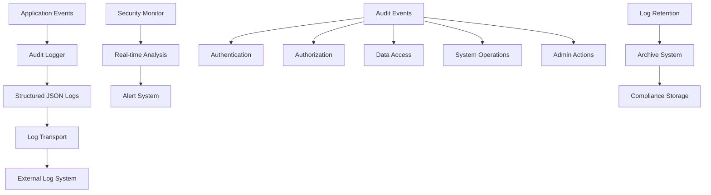

# Audit Logging and Trail Documentation

This document details the comprehensive audit logging system implemented in the Kavach system, covering security events, user actions, system operations, and compliance requirements.

## Overview

The Kavach system implements a comprehensive audit logging system that captures all security-relevant events, user actions, and system operations. The audit trail provides:

- **Complete Event Coverage**: All authentication, authorization, and data access events
- **Structured Logging**: JSON-formatted logs suitable for analysis and alerting
- **Real-time Monitoring**: Immediate logging of security events
- **Compliance Support**: Audit trails for regulatory compliance (GDPR, SOC 2)
- **Forensic Capability**: Detailed event reconstruction for incident investigation

## Audit Architecture



## Audit Event Categories

### 1. Authentication Events

```typescript
export type AuthenticationEvents = 
  | 'auth.signup.success'
  | 'auth.signup.failed'
  | 'auth.login.success'
  | 'auth.login.failed'
  | 'auth.logout'
  | 'auth.refresh.success'
  | 'auth.refresh.failed'
  | 'auth.email.verify.success'
  | 'auth.email.verify.failed'
  | 'auth.verification.token.generated'
  | 'auth.session.created'
  | 'auth.session.invalidated'
  | 'auth.session.expired'
  | 'auth.password.changed'
  | 'auth.account.locked'
  | 'auth.account.unlocked';
```

**Example Authentication Audit Log:**

```json
{
  "timestamp": "2025-01-20T10:30:45.123Z",
  "event": "auth.login.success",
  "category": "authentication",
  "severity": "low",
  "userId": "550e8400-e29b-41d4-a716-446655440000",
  "email": "user@example.com",
  "role": "customer",
  "ip": "192.168.1.100",
  "userAgent": "Mozilla/5.0 (Windows NT 10.0; Win64; x64) AppleWebKit/537.36",
  "requestId": "req_abc123def456",
  "correlationId": "corr_xyz789",
  "success": true,
  "metadata": {
    "loginMethod": "email_password",
    "sessionDuration": "7d",
    "mfaUsed": false
  }
}
```

### 2. Authorization Events

```typescript
export type AuthorizationEvents =
  | 'auth.authorization.granted'
  | 'auth.authorization.denied'
  | 'auth.permission.checked'
  | 'auth.role.verified'
  | 'auth.access.restricted';
```

**Example Authorization Audit Log:**

```json
{
  "timestamp": "2025-01-20T10:31:15.456Z",
  "event": "auth.authorization.denied",
  "category": "authorization",
  "severity": "medium",
  "userId": "550e8400-e29b-41d4-a716-446655440000",
  "email": "user@example.com",
  "role": "customer",
  "ip": "192.168.1.100",
  "requestId": "req_def456ghi789",
  "correlationId": "corr_abc123",
  "resource": "/admin/users",
  "action": "read",
  "reason": "insufficient_permissions",
  "metadata": {
    "requiredRole": "admin",
    "actualRole": "customer",
    "protectionLevel": "admin"
  }
}
```

### 3. Security Events

```typescript
export type SecurityEvents =
  | 'security.suspicious.activity'
  | 'security.rate.limit.exceeded'
  | 'security.multiple.failed.attempts'
  | 'security.token.manipulation'
  | 'security.session.hijack.attempt'
  | 'security.unauthorized.access';
```

**Example Security Audit Log:**

```json
{
  "timestamp": "2025-01-20T10:32:00.789Z",
  "event": "security.multiple.failed.attempts",
  "category": "security",
  "severity": "high",
  "email": "attacker@example.com",
  "ip": "203.0.113.45",
  "requestId": "req_security123",
  "correlationId": "corr_security456",
  "action": "block_ip",
  "metadata": {
    "attemptCount": 5,
    "timeWindow": "15m",
    "endpoint": "/api/v1/auth/login",
    "blockDuration": "1h"
  }
}
```

## Audit Logger Implementation

### 1. Core Audit Logger

```typescript
import pino from 'pino';
import { ship } from './log-transport';

// Dedicated structured audit logger
export const auditLogger = pino({
  name: 'audit',
  level: process.env.AUDIT_LOG_LEVEL || 'info',
  messageKey: 'message',
  timestamp: pino.stdTimeFunctions.isoTime,
  formatters: {
    level: (label) => ({ level: label }),
    log: (object) => {
      // Ensure sensitive data is scrubbed
      const scrubbed = { ...object };
      delete scrubbed.password;
      delete scrubbed.token;
      delete scrubbed.refreshToken;
      delete scrubbed.accessToken;
      delete scrubbed.sessionToken;
      return scrubbed;
    }
  }
});

export interface AuditBase {
  event: AuditEventName;
  userId?: string;
  email?: string;
  ip?: string;
  requestId?: string;
  correlationId?: string;
  role?: string;
  success?: boolean;
  errorCode?: string;
  error?: string;
  timestamp?: string;
  userAgent?: string;
  resource?: string;
  action?: string;
  severity?: 'low' | 'medium' | 'high' | 'critical';
  category?: 'authentication' | 'authorization' | 'profile' | 'security' | 'system' | 'admin';
  metadata?: Record<string, any>;
  [k: string]: any;
}

export function emitAudit(event: AuditBase) {
  const scrubbed = { ...event } as Record<string, any>;
  
  // Add timestamp if not provided
  if (!scrubbed.timestamp) {
    scrubbed.timestamp = new Date().toISOString();
  }
  
  // Additional scrubbing for security
  delete scrubbed.password;
  delete scrubbed.token;
  delete scrubbed.refreshToken;
  delete scrubbed.accessToken;
  delete scrubbed.sessionToken;
  
  // Log with appropriate level based on severity
  const severity = event.severity || 'medium';
  switch (severity) {
    case 'critical':
      auditLogger.fatal(scrubbed);
      break;
    case 'high':
      auditLogger.error(scrubbed);
      break;
    case 'medium':
      auditLogger.warn(scrubbed);
      break;
    case 'low':
    default:
      auditLogger.info(scrubbed);
      break;
  }
  
  // Ship to external systems (fire-and-forget)
  ship(scrubbed).catch(() => {
    // Silently handle shipping errors to prevent audit logging from affecting application flow
  });
}
```

### 2. Category-Specific Audit Functions

```typescript
// Authentication audit logging
export const auditAuth = (event: Omit<AuditBase, 'category'> & { 
  event: Extract<AuditEventName, `auth.${string}`> 
}) => {
  emitAudit({ ...event, category: 'authentication' });
};

// Security audit logging
export const auditSecurity = (event: Omit<AuditBase, 'category'> & { 
  event: Extract<AuditEventName, `security.${string}`> 
}) => {
  emitAudit({ ...event, category: 'security', severity: event.severity || 'high' });
};

// System audit logging
export const auditSystem = (event: Omit<AuditBase, 'category'> & { 
  event: Extract<AuditEventName, `system.${string}`> 
}) => {
  emitAudit({ ...event, category: 'system' });
};

// Profile audit logging
export const auditProfile = (event: Omit<AuditBase, 'category'> & { 
  event: Extract<AuditEventName, `profile.${string}`> 
}) => {
  emitAudit({ ...event, category: 'profile' });
};

// Admin audit logging
export const auditAdmin = (event: Omit<AuditBase, 'category'> & { 
  event: Extract<AuditEventName, `admin.${string}`> 
}) => {
  emitAudit({ ...event, category: 'admin', severity: event.severity || 'medium' });
};
```

### 3. Log Transport System

```typescript
export interface LogTransportConfig {
  enabled: boolean;
  endpoint?: string;
  apiKey?: string;
  batchSize: number;
  flushInterval: number;
  retryAttempts: number;
}

class LogTransport {
  private config: LogTransportConfig;
  private logBuffer: any[] = [];
  private flushTimer?: NodeJS.Timeout;

  constructor() {
    this.config = {
      enabled: process.env.LOG_TRANSPORT_ENABLED === 'true',
      endpoint: process.env.LOG_TRANSPORT_ENDPOINT,
      apiKey: process.env.LOG_TRANSPORT_API_KEY,
      batchSize: parseInt(process.env.LOG_BATCH_SIZE || '100'),
      flushInterval: parseInt(process.env.LOG_FLUSH_INTERVAL || '5000'),
      retryAttempts: parseInt(process.env.LOG_RETRY_ATTEMPTS || '3')
    };

    if (this.config.enabled) {
      this.startFlushTimer();
    }
  }

  async ship(logEntry: any): Promise<void> {
    if (!this.config.enabled) {
      return;
    }

    // Add to buffer
    this.logBuffer.push({
      ...logEntry,
      timestamp: logEntry.timestamp || new Date().toISOString(),
      source: 'kavach-auth-system'
    });

    // Flush if buffer is full
    if (this.logBuffer.length >= this.config.batchSize) {
      await this.flush();
    }
  }

  private async flush(): Promise<void> {
    if (this.logBuffer.length === 0 || !this.config.endpoint) {
      return;
    }

    const batch = [...this.logBuffer];
    this.logBuffer = [];

    try {
      await this.sendBatch(batch);
    } catch (error) {
      console.error('Failed to ship audit logs:', error);
      // Re-add failed logs to buffer for retry
      this.logBuffer.unshift(...batch);
    }
  }

  private async sendBatch(batch: any[], attempt: number = 1): Promise<void> {
    try {
      const response = await fetch(this.config.endpoint!, {
        method: 'POST',
        headers: {
          'Content-Type': 'application/json',
          'Authorization': `Bearer ${this.config.apiKey}`,
          'User-Agent': 'Kavach-Audit-Logger/1.0'
        },
        body: JSON.stringify({
          logs: batch,
          metadata: {
            source: 'kavach-auth-system',
            version: '1.0',
            timestamp: new Date().toISOString()
          }
        })
      });

      if (!response.ok) {
        throw new Error(`HTTP ${response.status}: ${response.statusText}`);
      }
    } catch (error) {
      if (attempt < this.config.retryAttempts) {
        // Exponential backoff
        const delay = Math.pow(2, attempt) * 1000;
        await new Promise(resolve => setTimeout(resolve, delay));
        return this.sendBatch(batch, attempt + 1);
      }
      throw error;
    }
  }

  private startFlushTimer(): void {
    this.flushTimer = setInterval(() => {
      this.flush().catch(error => {
        console.error('Scheduled flush failed:', error);
      });
    }, this.config.flushInterval);
  }

  destroy(): void {
    if (this.flushTimer) {
      clearInterval(this.flushTimer);
    }
    // Final flush
    this.flush().catch(() => {});
  }
}

// Singleton instance
const logTransport = new LogTransport();

export const ship = (logEntry: any) => logTransport.ship(logEntry);

// Graceful shutdown
process.on('SIGTERM', () => logTransport.destroy());
process.on('SIGINT', () => logTransport.destroy());
```

## Audit Event Examples

### 1. User Registration Audit

```typescript
// Successful registration
auditAuth({
  event: 'auth.signup.success',
  userId: user.id,
  email: user.email,
  ip: clientIP,
  requestId: correlationId,
  correlationId: correlationId,
  role: user.role,
  severity: 'low',
  metadata: {
    registrationMethod: 'email',
    emailVerificationRequired: true,
    profileCompletionRequired: true
  }
});

// Failed registration
auditAuth({
  event: 'auth.signup.failed',
  email: data.email,
  ip: clientIP,
  requestId: correlationId,
  correlationId: correlationId,
  errorCode: 'DUPLICATE_EMAIL',
  severity: 'low',
  metadata: {
    reason: 'email_already_exists',
    attemptedRole: data.role
  }
});
```

### 2. Login Attempt Audit

```typescript
// Successful login
auditAuth({
  event: 'auth.login.success',
  userId: user.id,
  email: user.email,
  ip: clientIP,
  requestId: correlationId,
  correlationId: correlationId,
  role: user.role,
  severity: 'low',
  metadata: {
    loginMethod: 'email_password',
    sessionCreated: true,
    refreshTokenIssued: true,
    userAgent: request.headers.get('user-agent')
  }
});

// Failed login
auditAuth({
  event: 'auth.login.failed',
  email: data.email,
  ip: clientIP,
  requestId: correlationId,
  correlationId: correlationId,
  errorCode: 'INVALID_CREDENTIALS',
  severity: 'medium',
  metadata: {
    reason: 'invalid_password',
    attemptCount: await getFailedAttemptCount(data.email),
    userAgent: request.headers.get('user-agent')
  }
});
```

### 3. Administrative Action Audit

```typescript
// User ban action
auditAdmin({
  event: 'admin.user.banned',
  userId: targetUserId,
  email: targetUser.email,
  adminId: adminSession.userId,
  ip: clientIP,
  requestId: correlationId,
  severity: 'high',
  action: 'ban_user',
  reason: banReason,
  metadata: {
    adminEmail: adminSession.email,
    targetRole: targetUser.role,
    banDuration: 'permanent',
    affectedServices: ['service1', 'service2']
  }
});

// User creation by admin
auditAdmin({
  event: 'admin.user.created',
  userId: newUser.id,
  email: newUser.email,
  adminId: adminSession.userId,
  ip: clientIP,
  requestId: correlationId,
  severity: 'medium',
  action: 'create_user',
  metadata: {
    adminEmail: adminSession.email,
    createdRole: newUser.role,
    autoApproved: newUser.isApproved,
    initialStatus: {
      emailVerified: newUser.isEmailVerified,
      profileCompleted: newUser.isProfileCompleted
    }
  }
});
```

### 4. Security Event Audit

```typescript
// Suspicious activity detection
auditSecurity({
  event: 'security.suspicious.activity',
  userId: session?.userId,
  email: session?.email,
  ip: clientIP,
  requestId: correlationId,
  severity: 'high',
  action: 'flag_activity',
  metadata: {
    activityType: 'unusual_login_pattern',
    riskScore: 85,
    indicators: [
      'new_device',
      'unusual_location',
      'rapid_requests'
    ],
    mitigationActions: ['require_mfa', 'notify_user']
  }
});

// Rate limit exceeded
auditSecurity({
  event: 'security.rate.limit.exceeded',
  ip: clientIP,
  requestId: correlationId,
  severity: 'medium',
  action: 'rate_limit',
  metadata: {
    endpoint: '/api/v1/auth/login',
    requestCount: 10,
    timeWindow: '15m',
    blockDuration: '1h',
    userAgent: request.headers.get('user-agent')
  }
});
```

## Audit Log Analysis

### 1. Log Query Examples

```typescript
// Find all failed login attempts for a user
export async function getFailedLoginAttempts(email: string, timeRange: string = '24h'): Promise<any[]> {
  const query = {
    event: 'auth.login.failed',
    email: email,
    timestamp: {
      $gte: new Date(Date.now() - parseTimeRange(timeRange))
    }
  };
  
  return await auditLogCollection.find(query).sort({ timestamp: -1 }).toArray();
}

// Find all admin actions by a specific admin
export async function getAdminActions(adminId: string, timeRange: string = '7d'): Promise<any[]> {
  const query = {
    category: 'admin',
    adminId: adminId,
    timestamp: {
      $gte: new Date(Date.now() - parseTimeRange(timeRange))
    }
  };
  
  return await auditLogCollection.find(query).sort({ timestamp: -1 }).toArray();
}

// Find security events by severity
export async function getSecurityEventsBySeverity(severity: string, timeRange: string = '24h'): Promise<any[]> {
  const query = {
    category: 'security',
    severity: severity,
    timestamp: {
      $gte: new Date(Date.now() - parseTimeRange(timeRange))
    }
  };
  
  return await auditLogCollection.find(query).sort({ timestamp: -1 }).toArray();
}
```

### 2. Audit Metrics and Reporting

```typescript
export class AuditMetrics {
  static async generateSecurityReport(timeRange: string = '24h'): Promise<SecurityReport> {
    const startTime = new Date(Date.now() - parseTimeRange(timeRange));
    
    const [
      authEvents,
      securityEvents,
      adminEvents,
      failedLogins,
      suspiciousActivity
    ] = await Promise.all([
      this.countEventsByCategory('authentication', startTime),
      this.countEventsByCategory('security', startTime),
      this.countEventsByCategory('admin', startTime),
      this.countFailedLogins(startTime),
      this.countSuspiciousActivity(startTime)
    ]);

    return {
      timeRange,
      generatedAt: new Date().toISOString(),
      summary: {
        totalEvents: authEvents + securityEvents + adminEvents,
        authenticationEvents: authEvents,
        securityEvents: securityEvents,
        adminEvents: adminEvents,
        failedLogins: failedLogins,
        suspiciousActivity: suspiciousActivity
      },
      topRisks: await this.getTopSecurityRisks(startTime),
      recommendations: this.generateRecommendations(failedLogins, suspiciousActivity)
    };
  }

  private static async countEventsByCategory(category: string, startTime: Date): Promise<number> {
    return await auditLogCollection.countDocuments({
      category: category,
      timestamp: { $gte: startTime }
    });
  }

  private static async countFailedLogins(startTime: Date): Promise<number> {
    return await auditLogCollection.countDocuments({
      event: 'auth.login.failed',
      timestamp: { $gte: startTime }
    });
  }

  private static async countSuspiciousActivity(startTime: Date): Promise<number> {
    return await auditLogCollection.countDocuments({
      event: 'security.suspicious.activity',
      timestamp: { $gte: startTime }
    });
  }

  private static async getTopSecurityRisks(startTime: Date): Promise<SecurityRisk[]> {
    const pipeline = [
      { $match: { category: 'security', timestamp: { $gte: startTime } } },
      { $group: { _id: '$event', count: { $sum: 1 } } },
      { $sort: { count: -1 } },
      { $limit: 5 }
    ];

    const results = await auditLogCollection.aggregate(pipeline).toArray();
    return results.map(r => ({ event: r._id, count: r.count }));
  }

  private static generateRecommendations(failedLogins: number, suspiciousActivity: number): string[] {
    const recommendations: string[] = [];

    if (failedLogins > 100) {
      recommendations.push('Consider implementing stricter rate limiting for login attempts');
    }

    if (suspiciousActivity > 10) {
      recommendations.push('Review and enhance anomaly detection rules');
    }

    if (failedLogins > 50 && suspiciousActivity > 5) {
      recommendations.push('Consider implementing additional authentication factors');
    }

    return recommendations;
  }
}

interface SecurityReport {
  timeRange: string;
  generatedAt: string;
  summary: {
    totalEvents: number;
    authenticationEvents: number;
    securityEvents: number;
    adminEvents: number;
    failedLogins: number;
    suspiciousActivity: number;
  };
  topRisks: SecurityRisk[];
  recommendations: string[];
}

interface SecurityRisk {
  event: string;
  count: number;
}
```

## Compliance and Retention

### 1. GDPR Compliance

```typescript
export class GDPRAuditCompliance {
  /**
   * Anonymize audit logs for GDPR compliance
   */
  static async anonymizeUserAuditLogs(userId: string): Promise<void> {
    const anonymizedData = {
      userId: `anon_${this.generateAnonymousId(userId)}`,
      email: `anon_${this.generateAnonymousId(userId)}@anonymized.local`,
      ip: this.anonymizeIP,
      userAgent: '[ANONYMIZED]'
    };

    await auditLogCollection.updateMany(
      { userId: userId },
      { $set: anonymizedData }
    );
  }

  /**
   * Export user audit logs for GDPR data portability
   */
  static async exportUserAuditLogs(userId: string): Promise<any[]> {
    const logs = await auditLogCollection.find({ userId: userId }).toArray();
    
    return logs.map(log => ({
      ...log,
      exportNote: 'This data was exported as part of GDPR data portability request',
      exportDate: new Date().toISOString()
    }));
  }

  private static generateAnonymousId(userId: string): string {
    return createHash('sha256').update(userId).digest('hex').substring(0, 8);
  }

  private static anonymizeIP(ip: string): string {
    // Keep first two octets for IPv4, anonymize the rest
    const parts = ip.split('.');
    if (parts.length === 4) {
      return `${parts[0]}.${parts[1]}.xxx.xxx`;
    }
    return 'xxx.xxx.xxx.xxx';
  }
}
```

### 2. Log Retention Policy

```typescript
export class AuditLogRetention {
  private static readonly RETENTION_POLICIES = {
    authentication: 90 * 24 * 60 * 60 * 1000,  // 90 days
    security: 365 * 24 * 60 * 60 * 1000,       // 1 year
    admin: 2 * 365 * 24 * 60 * 60 * 1000,      // 2 years
    system: 30 * 24 * 60 * 60 * 1000,          // 30 days
    profile: 180 * 24 * 60 * 60 * 1000         // 180 days
  };

  static async cleanupExpiredLogs(): Promise<void> {
    for (const [category, retentionPeriod] of Object.entries(this.RETENTION_POLICIES)) {
      const cutoffDate = new Date(Date.now() - retentionPeriod);
      
      const result = await auditLogCollection.deleteMany({
        category: category,
        timestamp: { $lt: cutoffDate }
      });

      console.log(`Cleaned up ${result.deletedCount} expired ${category} audit logs`);
      
      // Audit the cleanup operation
      auditSystem({
        event: 'system.audit.cleanup',
        severity: 'low',
        action: 'cleanup_logs',
        metadata: {
          category: category,
          deletedCount: result.deletedCount,
          cutoffDate: cutoffDate.toISOString()
        }
      });
    }
  }

  static async archiveOldLogs(): Promise<void> {
    // Implementation would move old logs to archive storage
    // This is a placeholder for the archival process
    console.log('Archiving old audit logs...');
  }

  static scheduleCleanup(): void {
    // Run cleanup daily at 2 AM
    const cleanupInterval = 24 * 60 * 60 * 1000; // 24 hours
    
    setInterval(async () => {
      try {
        await this.cleanupExpiredLogs();
        await this.archiveOldLogs();
      } catch (error) {
        console.error('Audit log cleanup failed:', error);
        
        auditSystem({
          event: 'system.audit.cleanup.failed',
          severity: 'high',
          error: error.message,
          action: 'cleanup_logs'
        });
      }
    }, cleanupInterval);
  }
}

// Start cleanup scheduler
AuditLogRetention.scheduleCleanup();
```

## Testing Audit Logging

```typescript
describe('Audit Logging', () => {
  test('should log authentication events correctly', async () => {
    const mockEvent = {
      event: 'auth.login.success' as const,
      userId: 'test-user-id',
      email: 'test@example.com',
      ip: '192.168.1.1',
      requestId: 'test-request-id'
    };

    auditAuth(mockEvent);

    // Verify log was created (implementation depends on log storage)
    const logs = await getAuditLogs({ event: 'auth.login.success' });
    expect(logs).toHaveLength(1);
    expect(logs[0]).toMatchObject(mockEvent);
  });

  test('should scrub sensitive data from logs', () => {
    const eventWithSensitiveData = {
      event: 'auth.login.success' as const,
      userId: 'test-user-id',
      password: 'secret-password',
      token: 'secret-token'
    };

    const scrubbed = scrubSensitiveData(eventWithSensitiveData);
    
    expect(scrubbed.password).toBeUndefined();
    expect(scrubbed.token).toBeUndefined();
    expect(scrubbed.userId).toBe('test-user-id');
  });

  test('should handle log transport failures gracefully', async () => {
    // Mock transport failure
    jest.spyOn(logTransport, 'ship').mockRejectedValue(new Error('Transport failed'));

    // Should not throw error
    expect(() => {
      auditAuth({
        event: 'auth.login.success',
        userId: 'test-user-id'
      });
    }).not.toThrow();
  });
});
```

## Configuration

### Environment Variables

```bash
# Audit Logging Configuration
AUDIT_LOG_LEVEL=info
LOG_TRANSPORT_ENABLED=true
LOG_TRANSPORT_ENDPOINT=https://logs.example.com/api/v1/logs
LOG_TRANSPORT_API_KEY=your-log-transport-api-key

# Batch Configuration
LOG_BATCH_SIZE=100
LOG_FLUSH_INTERVAL=5000
LOG_RETRY_ATTEMPTS=3

# Retention Configuration
AUDIT_RETENTION_DAYS=365
AUDIT_CLEANUP_ENABLED=true
```

### Production Checklist

- [ ] Audit logging enabled for all security events
- [ ] Log transport configured for external systems
- [ ] Sensitive data scrubbing implemented
- [ ] Log retention policies configured
- [ ] Compliance requirements met (GDPR, SOC 2)
- [ ] Log analysis and alerting set up
- [ ] Regular audit log reviews scheduled
- [ ] Backup and recovery procedures for audit logs

## Related Documentation

- [Security Monitoring](./anomaly-detection.md) - Real-time security monitoring
- [JWT Security](../authentication/jwt-security.md) - Token security events
- [RBAC](../authorization/role-based-access.md) - Authorization events
- [API Security](../../api/authentication.md) - API security events